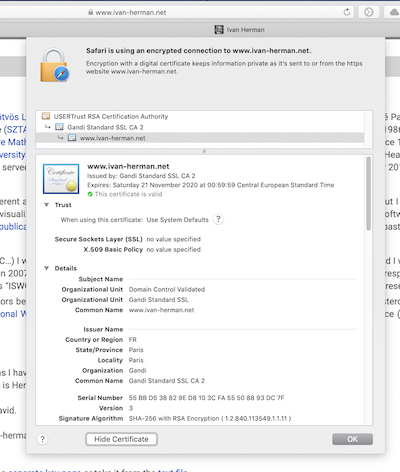

# DID and the Web

By [Ivan Herman](https://www.w3.org/People/Ivan/) (<ivan@w3.org>)

_(Disclaimer: as member of W3C’s permanent I am currently the staff contact for the W3C DID Working Group. However, these positions statements are my own, and they by no way represent some sort of an official W3C position.)_

The DID[[1](#r1)] (and VC[[2](#r2)]) Use Cases documents have a number of interesting use cases, from health care application to university credentials, or from corporate tax issues to travel documents. There is, however, comparatively little about what the use cases and requirements are on the relationship of DIDs (and VC's) _and the Web_.

## 1. DID and the Web

There can be long philosophical debates about what the Web is; this is not the time and place for it. Instead, let us simply rely on the ”Architecture of the World Wide Web (WebArch)”[[3](#r3)] document by the W3C. Although the document is (in Web years) relatively old, it is still very much relevant.

The WebArch document’s power is its high and abstract level. It defines the architectural basis of the Web on three axes:

1. [**Identification**](https://www.w3.org/TR/webarch/#identification): “URIs are used to identify resources.”
2. [**Interaction**](https://www.w3.org/TR/webarch/#interaction): “Web agents communicate using standardized protocols that enable interaction through the exchange of messages which adhere to a defined syntax and semantics.”
3. [**Formats**](https://www.w3.org/TR/webarch/#formats): “Most protocols used for representation retrieval and/or submission make use of a sequence of one or more messages, which taken together contain a payload of representation data and metadata, to transfer the representation between agents.”

These concepts (that are described in much more details in [[3](#r3)]) are intentionally very general.

There are some interesting points in this description when looking at it from a DID point of view:

- In spite of what many believe, the generic concept of the Web is _not dependent of HTTP URI-s_. Put it another way, _any_ URI scheme, that abides to the various requirements described in the the WebArch document, is a perfect, first-class citizen of the Web. _That includes DID-s_: DID-s are defined as URI-s and, furthermore, a cursory look at the WebArch document shows that DID-s do indeed abide to the general description of WebArch.
- Similarly, the WebArch document refers to general “Web agents” and _not necessarily_ browsers. Web agents may include other active entities. There are numerous examples for applications that do use URIs (possibly HTTP URIs), that also interact with resources retrieved via those URI-s, but are not “browsers” in the sense of Chrome, Safari, or Firefox. Again, the (DID, DID Methods, DID Documents) triple is quite in line with the descriptions of those interactions.
- The role of “Standardized Protocols” are played, in the case of DID, by a combination of DIDs, DID Documents, and Methods. It may require some work to place the generality of methods in this framework: how much should be standardized and how much should be left to implementations?
- Clearly, the DID Documents are the ”payload of representation data and metadata”… 

What this tells me is that DIDs _are, and must be considered as integral part of the Web_ per the Web Architecture. This statement sounds obvious but it isn’t: there are experts in the community who, whilst have no opposition to DID _per se_, consider it as a technology outside of the Web. Nevertheless, probably, due diligence would require that the DID Working Group, or any other group like the CCG, make a more systematic comparison and check with the Web Architecture concepts to make it sure that the relationships are smooth.

## 2. DID in Browsers

Whilst it gives a cosy feeling that DID (and, closely related, VCs) _are_ part of the Web, one has to recognize that, for many, the Web is what the browsers do. If we add _(human) user_ interaction to the mix, then browsers are indeed pretty much at the centre of the Web out there. I.e., the question of how DIDs and browsers relate _must_ be addressed.

### Information on DIDs

We can ask the following question, in practical terms:

> _What should happen if one puts a DID into the address bar of a browser?_

A possible answer may be: nothing. I.e., that DIDs are so different from URLs that we should not even try to define this behavior. Personally, I do not believe this is the right answer: if we want DIDs to be widely adopted we have to provide at least some level of user interface to their handling which, taking into account the predominant role played by browsers, essentially boils down to the question above.

An analogy may be the way browsers can display information about secure (i.e., HTTPS) web sites. All dominant browsers display some information on whether the site is secure and, if asked, they come up with a panel on the details of the local certificates like this:

Obviously, one has to understand lots of things to make a _real_ sense out of this panel but, it is still very important that this information (and the sign appearing by the URL in the URL bar) is present. We can imagine something similar for DIDs: the browser could come up with:

- a view of the DID document
- a statement whether the DID is indeed authentic and, if so, give as much information on authentication as possible
- list of services that can be pursued in the browser (e.g., home page) as a series of clickable links

The goal is to give the user a _trust in the DID itself, as well as the DID subject_.

Note that it may not easy to achieve this: the multiplicity of DID methods may make this a challenge for browser implementations. This _may_ mean that there should be some standard browser APIs that method implementations must abide to, as well as implementations of these APIs for browsers. There should also be some sort of a standard among browsers on what should be displayed and how, to ensure public trust.

### DID+VC as personal identification?

The work started elsewhere[[4](#r4)] by Markus Sabadello et al. addresses the usage of DID as part a personal identification mechanism on the Web (it is also [addressed](https://www.w3.org/TR/did-use-cases/#sso) from the DID Use Cases document). From the Web point of view, I believe this work is extremely important; it may become a “killer app” of DIDs and VCs on the Web and for users at large if it proves to be better and more reliable than the current ways people use self-authentication on the Web. Note that the issues are not only protocol level questions as in [[4](#r4)], or their connection to other existing protocols, but also the kind of user interface, wallets, etc., it can provide. Can we imagine a world where a wallet (a bit like current password managers like 1Password) would contain DIDs and credentials for the different Web sites? Would that be superior to today's experiences and, if yes, how? How would we convince users to adopt these?

## 3. DID on the Semantic Web

The issue of digital identity has been a central question on the Semantic Web, too. Indeed, the central concept on the Semantic Web is to use URIs to identify “things” on which semantic statements are made, where “things” can be just about anything: resources on the Web, but also objects, sensors, abstract concepts, or indeed individual persons. Hence the predominance of URIs in standards like RDF[[5](#r5)].

But there is also another central mantra on the Semantic Web which is usually referred to as “follow your nose”. This means that whenever a URI is found as part of a semantic statement, one (i.e., a machine or a person) should be able to use that URI to find _information about the “thing” identified by that URI._ Because, at the moment, HTTP is the dominant mechanism to achieve that, the “Linked Data” community often relies on HTTP URIs. See, for example, the original “Linked Data Note”[[6](#r6)] of Tim Berners-Lee which says (emphasis is mine):

> 1. Use URIs as names for things.
> 2. **Use HTTP URIs so that people can look up those names.**
> 3. When someone looks up a URI, provide useful information, using the standards (RDF*, SPARQL).
> 4. Include links to other URIs so that they can discover more things.

(It must be emphasized that the RDF standard does _not_ require HTTP URIs; “Linked Data” is some form of an informal layer _on top_ of the formal Semantic Web standards.) The Linked Data community has also developed a personal identity mechanism on top of HTTP for that purpose, combining it with some authentication mechanism based on certificates, called WebID[[7](#r7)].

However, the problems with HTTP based personal identification are known and were among the main issues leading to the DID work: decentralization, persistency, or authentication/verifiability. I.e., DID _should_ become an alternative to HTTP based identifications on the Semantic Web, too; but that can only happen if the four principles of Linked Data, as quoted above, can be upgraded to the DID case as well. What exactly happens if one replaces the term “HTTP” with “DID” in these four statements?

(A side issue: WebID did not really “made it” as a personal ID even among people who are not driven away by the Semantic Web. Personally, I believe one of the reasons is the extreme unfriendliness of all setups, creations, management, etc., of certificates, which is at the heart of WebID. This should be a warning to all things DID: there should be very user-friendly tools around very quickly to allow for everyday users to use this; technology is not enough…)

---

[1] [“Use Cases and Requirements for Decentralized Identifiers”](https://www.w3.org/TR/did-use-cases/), Joe Andrieu and Phil Archer (editors), W3C Working Draft. https://www.w3.org/TR/did-use-cases/  
[2] [”Verifiable Credentials Use Cases”](https://www.w3.org/TR/vc-use-cases/), Shane McCarron; Joe Andrieu; Matt Stone; Tzviya Siegman; Gregg Kellogg; and Ted Thibodeau, Jr. (editors), W3C Note, 24 September 2019. https://www.w3.org/TR/vc-use-cases/  
[3] [“Architecture of the World Wide Web”](https://www.w3.org/TR/webarch/), Ian Jacobs and Norman Walsh (editors), W3C Recommendation, 15 December 2004. https://www.w3.org/TR/webarch/  
[4] [“Introduction to DID Auth”](https://github.com/WebOfTrustInfo/rwot6-santabarbara/blob/master/final-documents/did-auth.md), Markus Sabadello; Kyle Den Hartog; Christian Lundkvist; Cedric Franz; Alberto Elias; Andrew Hughes; John Jordan; and Dmitri Zagidulin, Web of Trust 6, 2018, https://github.com/WebOfTrustInfo/rwot6-santabarbara/blob/master/final-documents/did-auth.md.  
[5] [“RDF 1.1 Concepts and Abstract Syntax”](http://www.w3.org/TR/rdf11-concepts/), Richard Cyganiak; David Wood; and Markus Landhaler (editors), W3C Recommendation, 25 February 2014. http://www.w3.org/TR/rdf11-concepts/  
[6] [”Linked Data”](https://www.w3.org/DesignIssues/LinkedData.html), Tim Berners-Lee, Design Issues, 2006, https://www.w3.org/DesignIssues/LinkedData.html  
[7] [“WebID 1.0”](https://dvcs.w3.org/hg/WebID/raw-file/tip/spec/identity-respec.html), Andrei Sambra; Stéphane Corlosquet (editors), 2014, https://dvcs.w3.org/hg/WebID/raw-file/tip/spec/identity-respec.html  

