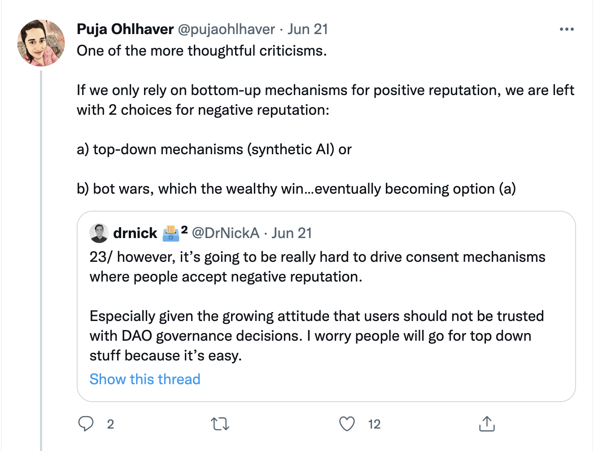

# Multi-dimensional Reputation Systems Using Webs-Of-Trust.

by [Oliver Klingefjord](mailto:oliverklingefjord@gmail.com), [Replabs](https://replabs.xyz). (Berlin)

## Abstract

From the early days of PageRank, to classic reputation systems, to modern platform recommenders – the algorithms that filter and rank content fill the legitimacy void following a faltering trust in old institutions and the information explosion of the internet. These systems have become increasingly de-contextualized and collapse reputation into scalars like followers, retweets, tokens or karma. A proposal for a multi-dimensional web-of-trust based reputation system is suggested, that is implementable on social media platforms with affordances for posting and commenting. Eventually, such a system could grow into a reputation layer for the internet that helps us create the legitimation structures we need to cope with the ocean of information we’re drowning in.

## Introduction

_What is true?_

Some preposterously claim that we’re living in a "post-truth" era. Of course, there never was a "truth"-era. What is often referred to is decaying trust in old legitimization structures like newspapers and universities and an explosion of the amount of content we’re interacting with, and the veracity of which we have to judge. The void of legitimacy created from this has been filled by algorithms and reputation systems that either explicitly or implicitly grant legitimacy.

Both search engines, reputation systems and recommender systems can be considered legitimization structures. Reputation systems grant legitimacy by explicitly showcasing likes, upvotes or karma. Recommenders grant items legitimacy implicitly by ranking them high in a feed. Search engine algorithms like PageRank use hyperlink density as a direct proxy for legitimacy.

All of these systems have their failings; search engine algorithms like PageRank calculate universal reputation scores, collapsing a multi-dimensional reputation landscape into a scalar. Classic reputation systems like those on Reddit and StackOverflow similarily roll up contextualized reputation into a universal "karma" score. Recommenders generate legitimacy as a side-effect from optimizing for engagement, equating virality and credibility.

Thanks to recent advances in NLP, it is now possible to create multi-dimensional reputation systems that allow us to move away from scalar reputation scores and other such simplistic notions.

## What is reputation?

Reputation arguably shouldn’t be used outside of its intended context. The FICO credit score is an example of a reputation score that was widely abused due to its simplicity and false sense of objectivity. The authors of ["Building Web Reputation Systems"](https://www.amazon.com/Building-Reputation-Systems-Randy-Farmer/dp/059615979X) argue on that basis that karma (interpersonal reputation) should be as narrowly applied as possible and never transferable between contexts.

Are there exceptions to that rule? Before elaborating further, let’s break down the notion of context into _scope_ and _type_:

The _scope_ is the size of a "local objectivity". There is no true "objective view" of a person’s reputation – reputation is entirely relational. A universal "musician reputation score" would promote mediocre cookie-cutter pop. To use a machine-learning analogy, it is equivalent to under-fitting a reputation model on a multidimensional reputation landscape. The interesting scenes are troughs and valleys, each with their own notion of what makes a great musician.

"Musician", in the example above, could be seen as a _type_. Any predefined categories ought to be avoided, as the specificity of a type is arbitrary. The world does not neatly fit into the object-oriented ontology championed by the semantic web. Thankfully, language models allow us to move beyond the semantic-web paradigm.

Equipped with this terminology, let’s return to the question; should reputation be portable between contexts?

Due to types being arbitrarily specific, some reputation should arguably be portable across neighboring types. A reputable astrophysicist within the scope of a university should have authority in their judgment of a thermodynamics article, albeit less so than someone of equal caliber who has specialized specifically in that branch of physics.

Reputation should not be ported across scopes. Excelling in a sub-genre of music, like experimental death-metal, should not automatically grant you privileges within the ambient electronic scene – the reputation within these scenes is a function of the people who make up the scene itself. However, the reputation for an experimental death-metal artist could be recalculated for a scope broad enough to incorporate both scenes. The extent of the scope is arbitrary – you could calculate the reputation for musicians in North America. In practice, this would flatten the reputation landscape and produce uninteresting mediocrity. Therefore it is always best to keep the scope as narrow as possible.

## Proposal

What follows is a suggestion for how to construct reputation statements from social media that can be used to create multi-dimensional reputation systems.

In ["Building web reputation systems"](https://www.amazon.com/Building-Reputation-Systems-Randy-Farmer/dp/059615979X), the authors propose an ontology in which the basic building block of reputation systems are "reputation statements" consisting of a claim, a subject and a reputable entity. The subject is most often the user, the claim could be explicit or implicit, and the entity could be another user or an object, like a tweet or an article.

Explicit interpersonal reputation statements are problematic outside of narrow domains like ride sharing apps. The authors thus argue that users of reputation statements should never rate each other directly. However, social media platforms are full of implicit reputation statements. For example, Twitter replies could be seen as an assessment about a certain tweet.



The tweet from `@pujaohlaver` contains semantic information evaluating the information provided in the twitter thread made by `@DrNickA`. This link could be formalized as follows:

```
{
	"comment_author": "@pujaohlaver", // Could be a DID
	"content_author": "@DrNickA", // Could be a DID
	"context": "httpos://twitter.com",
	"content": "Ok, time to start looking at [...]"
	"content_url": "https://twitter.com/DrNickA/status/1539295058888998914"
	"comment": "One of the more thoughtful criticisms [...]"
	"comment_url": "https://twitter.com/pujaohlhaver/status/1539312761091461120"
}
```

These reputation statements would together form a web-of-trust that link users together. The statement above would be an edge in a directed graph, pointing from `@pujaohlaver` to `@DrNickA`. Thanks to recent advances in language models, we can use algorithms like PageRank to dynamically evaluate a type of reputation within the boundaries of a certain scope using the textual information in the comment and the content.

For example, one could query the scope of everyone in a twitter list for the reputation type of "Reputation Systems". A directed graph could be constructed from the reputation statements for all the participants in the scope. The content strings could be converted to language embeddings through an embedding model, and the comment strings could be converted to floating points using a sentiment classifier. The weights for each edge could then be calculated from the cosine similarity between the embedding of the query (in this case, "Reputation Systems") and the content string embeddings, scaled by the sentiment scores.

In the example above, the edge linking `@pujaolhaver` and `@DrNickA` would count positively towards `@DrNickA`'s reputation when queried for "Reputation Systems" as the text in the tweet is semantically close to "Reputation Systems", and the sentiment in `@pujaohlaver`'s reply tweet is positive.

It's important to note that this is a bare-bones example of how such a system could work, and comes with many caveats. For instance, sentiment is an imperfect proxy for an assessment. A thoughtful disagreement should arguably not count towards negative reputation for the content author in the eyes of the comment author.

## Conclusion

An ontology of a web-of-trust consisting of reputation statements with textual information, that can be queried for given a scope and a type using language models is suggested. This system could be constructed using scraped twitter data, but would generalize to any social media platform that allows for posting and commenting using text.
