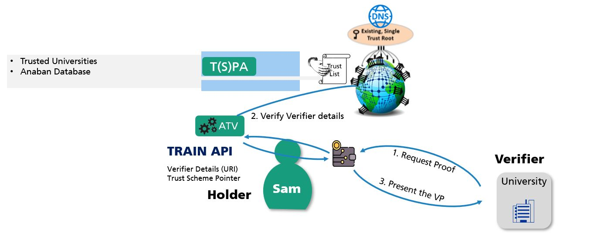

# Trust Registries – Enhancing Interoperability and preventing Phishing/MITM Attacks.

by [Isaac Henderson Johnson Jeyakumar](mailto:isaac-henderson.johnson-jeyakumar@iat.uni-stuttgart.de), University of Stuttgart, Germany & [Michael Kubach](mailto:michael.kubach@iao.fraunhofer.de), Fraunhofer IAO, Germany.

## Abstract 

Trust Registries are one of the inevitable components in governance frameworks to establish trust. Trust Registries help to verify the trustworthiness of the actors behind data interactions by making authorized entities available for query through a trust list. In order to enhance interoperability and trustworthiness of interactions in the Self-Sovereign Identity (SSI) ecosystem in addition to cryptographic enhancements, institutional trust has to be achieved. This is possible through Trust Registries together with a solution to manage these registries across different institutions and trust domains. Currently, for example, there are 135 DID methods listed in the DID spec  and probably many more unregistered ones each following different cryptographic and governance standards. So, based on only the DID method it is impossible to verify the trustworthiness of different parties involved in the ecosystem. In the following section we therefore describe how TRAIN (TRust mAnagement INfrastructure) can be used to verify the trustworthiness of different entities, in addition we describe how interoperability is achieved using ETSI Trust lists and finally a use case describing the verification of trustworthiness of verifiers using TRAIN approach. 

## TRAIN (TRust mAnagement INfrastructure)

TRAIN provides a trust management infrastructure that allows to verify the trustworthiness of involved parties in an SSI Ecosystem. An example would be if a certain issuer is trustworthy (e.g. is it a real bank or just a fake bank).

TRAIN aims to add a trust-component to an SSI ecosystem, that could be structured according to the ESSIF-Framework. This component enables the discovery and verification of lists of trustable parties in the ecosystems (Trust Registries), as well as the definition, consideration, and verification of eIDAS compliance (including LoAs) of involved parties. TRAIN provides a decentralized framework for the publication and querying of trust information. It makes use of the Internet Domain Name System (DNS, DNSSEC) with its existing global infrastructure, organization, governance and security standards to establish the trust discovery process. The trust list format used by TRAIN follows the established ETSI standard that is used for eIDAS trust lists. Hence, easy adoption and interoperability across different trust infrastructures can be achieved.

## Interoperability using ETSI Trust List

TRAIN leverages the ETSI standard TS 119 612 [1] for Trust Lists to facilitate interoperability and adoption. This standard is already in productive use for eIDAS Trust Lists for the identification and verification of Qualified Trust Service Providers (QTSP). eIDAS Trust List compile different accredited Trust Service Providers along with their services in a machine-readable form. For the SSI ecosystem the Trust Service Providers’ equivalent will be trustable (according to the rules and accreditation processes of the respective Trust Scheme/Trust Framework) entities who operate as Issuers, Holders and Verifiers. Entities and services can vary according to the respective requirements and application domains of a certain Trust Scheme. For example: A State authority can be a Trust Service Provider who offers different service like National identity credential issuance, social security number issuance etc. These details are made available through TRAIN Trust Lists in a machine-readable form. Thereby other entities are able to verify the trustworthiness of these entities. For issuers this has already been demonstrated in a proof of concept that is described in detail in the following paper [2]. 

## Verifying the Trustworthiness of Verifiers

Verifiers play a major role in handling sensitive data received by the Holder. A phishing/MITM attack at the verifier side can intercept sensitive user data and the data can be redirected to a malicious attacker. Hence, it is important for the Holder to identity and verify the trustworthiness of the Verifier before transferring user-sensitive data. In the following Figure 1 we consider a scenario where Sam (Holder) applies for a Master’s Program in a University. In this application process he needs to confirm his personal identity and transfer his Bachelor’s transcripts. Before sharing his data, Sam needs to know the trustworthiness of the university. Therefore, Sam’s wallet calls the TRAIN API to verify the trustworthiness of the university by querying the corresponding trust list. Thereby the Holder can validate the compliance with Sam’s trust requirements using the TRAIN API based on its configuration before sharing sensitive data to the verifier (the university). 

Figure 1: Verification of Verifiers using TRAIN Infrastructure

## TRAIN Outcomes
An illustrative interoperability use case for the European Health Insurance Card (EHIC) has been realized and demonstrated with SICPA SA and Validated ID [3]. The latest draft of OpenID Connect for Verifiable Presentations (OIDC4VC) [4]contains informative implementation guidelines describing how issuers, holders and verifiers can utilise the TRAIN trust scheme approach. TRAIN approach was also used to develop a Proof of Concept (PoC) for Global Covid Certificate Network (GCCN)  an initiative by Linux Foundation for Public Health (LPFH) to identify the trustworthiness of Covid Credentials on a global scale[5].

## References

[1]	ETSI: Electronic Signatures and Infrastructures (ESI), ‘General Policy Requirements for Trust Service Providers’. ETSI, Sophia Antipois Cedex, France, European Standard ETSI EN 319 401, 2016. [Online](http://www.etsi.org/deliver/etsi_en/319400_319499/319401/02.01.01_60/en_319401v020101p.pdf.)

[2]	I. H. J. Jeyakumar, D. W. Chadwick, and M. Kubach, ‘A novel approach to establish trust in verifiable credential issuers in Self-sovereign identity ecosystems using TRAIN’, In: Roßnagel, H., Schunck, C. H. & Mödersheim, S. (Hrsg.), Open Identity Summit 2022. Bonn: Gesellschaft für Informatik e.V.. (S. 27-38). DOI: 10.18420/OID2022_02.

[3]	V. M. Jurado, X. Vila, M. Kubach, I. H. Johnson, A. Solana, and M. Marangoni, ‘Applying assurance levels when issuing and verifying credentials using Trust Frameworks’, In: Roßnagel, H., Schunck, C. H. & Mödersheim, S. (Hrsg.), Open Identity Summit 2021. Bonn: Gesellschaft für Informatik e.V.. (S. 167-178)., p. 12.

[4]	‘OpenID Connect for Verifiable Presentations’. https://openid.net/specs/openid-connect-4-verifiable-presentations-1_0-07.html (accessed Feb. 11, 2022).

[5]	‘Global COVID Certificate Network (GCCN)’, Linux Foundation Public Health, Jan. 12, 2022. https://www.lfph.io/global-covid-certificate-network/ (accessed Jan. 12, 2022).

