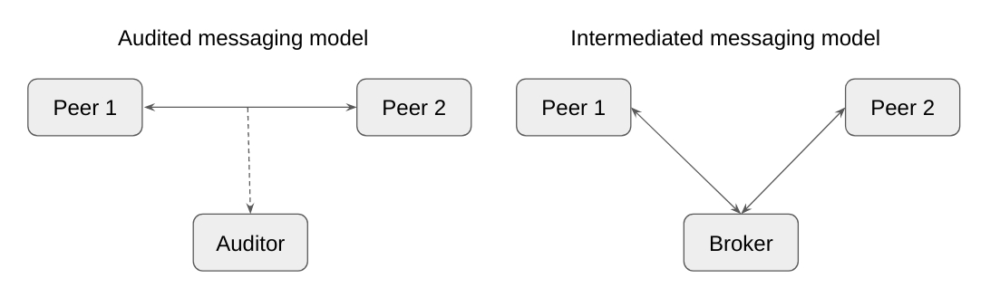

# Audited DIDComm connections

By: Fabrice Rochette ([2060.io](https://2060.io))
Date: Aug 12, 2022
Version: 1.0

DIDComm is a promising technology that could potentially become an universal way of connecting people (and their devices) and exchanging messages between them.

Up to now, most use cases with this technology involve peer to peer interactions between two parties that need to privately exchange data regardless of the underlying transport mechanism they use. These scenarios consider that, even if the messages between them could be handled by other parties for transport purposes, they are end-to-end encrypted so no one apart from the sender and the recipient can read the contents.

However, there are certain situations where it might be useful (or even required) to include a third-party that could be able to audit or mediate these interactions. Such third-party could therefore read these interactions and keep an history of the interaction between the two parties involved in the connection.

This _intermediary_ or _broker_ is trusted by both parties and could take the required measures to ensure that they meet the requirements to establish the connection, in such a way that the two parties might delegate on it the identity verification. Actually, probably they won't even care of who the other party are, but will be interested on their capabilities to reach the goal of the communication.

It could be interesting to analyze two different messaging models that might apply better for some or other cases: the audited and the intermediated (or proxy) message model:

## A real-world use case

To better explain the usage of these intermediaries, we can think of a technical support communication channel where end-users connect and authenticate theirselves. Then, according to their profile and needs, a support ticket is created and will be handled by any available operator. It might occur that for some reason such operator must drop the connection (e.g. goes offline or lack of technical knowledge) so they can pass it to another one. With this scheme, this can happen in a transparent way for the end-user, who probably won't even notice of this change.

The operator who takes the ticket can query the case history from the intermediary agent and then resume the conversation.

By using a mechanism like this one, end users can connect to their service providers by using their favourite DIDComm-capable agent, as the same can be the case of the operators. This would minimize the costs for the service providers and accelerate the learning curve of users, who will not need to learn a new software or enter a different website.

## Not only for text messaging

Currently, in practice DIDComm is mainly used for VC issuance/presentation and basic text messaging. This could be enough for simple scenarios, but certainly it will become important to add more capabilities to enrich the communication channel in this three-way channel.

Fortunately, DIDComm is extensible and new protocols can be created to bootstrap other protocols that all parties can access and track, such as:

- Audio and video messages
- Document exchange
- Call establishment

## Prior and current art

This audited DIDComm concept can be related to the n-wise relationships discussed in [1] and mentioned in Peer DID specification [2], probably extending from it. There is an interest of adding n-wise to DIDComm v3 [3], which would make it convenient for discussion.

## References

[1]: [Pairwise to N-Wise](https://docs.google.com/document/d/1BjYdivGQ9GxIz9CJ2ymNvMA68uHZm8bFOTyCHDmziOU/edit#heading=h.yu93zlafugmn)
[2]: [Peer DID Method Specification](https://identity.foundation/peer-did-method-spec/#how-peer-n-wise-relationships-are-built-and-used)
[3]: [DIDComm v3 Wishlist](https://hackmd.io/Lm6_x4GDQW-q3VuMN2wEvw)