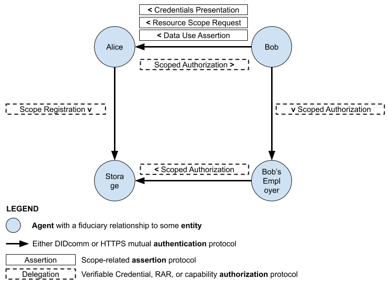

**Delegated Authorization - The Alice to Bob Use Case**

By: Adrian Gropper (agropper@healthurl.com)

Identity, identifiers and credentials are not an end in themselves. They are essential ingredients, among others, for practical transactions involving multiple parties. Decentralization challenges transaction protocols that support self-sovereignty for individuals in highly asymmetric relationships with institutions. The Alice to Bob Use Case merges the SSI and open authorization domains to speed adoption of emerging standards while also promoting decentralization.

**Illustrated Relationship Among Four Typical Self-Sovereign Entities**

**Use Case Description**

Alice is a typical patient. Alice wants to control and share some attributes that have to be streamed or queried directly from a third party storage, typical of medical imaging or large structured data sets like a health record, or a continuous heart monitor. Alice wants the storage to communicate directly with various others but also wants to retain her right to multiple aliases to manage unwanted correlation among various storage entities.

Bob is a typical doctor. He has many public credentials as well as private attributes such as contact info. Bob was not known to Alice at the time her attribute is created by a storage service provider such as an imaging center or hospital. Bob wants to negotiate a scope of attribute access with Alice while minimizing the sharing of his private attributes with Alice. Bob uses his public credentials as part of this negotiation with Alice and also as a non-repudiable way to sign prescriptions and other attributes pertaining to Alice.

In the typical case,

- --Alice may or may not yet have a DID when she first interacts with the storage. She typically identifies herself though a routable credential restoration endpoint such as an email address associated with one of her aliases. Alice may not need a DID at all or could choose to adopt a DID if there&#39;s a good reason.
- --Bob needs a DID to prove his credentials and to link them to non-repudiable signatures in his work. Bob has a smartphone that he uses as a secure element to facilitate these signatures.
- --To access the store of Alice&#39;s attributes, Bob typically is using a client that is under the control of some other entity. Bob may be authenticated into his client using his DID or via more traditional means.
- --Bob wants to be able to delegate access to Carol, another doctor, when she is covering his practice. Alice does not need to know about this delegation.
- --The storage entity is subject to various requirements when either Bob or Carol present a client and their scope of access request. In some cases, the store modifies the scope of access and may need to notify Alice that the scope of a request about her was modified.
- --Alice wants to keep separate aliases in her dealings with different stores unless a controlled substance or other reason for verified identity is mandated.

**References**

- Daniel Hardman on PeerDIDs [https://ssimeetup.org/peer-dids-secure-scalable-method-dids-off-ledger-daniel-hardman-webinar-42/](https://ssimeetup.org/peer-dids-secure-scalable-method-dids-off-ledger-daniel-hardman-webinar-42/)

- Transactional Authorization [https://tools.ietf.org/html/draft-richer-transactional-authz-03](https://tools.ietf.org/html/draft-richer-transactional-authz-03)
- IETF OAuth RAR PAR [https://oauth.net/events/2019-11-ietf106/](https://oauth.net/events/2019-11-ietf106/) and [https://medium.com/oauth-2/rich-oauth-2-0-authorization-requests-87870e263ecb](https://medium.com/oauth-2/rich-oauth-2-0-authorization-requests-87870e263ecb)
- OpenID Foundation FAPI [https://bitbucket.org/openid/fapi/issues/275/adopt-par-rar-as-recommended-way-to-convey](https://bitbucket.org/openid/fapi/issues/275/adopt-par-rar-as-recommended-way-to-convey)
- Encrypted Data Vaults [https://www.dropbox.com/s/7d9ptf9lsvhyro7/encrypted-data-vaults-SoC-Highlights.pdf?dl=0](https://www.dropbox.com/s/7d9ptf9lsvhyro7/encrypted-data-vaults-SoC-Highlights.pdf?dl=0)
- Daniel Hardman (Aries) Agent Definition [https://github.com/hyperledger/aries-rfcs/blob/master/concepts/0004-agents/README.md#essential-characteristics](https://github.com/hyperledger/aries-rfcs/blob/master/concepts/0004-agents/README.md%23essential-characteristics)
- WebID [https://www.w3.org/wiki/WebID](https://www.w3.org/wiki/WebID)
- Hub Specification Planning [https://hackmd.io/PcPM0ecNS6W3fnZmAz\_03Q?view](https://hackmd.io/PcPM0ecNS6W3fnZmAz_03Q?view)
- Identity Hubs as PDS [https://techcommunity.microsoft.com/t5/Azure-Active-Directory-Identity/Identity-Hubs-as-personal-datastores/ba-p/389577](https://techcommunity.microsoft.com/t5/Azure-Active-Directory-Identity/Identity-Hubs-as-personal-datastores/ba-p/389577)
- DID and DID Use Cases [https://w3c.github.io/did-use-cases/](https://w3c.github.io/did-use-cases/)
- Verifiable Credentials [https://w3c.github.io/vc-data-model/](https://w3c.github.io/vc-data-model/)
