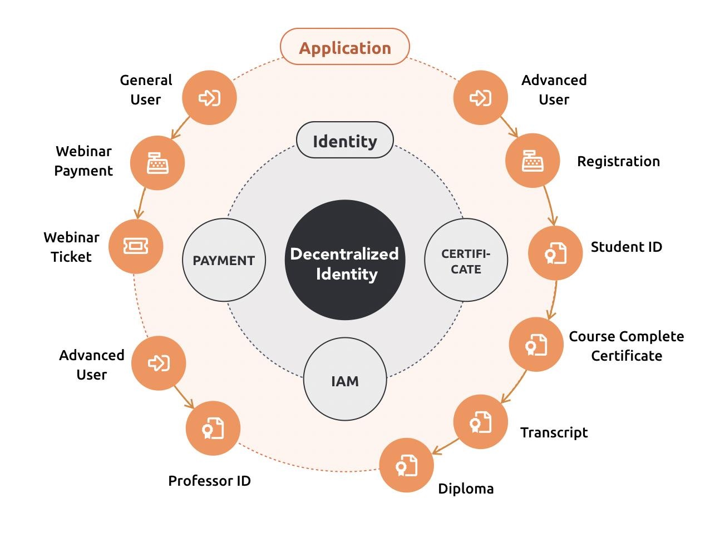

This is a proposed collaborative paper to be completed at [RWOT 2022](https://rwot11.eventbrite.com/), Den Haag, Netherlands, 26-30 September. 

# DID Connect, connecting people, devices and applications via DID and Verifiable Credentials

By: Robert Mao [ArcBlock](https://arcblock.io)  
Date: Jul 10, 2022
Version: 0.1

##  Introduction

DID Connect is a suite of RESTful APIs, UX components and SDK that provide a framework for DID interactions, connecting people, devices and applications via DID and Verifiable Credentials.

DID Connect allows for clients of all types including browser-based, mobile, and javascript clients, to request and receive information about identities and the presentation of Verifiable Credentials.  DID Connect focuses on the end users experience and applications, it’s independent to specific DID method implementations. 

## Inspiration and previous works

DID Connect is Inspired by [Facebook Connect](https://developers.facebook.com/blog/post/2008/05/09/announcing-facebook-connect/), [OpenID Connect](https://openid.net/wg/connect/), [WalletConnect](https://walletconnect.com), [Sign-in with Ethereum](https://login.xyz) and other similar services.

Facebook Connect is a set of APIs launched by Facebook in 2008 that enables users to log on to third-party websites, applications or devices using their Facebook identity.  Facebook Connect was very successful after its debut and contributed significantly for its growth, however Facebook seems to have abandoned the “Facebook Connect” brand recently and the feature remains as a part of its SDK. 

Since then, Google, LinkedIn, Twitter all developed a sort of similar service and compete with each other. 

Even though Facebook Connect is an exact opposite example as a centralized identity service, the smooth end-user experience and easy-to-integrate developer experience is something Decentralized Identity community should adopt.  

OpenID Connect is a suite of RESTful APIs  that provide a framework for identity interactions, it allows for clients of all types including browser-based, mobile, and javascript clients, to request and receive information about identities and currently authenticated sessions. 

WalletConnect is the protocol and service connecting mobile blockchain wallets to dapps, it was developed for Ethereum only but it’s expanding to other blockchains recently. Sign-in with Ethereum is a new form of authentication that enables users to control their digital identity with their Ethereum account and ENS profile instead of relying on a traditional intermediary.  Sign-in with Ethereum usually works together with WalletConnect and is very Ethereum centric. 

There were some now inactive projects that tried to solve similar problems, e.g.  UniLogin (aka UniversalLogin), uPort. And also some proprietary solutions, such as Global.id, Civic, etc. 

We have built DID Connect and iterated for 2 major versions and open sources all the design and code.  We wish to work together with the DID and open source community to keep improving DID Connect and make the DID user experience excellent for consumer users and developers. 

## Protocols

[TBD]

## UX design Components

We believe the user experience is the important winning factor for any identity products, thus an open, standard, extensible yet simple to adopt user experience design is crucial. 

[TBD]

## Framework and SDK

Even though anyone can implement DID Connect from scratch by simply following the standard, it will be much more convenient to just use ready-made frameworks and SDKs to make adoption easier. 
[TBD]

## Extensibility 

DID Connect needs to provide extensibility since the DID allows infinite provider methods, the standard protocol, UX component and SDK can only cover the core scenarios, if a method providers create new innovative experiences, they want to be able to reuse the existing framework and add their customized features. 

[TBD]

