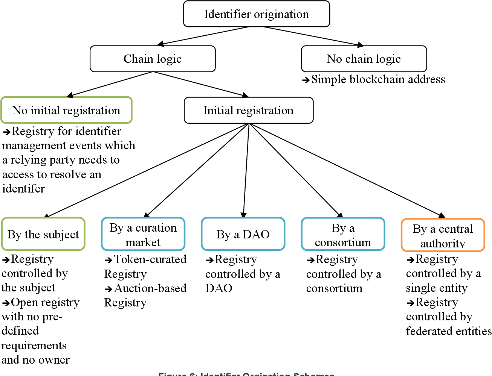

# DID Traits

Proposed collaborative paper initially authored by [Charles Cunningham](https://github.com/chunningham) to be completed as part of the RWOT 2022 in The Hague, Netherlands 26-30 September.

## Abstract

The DID specification describes a common interface which myriad Identifier systems can implement to different degrees. It provides a powerful abstraction over many implementations, but making use of DID Methods still requires some knowledge of the underlying implementation characteristics for many use cases.

For example, service endpoints as described in the DID specification are a useful tool for some types of application to build with, enabling a means of service discovery given only a DID. Many DID methods cannot support this feature (e.g. \`did:key\`) as they have immutable DID Documents. This is not a problem to be solved, but an illustration of the distinctions that can be made between DID methods which might be considered for different use cases when building with DIDs.

## Introduction

DID Traits are feature sets for DID methods which require the method to have certain characteristics. Example traits include Service Endpoint support and JWS signature support. Example characteristics include Mutability and JWK support. A DID Method with the Mutability characteristic will be better able to implement behaviour/trait of Key Rotation.

## Prior Art

### [DID Method Rubric v1.0](https://www.w3.org/TR/did-rubric/)

Evaluates the level of decentralisation for a DID Method in several categories. The Security and Privacy sections are particularly relavent to this document and represent a good starting point.

### [A Taxonomic Approach to Understanding Emerging Blockchain Identity Management Systems](https://csrc.nist.gov/publications/detail/white-paper/2020/01/14/a-taxonomic-approach-to-understanding-emerging-blockchain-idms/final)

NIST 2020, classifies various SSI and Blockchain IDMSs taxonomically based on architecture and other properties.

## Goals

The Goal of this document is to categorise different kinds of DID methods based on their behaviour along various axis, in order to enable reasoning about which DID methods are technologically suitable for a given use case or set of requirements. For example, use cases involving 

## Characteristics

Figure 6 from Lesavre et al, showing the relationship between trust architecture and Identifier creation in Identity Management Systems.

### Mutability

One characteristic which strongly divides methods into two categories is mutability. Immutable DID Methods are those where the resolution result is constant for a given DID, while mutable methods are those whose result can change over time. For most of this document, we will consider mutable DIDs.

#### Immutable DIDs

Immutable DID Methods typically derive their identifiers cryptographically from a constant keypair in such a way that the DID can be used to generate the entire DID Document. This behaviour prevents them from natively supporting features such as key rotation, however it does make them suitable for a wide range of use cases which benefit.

## Traits

### Registration Requirements

#### Pre and Post conditions

### Inception and Update

#### Controller Updates

### Key and Verification Method Type support

#### JWK and JWS

#### Linked Data Proofs

#### Selective Disclosure

#### Other

### Historical State Inspection

#### Timestamps

### State Proofs

### Extended Semantics Support

#### Same As

#### Controller

### Service Endpoint support

### Resolver consistancy and provenance guarentees

#### Cachability

