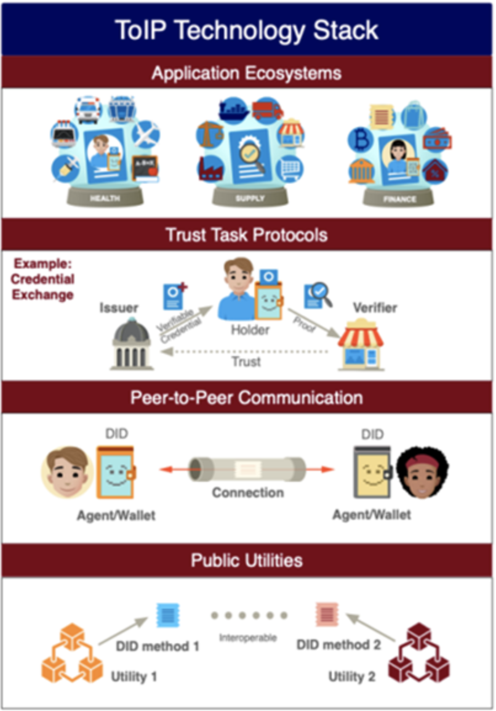

This is a proposed collaborative paper to be completed at [RWOT 2022](https://rwot11.eventbrite.com/), Den Haag, Netherlands, 26-30 September. 

# How can we live with multiple exchange profiles in an ever evolving world

By: Snorre Lothar von Gohren Edwin [Diwala](https://www.diwala.io/)  
Date: Jul 19, 2022
Version: 0.1

##  Introduction

We have 4 core layers of of SSI

These layers now have many [standards around them](https://whimsical.com/decentralized-mapping-exercise-CUhk3dT4RUZvGa4Lt7rNvD) and in a perfect world we would love all of them to be able to communicate with each other, so that we can bring our own wallet or device into an ecosystem and it just works!

To be able to get to that level of interoperability, there have been discussions on profiles such as [WACI-didcom](https://identity.foundation/waci-didcomm/). But how can one know what type of tech the other end is talking. Can we have some discovery mechanisms?

This type of exchange mechanism has also been mentioned in emails circumventing the ecosystem these days. See email from Anil, last Friday, 2:53AM - https://share.streak.com/iOqp68goUoEMZz96yCKlWM

## Inspiration and previous works

During [IIW #34](https://internetidentityworkshop.com/past-workshops/?mc_cid=ad27bbe93c&mc_eid=268fa922fc), see PDF proceeding #34 and page 185, there was a discussion on if its possible to solve the bring your own wallet problem. During this session there were talks about a discover handshake mechanism to explore the capabilities of the webpage you are talking to. Meaning wallets would most likely be supporting multiple profiles and webpages have a bit easier world.

There were also other companies having explored the same issues during their work, and had a self implemented protocol to do this discovery. Right now I dont have that persons name or contact information, but he was part of the session at IIW, and came from Europe, UK potentially.

The wish is to continue this discussion and see where it brings us, find the rabbit holes or reasons for why this is not working! Even better, find out why this makes sense to have!

## Protocols

[TBD]

But the list we know of today is [CHAPI](https://github.com/w3c-ccg/credential-handler-api/), [Didcomm](https://didcomm.org/), [OIDC](https://openid.net/wordpress-content/uploads/2021/09/OIDF_OIDC4SSI-Update_Kristina-Yasuda-Torsten-Lodderstedt.pdf)

## Framework and SDK

What is the outcome of something like this? Is it a software package people can use to signal their profile? Exchange a data model to understand what is going on on the other side?
[TBD]

## Research Questions 

Is this even feasible?
Does this make sense to look at or are we going into a rabbits hole that dont make sense?

[TBD]

