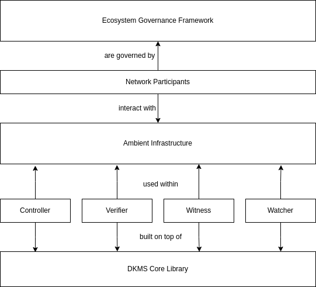

# DKMS for SSI
Essif-lab IoC#3 subgrantee:

- Robert Mitwicki robert.mitwicki@humancolossus.org
- Michal Pietrus michal.pietrus@argonauths.eu
- Philippe Page philippe.page@humancolossus.org

## 01 Introduction
Decentralised authentication provides a powerful mechanism for any peer-to-peer interaction, whether human-to-human or human-to-service. One party, the authenticator, authenticates the other party, the authenticatee, by conducting the verification process upon the cryptographic material the authenticatee provides to prove her capabilities. The method relies on verifying cryptographic material through an object we call a provenance log. This log is all that authenticatee needs to provide. 

This leads to clear symplifications:
- ~~identifier interoperability,~~
- ~~data provenance,~~
- ~~data-intensive event streaming,~~
- ~~event sourcing applications.~~

**Key management** refers to the management of cryptographic keys in a cryptosystem, dealing with the generation, exchange, storage, use, crypto-shredding and replacement of keys. It includes cryptographic protocol design, key servers, user procedures, and other relevant protocols.

**Decentralised Key Management System (DKMS)** project, initiated under the eSSIF-Lab, leverages the Key Event Receipt Infrastructure (KERI)[2] to build API Ecosystem Librairies for Self-Sovereign Identity (SSI) developers. Thus giving developers an access to a fully decentralised identifier system to achieve network interoperability while securing the identifiers when developing SSI solutions.

The quest for decentralised authentication is how a decentralised key management infrastructure, providing Self-certifying Identifier (SCI) issuance underpinned by one-way cryptographic functions, can offer information uniqueness from captured entropy. Furthermore, a decentralised authentication system must be platform-agnostic, with its identifiers interoperable across ecosystems, platforms, and networks.

## 02 Current status
At the time of writing, the DKMS is still on the active development phase and implemented a minimum set of features. The identifiers creation and management is stable but the infrastructure is still likely to evolve. 

The DKMS infrastucture is a novel approach to a cryptographically anchored information dissemination. The overall set of features allow network participants to establish and manage their identifiers from one side and from another to cryptographically verify the identifiers of others. On top of that a simple, yet powerful, OOBI mechanism was introduced to leverage discoverability.

### 02.1 Controller network
In the Controller network, Controller establishes his identifiers and interacts with Witnesses The use case dictates a DKMS network topology.The Controller is able to:

- establish and manage his identifiers;
- promulgate local identifiers changes to Witnesses for getting the receipts;
- promulgate received receipts to the other Witnesses (see Dissemination of Witnesses receipts among other identifier Witnesses)

### 02.2 Validator network
In the Validator network, Controller becomes the Validator so in essence only the context changes (also in this sense no additional library is needed). In the Validator network, Controller relies on the set of its Watchers that play altogether to serve the Validator Controller purposes and provide meaningful information like KEL's and their receipts. The Validator then is able to
- subscribe/unsubscribe to/from Watcher by issuing OOBI's. Furthermore each identifier gets its own set of Watchers.
- send any other Controller identifier OOBI to his own set of Watchers. These Watchers then resolve provided OOBI and try to fetch identifier KEL and its receipts. If they succeed, they furthermore perform KEL verification. Last but not least, they verify received receipts and making sure that the amount of received receipts satisfy the required amount specified in KEL.
- Conduct the end-verification of identifier KEL using information got from Watchers

### 02.3 Links to current code
| Library | Link |
| -------- | -------- |
| DKMS core library| https://github.com/THCLab/keriox|
|DKMS Watcher component|https://hub.docker.com/r/humancolossus/keriox-watcher|
|DKMS Witness component|https://hub.docker.com/r/humancolossus/keriox-witness|
|JavaScript/Typescript (Node.JS via NAPI) |https://github.com/THCLab/keri-bindings/tree/master/bindings/node.js|
|Dart|https://github.com/THCLab/keri-bindings/tree/master/bindings/dart|

The DKMS core library is being developed based upon the RFC's[9,10,11,12].

## 03 Current developments
### 03.1 Interoperability
To effectively manage interoperability of identifiers, DKMS requires a governance for shared security responsibility principle. Controllers (members of groups) in the network need sophisticated mechanisms to interact and eventually sign various types of messages in an asynchronous manner.
One of the proposal for this RWOT is to workout the interoperability mechanism between identifiers hosted on an Indy network and a ledger less HCF trust infrastructure. 

### 03.2 Discovery mechanism
Further developing the discovery mechanisms [4,5,6,7,8]

### 03.3 RWOT 11 plan
At RWOT we will focus on:
a) Working out an interoperability PoC with other participants
b) Addressing a key internal risk of decentralised authentication, impersonation of the controller through *guardianship* and *delegation*.

# References

* [1] DKMS-4SSI EU Grant No.
* [2] Smith,Samuel "Key Event Receipt Iinfrastructure (KERI) design" v2.60 2021/05/07; https://arxiv.org/abs/1907.02143
* [3] Smith, Samuel "The Universal Identifier Theory"

**Discovery Protocoles**

* [4] https://crates.io/crates/kademlia-dht
* [5] https://crates.io/crates/kad
* [6] https://www.scs.stanford.edu/~dm/home/papers/kpos.pdf
* [7] https://joearms.github.io/published/2015-06-19-Mutable-Value_Chains.html
* [8] RWOT 11 https://weboftrust.github.io/ietf-oobi/
* [9] IETF https://www.ietf.org/archive/id/draft-ssmith-cesr-02.html
* [10] IETF  https://www.ietf.org/archive/id/draft-pfeairheller-cesr-proof-00.html
* [11] IETF https://www.ietf.org/archive/id/draft-ssmith-oobi-00.html
* [12] IETF https://www.ietf.org/archive/id/draft-ssmith-said-02.html

**Guardianship**
* [13] Sovrin Foundation https://sovrin.org/wp-content/uploads/Guardianship-Whitepaper2.pdf
* [14] Knowles,Paul; Mitwicki,Robert; Page,Philippe ADD Links
* [15] Page,Philippe; Knowles,Paul; Mitwicki,Robert "Distributed Governance" ADD Links

