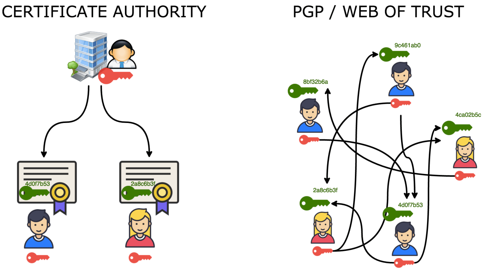
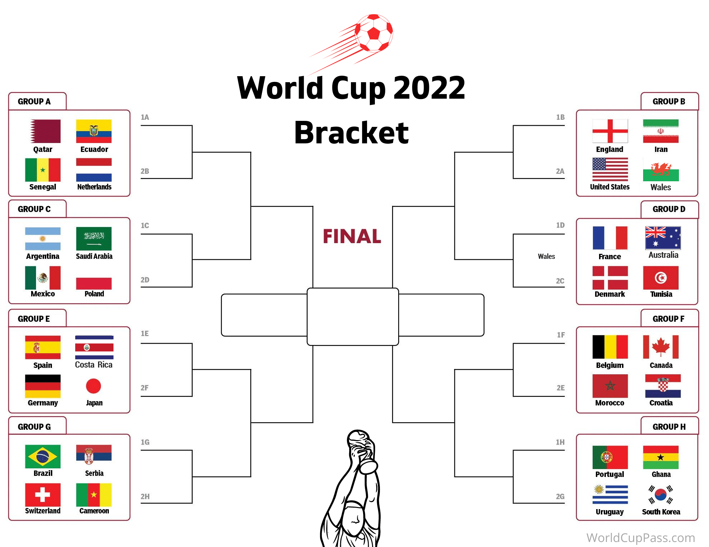

# Web of Trust, The Sequel: What We Can Learn from the World of Sports, Tinder, and Netflix to Build Dynamic & Decentralized Reputation

## Collaborators

[Ankur Banerjee](https://twitter.com/ankurb), CTO/co-founder at [cheqd](https://cheqd.io)

*Note:* All images are sourced from permissive-license sources (wherever possible)

## Context

### Web of Trust, As We Know It, Is Flawed

*Figure 1: Original Web of Trust illustrated ([source](https://bitcoinmagazine.com/technical/bitcoin-and-trust-are-equally-unavoidable))*

The core concept behind the [original Web of Trust](https://en.wikipedia.org/wiki/Web_of_trust) is based on actors (through cryptographic keys) vouching for each other. Quoting directly from Phil Zimmerman (emphasis mine):

> **As time goes on**, you will accumulate keys from other people that you may want to designate as trusted introducers. Everyone else will each choose their own trusted introducers. And everyone will gradually accumulate and distribute with their key a collection of certifying signatures from other people, **with the expectation that anyone receiving it will trust at least one or two of the signatures**. This will cause the emergence of a decentralized fault-tolerant web of confidence for all public keys.

#### Reputation should often *naturally* decay over time

Proof-of-authority systems like the one above often model for **reputation to go in only one direction: *upwards***. Actors who have been around longer gather more "stamps" of approval. This can be an issue because:

1. What if the actor was *once* reputable, but has had a change of heart on their morals? Or, in the case of companies, been [acquired by new owners who have a vastly different ethical/reputational stance](https://www.msn.com/en-gb/money/other/analysis-ben-26-jerrys-unilever-fight-shows-risks-of-ceding-control/ar-AA10HBn9?fromMaestro=true)?
2. Although the *ideal* of such decentralised PKI/reputation systems is to decentralise control so that no single actor becomes too powerful, [the reality is that such power tends to coalesce towards a handful of actors](https://w3techs.com/technologies/overview/ssl_certificate). How can we escape the pull towards formations of [natural monopolies](https://en.wikipedia.org/wiki/Natural_monopoly)?
3. Regardless of whether once-trustworthy actors start behaving like their evil-twin-from-another-dimension, high-reputation actors become *even more valuable* targets for hacks, such as when [Wired writer Mat Honan lost much of his online presence due to hackers wanting to take control of his three-letter *@mat* Twitter handle](https://www.wired.com/2012/08/apple-amazon-mat-honan-hacking/).

#### Doesn't *meaningfully* capture the multidimensional nature of reputation

Records of which keys/handles/identifiers vouch for others only goes so far as to say *I believe this key/handle/identifier is trustworthy*. That doesn't model the multi-faceted way in which humans interpret reputation:

1. A person could have a *stellar* reputation as a skilled doctor/engineer/teacher/artist/(insert profession here)...but have a *terrible* reputation in other aspects of life, e.g., credit score, being a good parent, ability at swimming, etc.
2. A company could be [delivering great returns to shareholders](https://ycharts.com/companies/AMZN/pe_ratio) but have a [terrible reputation for ESG (environmental, social, governance)](https://www.marketwatch.com/story/amazon-is-proof-of-a-major-weakness-in-esg-ratings-11636553274) or worker rights.

This is highlighted in previous RWOT proceedings, such as [the discussion on Anonymous Credentials in Sovrin](https://github.com/WebOfTrustInfo/rwot3-sf/blob/master/topics-and-advance-readings/anonymous-credentials-in-sovrin.md#trust-establishment):

> Sovrin also supports reputation events. These transactions may be public (unencrypted) or private (encrypted) and can support any type of reputation assertion. At the most basic level, reputation events enable an observer to trust that the ledger entry identifying an Issuer really is the issuer. This bootstrapping of trust could of course also be established "off-ledger", **for example by pointing to the Sovrin ledger entry from the Issuer’s website or distributing an X.509 certificate of the Issuer’s public key**.

But, trusting an X.509 certificate or a DID *on its own* doesn't contain enough semantic information on whether to trust the issuer *on that particular topic*.

### Reputation lies in the eyes of the beholder

Even if there was a model to capture multi-dimensional reputation, what *is* trustworthiness or reputation, anyway?

1. Extending that example of company ratings/certifications, [should oil & gas companies count in ESG stocks](https://moneyweek.com/investments/investment-strategy/605229/the-irresistible-rise-of-esg-investing)? Is it better if a coffee brand is [Fairtrade or Rainforest Alliance certified](https://sustainability.stackexchange.com/q/6262/14293)?
2. Wildly different [approval ratings for politicians such as Donald Trump](https://news.gallup.com/poll/328637/last-trump-job-approval-average-record-low.aspx), based on political affiliation.

It is extremely tempting, like [Vitalik Buterin and other authors of the "soul-bound tokens" paper](https://papers.ssrn.com/sol3/papers.cfm?abstract_id=4105763) did, to try build "on-ledger" reputation systems that provide a single "source of truth" for reputation. What this misses is *if I'm a professional in a certain field, my clients may want to check my professional skills, but they have no business also knowing my credit-worthiness*.

## Taking a Page Out of Sports Rankings

How could we find a *decentralized* mechanism for reputation that addresses the shortcomings outlined above? The answer could lie in similar complex systems in the field of sports.

Ranking systems for chess, tennis, football, video games etc often rank players/teams using a system called [Elo ratings](https://en.wikipedia.org/wiki/Elo_rating_system). This is done by [modelling interactions as a series of zero-sum games, where at a basic level](https://medium.com/purple-theory/what-is-elo-rating-c4eb7a9061e0):

> - If the higher-rated player wins, a few points are taken from the lower-rated player.
> - If the lower-rated player wins, a lot of points are taken from the higher-rated player.
> - If it’s a draw, the lower-rated player gains a few points from the higher rated player.

A more common term that some may know these systems is *brackets* or *playoffs*, as [visualised below from a FIFA Football World Cup 2022 bracket chart](https://worldcuppass.com/bracket/)...

### An unlikely inspiration from Tinder and Netflix

To understand how this concept could apply to dynamically bootstrapping a reputation system, we can [take a look at how Tinder used Elo ratings to rank profiles](https://www.theverge.com/2019/3/15/18267772/tinder-elo-score-desirability-algorithm-how-works) in their app. Essentially:

1. If any two users *both* swiped right on each others' profiles, it count as a "win" in Elo rating terms.
2. Similarly, *both* users swiping left counted as a loss.
3. If one user swiped right and the other left, that would count as a loss too - but would have a different impact on rankings based on their relative rankings.

It is worth acknowledging that sometimes such Elo rating systems can be gamed, and if designed badly, can lead to inequitable outcomes. (Tinder [moved away from using Elo ratings](https://www.tinderpressroom.com/powering-tinder-r-the-method-behind-our-matching/) themselves.)

Another example of this is how [Netflix moved from stars to a thumbs-up/thumbs-down rating system](https://about.netflix.com/en/news/goodbye-stars-hello-thumbs) (sometimes called a "Nero rating system", after the Roman emperor), essentially turning their rating signals to a zero-sum game between *their estimate* of how much they think a viewer will enjoy a title *versus* how what the viewer rated it as.

The key insight there was that [given a 5-point rating system, people gravitate either towards 1 or 5](https://ux.stackexchange.com/questions/4200/rate-vs-like-dislike): the rating scales in the middle see much fewer choices being made. This is not an isolated example: [YouTube came to the same conclusion and switched to Nero ratings](https://techcrunch.com/2009/09/22/youtube-comes-to-a-5-star-realization-its-ratings-are-useless/). [Uber driver ratings below 4 are basically a strong enough signal to kick a driver off the platform](https://www.businessinsider.com/leaked-charts-show-how-ubers-driver-rating-system-works-2015-2), since 

### Applying Elo ratings to decentralized reputation

A decentralized reputation system could similarly bootstrap ***reputation scores per topic or attribute*** much faster than trying to accumulate "stamps" over time. The benefits this offers are:

1. Reputation scores could go *up* as well as *down*.
2. Elo ratings naturally decay over time due to inactivity, just like how sportspeople who drop out of a sport drop out of league tables. Applied to reputation, this provided a sliding time window over which reputation could decay.
3. Crucially, even "new", low-ranked actors in a certain domain could trigger a reputation event that states *This higher-ranked actor is no longer nice*. On their own, a *single* lower-ranked actor couldn't significantly impact a higher-ranked one - which prevents [Sybil attack](https://en.wikipedia.org/wiki/Sybil_attack) scenarios. But, given *enough* actors stating positive/negative experiences, scores will change over time.
4. This does *not* mean an actor has a single reputation score - or a single score on how trustworthy their key/handle/identifier is. They could *dynamically* maintain *different* reputation scores on different topics. E.g., a company could have a high "buy" rating for their stock on financial metrics, but a low reputation on ESG. These can tied to Decentralized Identifiers (DIDs), for example, and assessed by the beholder differently.
5. Doesn't *necessarily* need to be on-chain. It could be off-chain/off-ledger and shared on a case-by-case basis: the same way Verifiable Credentials are.
6. **Finally** a potential alternative to the question *How do I know this issuer/DID is trustworthy?* instead of sharing lists of trusted DIDs manually or [`.well-known` DID configuration](https://identity.foundation/specs/did-configuration/) which is *basically* back to relying on centralised PKI / domain name reputation.
7. Extending that same idea, it could also apply to *trust frameworks*, *governance frameworks*, *schemas* etc. When a verifier is presented a credential from an isssuer/framework/schema they have never seen before, they can dynamically query the Elo rating based reputation score of each of those *on that particular topic/domain* and assess whether to trust the credential.

## Closing comments

Obviously, there are *lot* of things to map out on how to make this work in technical implementation, threat-modelling scenarios such as Sybil resistance, and ensuring there are safeguards to prevent unethical behaviour. I would love to collaborate at RWOT to map out other pros/cons not listed here.

However, this model could provide a *radically* different reputation model than centralised PKI, WOT-based decentralised PKI, or soul-bound tokens / SBTs (which offers no consent-led mechanisms to *reject* malicious reputation statements).

## References

### Worth reading

1. 

### Related submissions for RWOT11 The Hague

1. [A Minimal Approach to Linked Trust with Uncertainty](https://github.com/WebOfTrustInfo/rwot11-the-hague/blob/master/advance-readings/a-minimal-approach-to-linked-trust-with-uncertainty.md) by Golda Valdez

### Relevant previous RWOT proceedings

#### RWOT1 San Francisco

1. [Decentralized Cooperation needs Decentralized Reputation](https://github.com/WebOfTrustInfo/rwot1-sf/blob/master/topics-and-advance-readings/DecentralizedCooperationNeedsDecentralizedReputation.md) by Noah Thorp

#### RWOT3 San Francisco

1. [Anonymous Credentials in Sovrin](https://github.com/WebOfTrustInfo/rwot3-sf/blob/master/topics-and-advance-readings/anonymous-credentials-in-sovrin.md) by Jason Law, Daniel Hardman

#### RWOT4 Paris

1. [Design Considerations for Decentralized Reputation Systems](https://github.com/WebOfTrustInfo/rwot4-paris/blob/master/final-documents/reputation-design.md) by Angus Champion de Crespigny, Dmitry Khovratovich, Florent Blondeau, Klara Sok, Philippe Honigman, Nikolaos Alexopoulos, Fabien Petitcolas, Shaun Conway

#### RWOT6 Santa Barbara

1. [Distributed Reputation Systems Using Blockchain Records](https://github.com/WebOfTrustInfo/rwot6-santabarbara/blob/master/topics-and-advance-readings/distributed-reputation-systems-kate-sills.md) by Kate Sills

#### RWOT7 Toronto

1. [Peer to Peer Degrees of Trust](https://github.com/WebOfTrustInfo/rwot7-toronto/blob/master/final-documents/peer-to-peer-degrees-of-trust.md) by Harrison Stahl, Titus Capilnean, Peter Snyder, Tyler Yasaka
2. [Measuring Trust](https://github.com/WebOfTrustInfo/rwot7-toronto/blob/master/topics-and-advance-readings/measuring-trust.md) by Tyler Yasaka
3. [Decentralized Error Reporting](https://github.com/WebOfTrustInfo/rwot7-toronto/blob/master/topics-and-advance-readings/decentralized-error-reporting.md) by Jack Poole

#### RWOT9 Prague

1. [Decentralizing Reputation with DID](https://github.com/WebOfTrustInfo/rwot9-prague/blob/master/topics-and-advance-readings/Decentralizing-Reputation-with-DID.md) by Adrian Gropper
2. [Reputation Interpretation](https://github.com/WebOfTrustInfo/rwot9-prague/blob/master/final-documents/reputation-interpretation.md) by Arthur Brock, Kaliya Hamlin, Grace (Rebecca) Rachmany, Jakub Lanc
3. [Reputation in P2P Lending](https://github.com/WebOfTrustInfo/rwot9-prague/blob/master/draft-documents/P2P-lending-reputation.md) by Ed Curran
