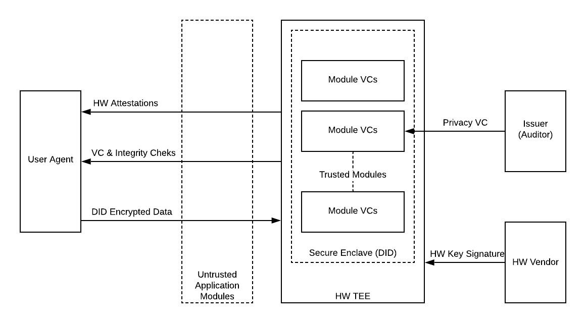

# Using TEE & VC As Privacy Proofs

By Tarek El-Gillani ([tarek@cloudmask.com](mailto:tarek@cloudmask.com))

## Problem

Users often provide private data to applications with the expectation that it would only be used for the agreed-upon purpose and time duration. Users, however, can’t enforce such limits and instead rely on:

1. Privacy regulations, such as the Right to be Forgotten, with its potential penalties for non-compliant application providers. Regulations, however, are jurisdiction-specific, reactive, and open to different interpretations.
2. Providers’ brand, where users judge vendors’ trustworthiness based on their reputation, and their associated server certificates/domains. However, this is not an objective measure and does not reward vendors who have invested in robust data security.

Examples where it is beneficial to ensure data privacy is objectively validated, include:

*   Consumers filling an online application and wanting to delete their data once the application process is concluded. 
*   Application providers wishing to prove to users that they have invested in secure confidential computing environments.
*   Applications using consumers and other unknown parties’ resources, as part of a distributed/decentralized compute infrastructure.
*   Organizations, such as governments, telco, health, and financial institutions, using 3rd party “commodity” systems, possibly across jurisdictions, to perform statistical analysis, ML, and other processing of private data.

### Practical Scenario:

As an example, consider a SaaS application developer, selling services to security conscience users. The developer has invested in a 3rd party DB that uses Trusted Execution Environment (TEE) to carry out data operations and otherwise keep data encrypted throughout its lifecycle.

The developer needs to demonstrate such DB/TEE investment as a competitive differentiator. With the proposed approach, the DB TEE software module would have a unique instance DID, and Privacy VCs issued by an independent auditor to the 3rd party DB vendor.

User Agents verify the VCs and confirm that its privacy claims meet the users’ needs. The user can then be confident that by encrypting sensitive data to the DB TEE DID, they can control its privacy and lifetime.

## Solution Approach

Proposed approach relies on Trusted Execution Environments (TEE) to provide hardware-backed attestations about trusted software modules’ integrity, in conjunction with Verifiable Credentials, to verify the privacy controls claimed by such modules.

Inspired by VC Supply Chain use cases, much like devices, trusted software modules possess VCs attesting to their privacy controls. VC Issuers audit/certify that a given module enforces claimed controls, such as permanently deleting data upon request.

Trusted Execution Environments rely on HW-protected private keys, signed by trusted vendors, such as Intel and ARM. Users can verify the authenticity of TEE HW and, in turn, trust it to verify the integrity of software modules loaded in its secure enclaves. 

Accordingly, by combining TEE, DID, and VC, we propose the following high-level protocol:

1. The User Agent validates TEE HW attestation. TEE should also have a DID.
2. TEE provides a list of loaded modules along with their content integrity check (hash).
3. Loaded modules provide VCs that bind their content hash to privacy control claims.
4. User Agent verifies VCs against trusted issuers and confirms that privacy controls are in line with the user’s expectations.
5. The User Agent encrypts sensitive data for a specific module/TEE DID, to prohibit access by Application modules running outside of TEE secure enclave.

### Alternatives 

Alternative include:

*   Zero-Knowledge Proofs which do not share private data, but don’t address the general case when there is a legitimate reason for application providers to access/store the actual data.
*   Cryptographic solutions such as homomorphic encryption, which provide higher protection, but, as of today, hard to scale and complex for existing applications to adopt.

### Security Consideration

Unlike Homomorphic encryption, the proposed approach is vulnerable to compromised HW. It does, however, mitigate threats from insiders, errors, and compromised software. Ultimately applications may eventually use a combination of current “reputation-based” security, TEE VCs, and homomorphic encryption.

## Important Questions

We need to address the following variations/questions:

*   Is it necessary for HW attestation to be DID/VC based, or can we mix between SSI and traditional identities for greater interoperability? If using DID, confirm that this can be safely done by a trusted software module, instead of HW change.
*   Each trusted module instance needs a unique DID. However, we still want to link them to VCs issued to the DID of the module’s author, to avoid having to audit every single instance.
*   Are there existing standards that can be leveraged to describe privacy controls/claims? How would these standards map abstract notion of, for example, time limits, to user’s expectation of data deletion when a specific event occurs, e,g. mortgage application declined, or a concluded health procedure.
*   When there are a chain of TEE servers, should the Trusted Modules verify other systems claims on behalf of the user?
*   In multi-tenant environments, modules would already be loaded in the secure enclave. Is there a value in keeping the current state of running servers on a distributed ledger?
*   Since there are some similarities to Supply Chain, can we use some of HyperLedger Sawtooth's work?
*   How can consumer devices be used to process private data? For example, a cryptocurrency based market for computing resources could use TEE enabled consumer devices.

## Proposed Scope

This topic may be broken up into 1) standards for VC privacy claims, 2) TEE integration with DID/VC, and 3) protocols to exchange TEE attestations, DIDs and VCs, which may leverage ongoing VC exchange work.

As a first step, we propose creating initial protocols/standards to support the above described Practical Scenario, using TEE already available in the market.

## References:

*   [OpenEnclave SDK](https://openenclave.io/)
*   [IETF Trusted Execution Environment Provisioning (TEEP) Architecture](https://tools.ietf.org/html/draft-ietf-teep-architecture-05)
*   WW3C DID and VC standards.

