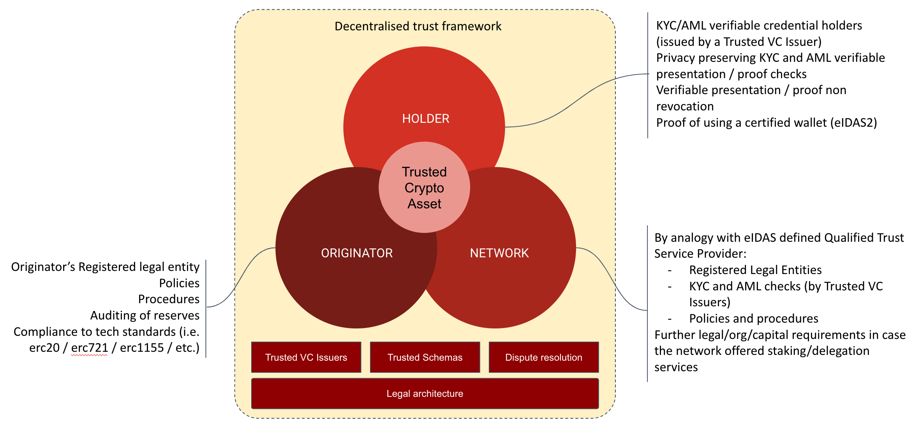
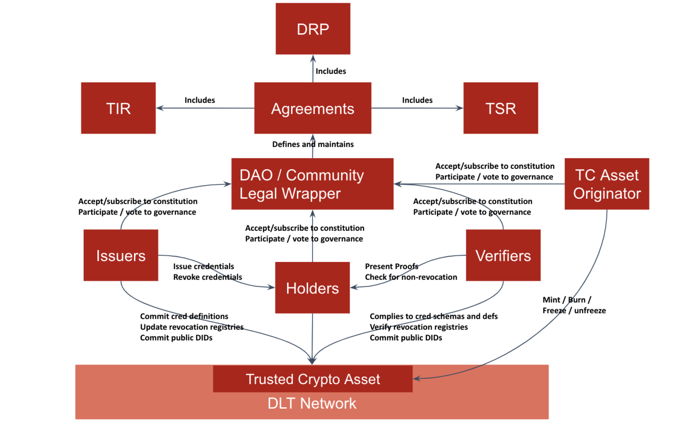
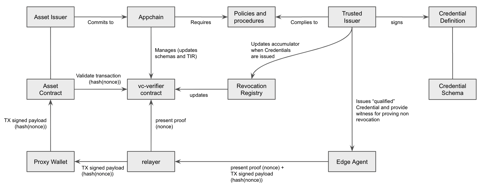

# Trusted Crypto Asset

A trust framework powering regulated crypto assets\
By: [Belsy Yuen](mailto:belsy@nymlab.it), [Elena Chachkarova](elena@nymlab.it), [Egidio Casati](mailto:egidio.casati@nymlab.it) for [NYMLAB srl](https://www.nymlab.it)

license: CC-BY

Official repo: https://github.com/nymlab/trusted-crypto-asset:

Date: Aug 2022

## Abstract

This document outlines the legal, organisational and technical characteristics of a framework that allows issuers and holders to manage "Trusted Crypto Assets" (TCA) in the context of a permissioned public decentralised network, leveraging on SSI protocols. We define a "Trusted Crypto Asset" as a particular asset class that intends to anticipate and satisfy regulatory requirements regarding the asset issuers, the network where they are minted and their holders.

The first section of the document focuses on the legal and organisational aspects of the framework, describing roles and requirements of the main actors and providing a legal architecture overview  while the second part offers the technical framework overview.

## TCA Legal and Organisational overview

Below is a diagram that outlines the key components of a proposed design pattern for the creation and sustainability of regulated crypto assets. We use the inclusive and risk-mitigating power of decentralisation and combine it with real-time auditing verification and a well-defined set of rules to provide a framework for an accountable, accessible and securely regulated crypto asset ecosystem.

### Roles

#### Originator

To originate a regulated token that can fully leverage on the technological innovation of “trustless” peer to peer exchange of value executed in public decentralised networks:

* The legal entity originating the crypto asset must comply with regulatory licensing, risk and capital reserve requirements
* The token logic must be consistent with the smart contract based standards for fungible, non fungible and composite token structures (e.g. [20](https://docs.openzeppelin.com/contracts/3.x/erc20), [721](https://docs.openzeppelin.com/contracts/3.x/erc721), [1155](https://docs.openzeppelin.com/contracts/3.x/erc1155))
* Policies and procedures regarding the management of fraud-prevention, AML risk on suspected accounts (freeze/unfreeze of funds) must be in place
* A continuous IT security auditing of the mint/burn infrastructure must be assured
* Where the asset is a stable coin, minters must provide real-time third party auditing of fiat reserves  

#### Holder

To be considered regulated, a crypto asset needs to satisfy regulatory requirements regarding its holders.
These requirements may vary on the basis of the crypto asset specific purpose, however, trusted crypto assets imply that  a set of minimal requirements are met, like proving that the holder has successfully carried out KYC and AML checks with an ascertainable trusted third party ([trusted issuer](/README.md#trusted-issuers)).
Decentralised identity and SSI protocols allow us to tread a narrow path that combines the user's right to privacy/anonymity with the possibility of on-chain verification that they have successfully, and without revocation, passed KYC and AML checks.
Furthermore, the EU is on the verge of issuing the new rules ([eIDAS2](https://digital-strategy.ec.europa.eu/en/policies/eidas-regulation)) and technical standards (mainly provided by [ETSI](https://www.etsi.org/)) regarding the so-called Identity wallets; in this regard, SSI provides us with the chance to inject in the transaction itself all the needed proofs, allowing for continuous validation of the personal wallet compliance.
Finally, an important client-side technical requirement is the binding between the holder and the verifiable credentials stored on the personal wallet; currently, this feature may be achieved through the adoption of anonymous credential technology.

#### Network

A sustainable proof of stake network, that provides token holders with the possibility to delegate their tokens and contribute to the network’s TVL in exchange for an APR, needs to comply with a number of regulatory constraints.

Know Your Validator (KYV):

* A trusted crypto asset holder who decides to delegate value to a specific validator must be guaranteed by an established assurance and accountability threshold  
* The mass adoption of decentralised technologies does not eliminate the need to protect the investor [token holder] willing to invest [stake] their crypto value with a validator
* Standard investor protection rules require moving beyond the concept of a 'trustless' network in favour of an ‘accountable’ network, where the value at stake [TVL] ceases to be the defining security metric, rather, the continuous and transparent process of verification of valid legal requirements and operational soundness becomes the minimum assurance threshold

### Utility components

#### Trusted Issuers

Trusted Issuers of [verifiable credentials](https://www.w3.org/TR/vc-data-model/#what-is-a-verifiable-credential) (VC) are instrumental to a decentralised trust framework.
Trusted Issuers define a decentralised trust framework:

* It is up to the network participating community ([DAO](https://www.investopedia.com/tech/what-dao/)) to establish and maintain the principles [requirements and constraints] regarding the trustability of assertions [VCs and proofs] based on the ascertainability of their Trusted Issuers
* The set of Trusted Issuers can be generally defined [eIDAS Trust Service Provider List] or locally specified, eventually inheriting the general available entities and integrating the set with specific third parties
* Most importantly, the shift from a federated identity schemas ([SAML](https://www.cloudflare.com/en-gb/learning/access-management/what-is-saml/), [Oauth2](https://oauth.net/2/) and [OIDC](https://openid.net/connect/)) where synchronous interaction with the identity provider is required to SSI allows for a full peer-to-peer interaction between the (credential) holder and the verifier

#### Trusted [credential schemas and definitions](https://www.w3.org/TR/vc-data-model/#data-schemas)

Once the set of issuers that may be considered trusted has been defined by the verifier, the holder can derive and present a proof from one or more of those trusted issuer credentials. The other founding element of a decentralised trust framework is the type and template structure of the assertions that the issuers (and the verifiers) agree upon to reach full interoperability and completion of information.
This can be achieved:

* At Domain/Community/DAO level, where all the participant, through a voting mechanism achieve consensus around a specified list of credential schemas
* At verifier level, where the single entity can decide to shape its own trusted set of credential, eventually integrating the community-based list

#### Dispute resolution procedure

The organisation of a participating community [DAO] around a set of principles and tools provides the backdrop for the incentives sustaining the accountability and liability threshold of different roles (verifiers, holders, issuers, DAOs) and helps defining pragmatic dispute resolution process ahead of comprehensive regulation.
Initiatives like [identrust](https://www.identrust.com/) have demonstrated that this approach is feasible and may benefit the community, introducing the necessary legal components to support operations from a business standpoint.
In concrete, the procedure should be based on a set of standardized technical evidences that the parties involved in a dispute can bring along, for instance:

* Proof, as an issuer, to comply to the community established set of protocols for evaluating a holder request to issue a specific type of credentials
* Issuer due diligence in case of credential revocation (proofs regarding the internal process to manage the revocation request, until publishing the revocation on-chain - for instance via crypto accumulator)
* Proof as a holder, to be in sole control of the credentials (credential-holder binding in case of [anonymous cred](https://wiki.hyperledger.org/download/attachments/6426712/Anoncreds2.1.pdf))
* Verifier due diligence in case of presentation request protocol and proofs of non revocation checks

### Legal Architecture

The diagram below represents the general perspective of a decentralised trust network that we believe is necessary for a crypto asset to be regulated, and it summarises the relations existing among all components.

## TCA Technical overview

In this section we focus on describing the technical aspects of the TCA framework, describing a set of minimal requirements that the solution must fulfill and defining a candidate architecture.

### Technical Requirements

* Eligibility of the holders to manage TCA must be verified on the base a verifiable proof;
* Verifiable proof must prove:
  - The user has received a (set of) verifiable credential(s) of a specific type (credential schema),
  - The user has received the (set of) verifiable credential(s) from one (or more) issuer(s) included in a list of Trusted Issuers and only eligible third parties should be able to look up the public [DID](https://www.w3.org/TR/did-core/#dfn-decentralized-identifiers) of the real issuer;
* Verifiable proof must not disclose any PII of the User, apart from pseudonyms information;
* A distinct verifiable proof must be provided by the holder for each transfer of TCA;
* The verifier must be able to check for revocation of the verifiable credentials from which the proof has been derived;
* In the case of revoked credentials, the TCAs controlled by the holder cannot be transferred and may become frozen until the holder provides a valid/non-revoked proof.

### Technical Architecture

The diagram below shows a reference architecture for the TCA, specifically for an Appchain. We assume an Appchain as a particular type of network where the nodes are fully dedicated to support one single dApp. The Appchain would be run by a DAO, in charge of defining policies and procedures to be set up and maintained through the usual proposal voting process. An example of such type of network is [Osmosis](https://docs.osmosis.zone/).

We also recommend the use of a particular type of wallet, based on a proxy smart contract, providing features like guardianship for key rotation and transaction relayer. An example of such type of wallet is the opensource project [VectisDAO](https://github.com/nymlab/vectis).

#### Environmental Components

* A crypto assets  that complies with regulatory requirements regarding their holders (e.g. KYC and AML verification for stable coin holders; proof of registration for regulated broker dealing with specific crypto asset classes)
* an Appchain (i.e. DAO, Network), where fully-regulated tokens can be exchanged among addresses presenting verifiable privacy-protecting proofs
* A smart contract wallet architecture, providing social recovery, transaction relayer
* A mobile identity wallet, controlling the smart contract wallet and holding credentials.
* A set of Trusted Issuers, selected by the dApp/Appchain on the base of the policies and procedure adopted, with the capacity to issue verifiable credentials for legal and regulatory compliance

#### Transaction validation

At the time of spending (i.e. transferring to another account) of the TCA, for a successful transaction, the holder must provide:

- standard signed transaction payload for the transfer: this payload includes the hash of a nonce;
- a proof derived from the received VCs, including a nonce in order to avoid reply attack and to bind the proof presentation to the transfer.

This two objects shall be produced by an edge agent (e.g. a mobile wallet controlling the proxy wallet and the attached funds,  able to control vc and derive proofs) and send to the network via a relayer.

The relayer, which is Appchain specific, shall route :

- the signed transfer payload to the proxy wallet, in order to be executed by the TCA contract, and
- the proof to the vc-verifier contract

Before committing the new state, the trusted crypto asset contract will query the vc-verifier contract if there is a valid proof for the hash(nonce).

In this scenario, the business logic for the validation is mainly done by the vc-verifier contract, leaving a minimum amount of work to the trusted crypto asset issuer, in terms of validation.

#### Transaction Execution strategies
Assuming we have a sender and a receiver, the validation strategy of a transfer of TCA from sender to receiver may be implemented in at least two different way:
- validation of the sender: in this case, only the sender is required to provide a verifiable proof at time of transfer, and no validation is applied to the receiver. The receiver will not be able to spend their token unless they provide a verifiable proof.
- validation of both sender and receiver: in this case, in order to validate both the subjects, the transaction is split in two sub transactions:
  - sender executes allowance in favour of receiver, up to a specific amount
  - receiver executes a claim

## Conclusions and next steps

This document stems from the convergence of a number of elements:
- our vision with respect to the growing emergence of public and decentralised networks
- the need to guarantee an adequate level of user experience and protection for the mass adoption of these technologies
- the inevitable action of the regulators of such technologies to protect users

At the moment, we can only speculate on the trajectory that regulation will take with respect to public and decentralised networks, hypotheses from which this proposal was born, and which will be gradually updated to take account of forthcoming regulatory changes.
