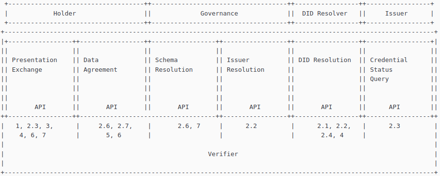

By Daniel Moledo &lt;<daniel@gataca.io>&gt; \
By Irene Hernandez &lt;<irene@gataca.io>&gt;

# Context

Interoperability has been one of the cornerstones of the SSI ecosystem. It has even been mentioned as one of the [formal objections of the DID Specification.](https://www.w3.org/2022/03/did-fo-report.html) The next step is to bring interoperability to the main SSI flows: verification and credential issuance.

There are many cases of interoperability that may be considered, as there are different actors in the SSI Ecosystem (Verifiers, Issuers and Holders), and multiple actors building tools over different technological stacks. So the first case to solve would be how a specific holder wallet can interact with a given verifier that supports SSI, but uses a tool built on a different technological stack than the wallet implementor.

The [Verifier Universal Interface (VUI)](https://identity.foundation/vui/) tackles this challenge. VUI is a global SSI interoperability project originally funded by [eSSIF-Lab](https://essif-lab.eu/our-projects/), a project funded by the European Commission within the Next Generation Internet Program, and led by [GATACA](https://gataca.io/?utm_source=Github&utm_medium=web&utm_campaign=RWOT). VUI aims to build a set of standard APIs to enable interoperability between ID Wallets and Verifier components: that is, to eliminate a possible vendor lock-in between any wallet and any verifier tool. Due to the current state of the art and the immense flexibility on use-cases, technological framework and current implementations, bringing interoperability is not an easy task. Any standardization effort must face the barrier of supporting most of the existing work, which may encompass different visions.

To tackle this challenge, the VUI process involves analyzing all operations specific to a Verifier. This helps identify the standard interfaces and processes that are consumed by the Verifier when interacting with a wallet, and define these in a way that is agnostic to any technological stack or use case.

The second vision of the VUI is to attempt to map existing standardization efforts with the goal of identifying their compatibilities, reusing as much accepted work as possible and identifying possible gaps in current standards.

# 1. Verifier operative requirements
After an analysis of the Verifier role and implemented tools, we have identified the following mandatory requirements on the verifier function to provide a basic functionality, as well as some desired requirements to provide an extended full functionality.

After an analysis of the Verifier role and implemented tools, we have identified the following mandatory requirements on the verifier function to provide a basic functionality, as well as some desired requirements to provide an extended full functionality.

Any Verifier MUST perform the following operations:

1. Request and receive specific information from holders in the form of Verifiable Credentials (VCs), presented in the form of a Verifiable Presentation

2. Verify received VCs. That includes:

    1. Verify the proofs of every credential

    2. Verify the proof of the presentation

    3. Verify that the information received matches the information requested

Additionally, any Verifier SHALL perform the following operations or be able to comply with the following requirements: 

2. While verifying the received Verifiable Credentials:

    4. Verify the Issuer of the credential

        1. Its authority over the credential

        2. Its associated trust level

    5. Verify the status of every credential

    6. Verify and match the ownership of the Verifiable Credentials and the Verifiable Presentation

    7. Verify that all credentials can be linked to the same entity

    8. Verify that the credentials requested satisfy some stablished constraints

3. Verify that the credentials have been handled from a secure wallet

4. Authenticate the wallet owner

5. Manage the consent of the usage of the information inside the credentials

6. Ensure user anonymity and non external traceability

7. Manage selective disclosure of the information contained on the credentials

The goal of the VUI is to cover the full functionality, for which we have identified 6 different APIs to interact with 4 different actors. The actors include:

1. The Holder of the Wallet

2. A DID resolution service (that could be internal to the verifier)

3. The issuers of the credentials in place

4. One or more governance frameworks applying to the actors on the ecosystem (Holder, Verifier and Issuer)

  

From of those 6 interfaces, we have detected different maturity statuses on their current state of the art:

Leading: Some interfaces have standards that, although not entirely established, are leading compared to others given their higher maturity state and level of adoption.

Divided: Some interfaces present multiple colliding efforts, more or less mature, but associated to specific framework constraints or given technology stacks.

Emergent: Some interfaces present multiple recent or stagnant efforts on standardization, but seem still a long away from consensus.

New: Some interfaces hadn’t been even identified as a possible need by the verifier and the holder.

| Maturity (increasing)  | New  | Emergent |  Divided  | Leading  |
|:---|:---|:---|:---|:---|
| Interfaces |  **Data Agreement** | **Schema Registry**   **Issuer Registry** | **Presentation Exchange**  | **Did Resolution**    **Credential Status**|
| Actors|  Holder | Governance Framework  |  Holder | Did-Resolver Issuer  |

# 2. Interfaces

The role of those interfaces is to be agnostic from any framework or programming language. Interfaces should be implemented with standard communication protocols through web services, preferrably using REST.

Depending on the party to interact with and the functionality described to cover, a Verifier may make use of just one, some, or all of the defined interfaces for its operation.

Some of these interfaces are already supported by current standardization efforts, in which case it has been specified so. 

To summarize, the following table shows the recommended standards for each of the defined interfaces. Note that for the schema registry interface, as it must support the full complexity of the credentials data model, no appropriate standard has been found nor suggested yet.

|Actor | Interface | Specification |
|:----|:----|:----|
|Did Registry | Did Resolution | [DIF DID-Resolution](https://w3c-ccg.github.io/did-resolution/)|
|Issuer| Credential Status | [Revocation List 2020](https://w3c-ccg.github.io/vc-status-rl-2020/)|
|Governance Framework| Issuer Resolution   Schema Resolution|[VUI Issuer Resolution](https://identity.foundation/vui/issuerResolution)   To Be Defined|
|Holder| Presentation Exchange   Data Agreements| [VUI extensions to DIF Presentation Exchange](https://identity.foundation/vui/presentationExchange)   [over [DID SIOP](https://openid.net/specs/openid-connect-4-verifiable-presentations-1_0.html)(recommended)]  [VUI Data Agreements](https://identity.foundation/vui/dataAgreements)*|

*Data agreements are currently being pushed on a specific DIF Working Group for data agreements. The VUI will point to the standard as soon as it is published by the Working Group.

# Conclusions

There are many operations that tools designed by the verifier must perform, depending on capacities external to the role of the Verifier itself. Those requirements may limit the functionality of a given verifier to interact with any wallet, if the functionality has not been specifically built to work with it.

In order to enable the Verifier to be interoperable with any wallet, all the different Actors in the ecosystem must provide common, standard interfaces to fulfill specific functions.

We have identified 6 of those interfaces that would seemingly enable all the verifier capabilities. We have also provided specifications fulfilling the interface within the current state of the art, extending the specification when required and even designing ad-hoc ones when there wasn’t sufficient previous work done.
