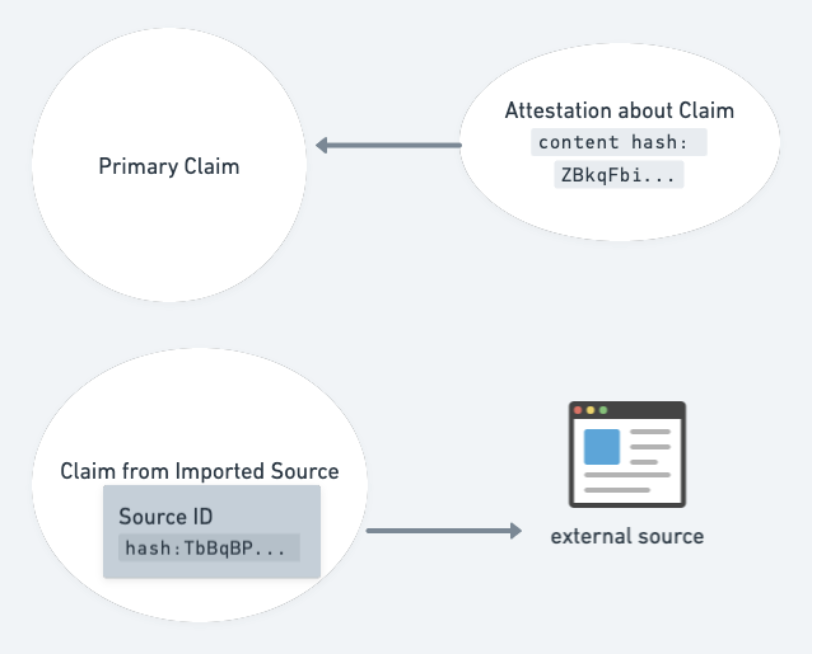

# Composing Credentials via LinkedClaims and Cryptographic Binding


## Co-Authors


* Phillip D. Long - T3 Innovation Network, Georgetown University & ASU
* Dmitri Zagidulin - MIT Digital Credentials Consortium
* Golda Velez - Cooperation.org 

## Abstract

The Verifiable Credential (VC) ecosystem has encountered several use cases that require a third-party assertion, or a linked claim to an existing object (another VC, a PDF, a web page, etc). Whether it is product reviews, linked claims of self-created credentials, provenance of academic paper reviews, or some other general purpose third-party assertion, these use cases have several requirements in common. Each use case may also require a domain-specific set of fields.

We propose a minimal format for connecting (and optionally cryptographically binding) credentials that will allow each use of third-party assertions to be represented as a set of LinkedClaims. Such a data set will enable verifiers to evaluate the credibility of claims, including those sourced from outside the Verifiable Credential ecosystem.  

Further, we propose to demonstrate the ability to compose several Verifiable Credentials into a single domain-specific credential using the LinkedClaim vocabulary that will satisfy the domain requirements of the likely users.

This approach will enable rich shared datasets to inform trust decisions while satisfying the requirements of domain-specific end users. One of the intentions of LinkedClaims Verifiable Credentials is to give individuals the agency to make such claims about themselves and others on their own terms.  


## Introduction

As the Verifiable Credential community gathers implementation experience based on the VC Data Model v1.0, and as it starts working on the next version of the spec, we see the VC landscape adopt two different (but interoperable) architectures.

The first approach favors large **compound credentials** that contain many claims, signed by the issuer as a set. In the education space, the CLRv2 (Comprehensive Learner Record v2) spec is one such canonical example, and is intended to be, well, comprehensive, containing a person’s entire educational history associated with enrollment overseen by a single issuer — the institution awarding the degree. Another example, both in the physical world of plastic cards as well as in the world of digital credentials, is the Driver's License, which is a collection of unrelated claims (name, address, age, picture, driving ability), grouped together for historical reasons of convenience.

The second approach, which is isomorphic/functionally equivalent to the first, uses linked micro-credentials with cryptographic binding.

The compound credential provides the recipient with a rich set of claims of potentially multiple types, along with alignments and other metadata needed to semantically express complex relationships among them. This is useful, but can lead to large payloads and introduce complexities on the part of systems consuming them. It also means that any change to any part of the complex payload that needs updating requires the revocation of the compound VC, and thus of all the components within it. After corrections are made, those edited parts need re-signing/reissuing as a part of a new compound payload package.

Micro-credentials allow for easier data minimization, support editing and reissuance of only those microcredentials whose data elements need updating, facilitate partial disclosure, and allow for secure re-composition down the line.

In addition to introducing and illustrating the `digestMultibase` mechanism, which allows the linking of non-VC objects, this paper proposes a new VC type `LinkedClaim`, used to import third party claims from possibly untrusted sources, with a `confidence` property to indicate the level to which the issuer wishes to express confidence in the imported claim. 

## Mental Model

A Verifiable Credential allows one entity to make a signed attestation. For someone to trust this attestation - even with evidence - they will want to know what others think about the claim and the issuer.  

Much data on the web and in the world is unsigned.  To know whether to trust it, we need a way for long-lived entities to point to it, to indicate a level of confidence, and to know if the external data has changed since it was pointed to.
<br/>


### A Brief Primer on Verifiable Presentations

Verifiable Presentations (VPs) are a general purpose wrapper/envelope for one or more VCs. When an Issuer sends VCs to a wallet, it sends them wrapped inside a VP envelope. When a wallet holder presents VCs to a requesting party, the wallet also wraps them inside a VP envelope.

Aside from serving as a lightweight container for one or more VCs, VPs allow the optional authentication of the presenting party (which is useful in many use cases).


* VPs don’t have to be signed. Performing DID-Authentication is optional. It’s reserved for use cases where it’s important for the receiver to know who the presentation is coming from.
* Also, by (optionally) signing a VP, you’re adding a tamper-proof binding on the bundle itself (in addition to the fact that any given VC inside a VP is already tamper-proof by itself).
* A commonly mis-understood fact: the VCs inside a presentation don’t have to be about the presenter. The holder may have in their possession credentials issued by third parties. For example, when applying to a job, an individual can obtain (and pass along) their school’s accreditation credential. They can also obtain and pass along a VC of the job description they’re applying for. Neither of those VCs (the school accreditation and the job description) mention the person at all (the job applicant is not the subject of either of those). As part of the application process, the job applicant submits a bundle of credentials (the Verifiable Presentation), some of which may be about the applicant (such as their awards and achievements), and others of which are not directly related, but that provide contextual value to the recipient (such as the job description VC).

## Requirements for Linked Claims

1. They must use the W3C Verifiable Credentials (v2) envelope data model.
2. They must be able to refer to (make a statement about) an external object, such as:
    * Another VC
    * A URL (web page, PDF, image, etc)
    * A _subsection_ of another VC (for example, an individual achievement or course in a transcript VC that contains multiple courses, or one among is a set of competences in VC).
3. They must provide an (optional) mechanism for cryptographic binding between VCs or between a VC and another URL. (This is the Hashlink / "digestMultibase" mechanism.)
4. They should define properties that describe the claim or assertion, including:
    * rich issuer metadata properties, describing who is making the claim, what their expertise/bona fides are what heir relationship is to the subject, etc.
    * a property containing evidence of the assertion (images, URLs, published papers, Github repos, etc.)
    * human-readable description of the assertion
    * an optional rating (such as for ecommerce product reviews)

## Cryptographic Binding via digestMultibase

This paper introduces the optional property <strong><code>digestMultibase</code></strong>, used to include a verifiable hash of the corresponding<code> <strong>id</strong></code> element. This enables safely linking to an external non-VC object in the <strong><code>id</code></strong> field, while still being able to verify that its content has not changed since making the assertion.

Note: a _hashlink_ is a general term for a combination of a URL and a digest.


#### **digestMultibase**

A <strong><code>digestMultibase</code></strong> property provides a way to lock down a link using a hash of its content by specifying the hash algorithm and (optionally) the canonicalization mechanism to perform before hashing. It is intended to apply to the <strong><code>id</code></strong> link at the same level. For more details on this proposed property, see [issue #952](https://github.com/w3c/vc-data-model/issues/952) on the VC Data Model. 


### Verifying Linked VCs

The presence of a <strong><code>digestMultibase</code></strong> property in a Verifiable Credential adds additional steps that must be performed during verification:

1. If a <strong><code>digestMultibase</code></strong> property is encountered, the verifier must locate the corresponding <strong><code>id</code></strong> property <em>on the same level of the JSON object</em> (that is, it should be a peer property). If no corresponding <strong><code>id</code></strong> property is found, the verifier should throw an error (denoting that this is an invalid use of <strong><code>digestMultibase</code></strong>).

2. Once the digest's corresponding `id` property has been located, the verifier must _dereference_ the URI specified in the `id`. That is, the verifier must fetch the `id` resource, so that it can compare its digest hash to the one specified in <strong><code>digestMultibase</code></strong>.
 
For example, if the <code>id</code> property contains an HTTP URI, the verifier must fetch it via that protocol. If the <code>id</code> property contains a URN, it means that the verifier must already have access to that object out of band (URNs are typically used to link VCs <em>within</em> a given Verifiable Presentation).

3. If the verifier is unable to dereference (fetch) the resource referred to by the id, it must throw an error.

4. The verifier must create a digest hash of the fetched resource, using the algorithm and parameters specified by the <strong><code>digestMultibase</code></strong> property.

5. The verifier must compare the fetched resource's digest hash to the hash value specified by the <strong><code>digestMultibase</code></strong> property. If the values do not match, it must throw an error.


### Hashlink Prior Art

A hashlink (typically containing a URI and a digest hash) cryptographically binds a VC to another VC or object by including a digest hash of the linked object itself. 

The <strong><code>digestMultibase</code></strong> mechanism referenced in this paper is not the only way to hashlink or cryptographically bind by reference.

The IETF [Cryptographic Hyperlinks IETF Draft](https://datatracker.ietf.org/doc/html/draft-sporny-hashlink-07) by Manu Sporny is an earlier iteration of <strong><code>digestMultibase</code></strong> and combines a URI and a digest value in a single string.

The IETF [ACDC - Authentic Chained Data Containers Draft](https://www.ietf.org/archive/id/draft-ssmith-acdc-02.html) uses a mechanism similar to digestMultibase (a combination of identifiers and digest hashes).

## Use Cases


### Linked Claims with Self-asserted Skill Credentials


#### 
<span style="text-decoration:underline;">User Story</span>: Alice seeks recommendation from Bob & Juanita for self-asserted skills she claims  \
<span style="text-decoration:underline;">Goal:</span> Alice wants recommendations about her skills from credible professionals \
<span style="text-decoration:underline;">Actors:</span> Alice, Bob, Juanita \
<span style="text-decoration:underline;">Pre-Conditions:</span> Alice/Bob/Juanita have: a decentralized identifier (DID); a credential wallet compliant with the W3C VC Data Model. The wallet has a simple, well designed UI to support self-issuing/signing of credentials \
<span style="text-decoration:underline;">Post-Conditions:</span> Alice gets Bob and Juanita to issue supporting credentials attesting to her claimed skills, bound to her self-asserted claim \
<span style="text-decoration:underline;">Trigger:</span> Alice sends an email to Bob and Juanita which includes the claims she’s making seeking their corroboration. She includes the ID and specific assertions for them to write their recommendation and bind them to her credential. \
<span style="text-decoration:underline;">Flow Narrative:</span>

Alice has worked in warehouse distribution centers since she dropped out of high school to earn money to support her mother and siblings, after her mother was forced to recuperate from injuries incurred in a vehicle accident.

Alice started as a custodian but over time and through observation and conversation with her co-workers she learned she could get trained to drive a warehouse forklift and significantly increase her earning potential. She enrolled in class 4 OSHA certified forklift driver training course while continuing her night custodian job. After receiving her certification she applied for a forklift driver opening at the company where she was employed but sought corroboration of her skills from her instructor at ISETA (Bootcamp 1.0) for the forklift specialization course, along with a LinkedClaim from her current supervisor attesting to her reliability, teamwork, and the attention to detail she has expressed in her current job.

Alice sends the self-asserted credential describing her skills relevant to the forklift driver position by email to Bob, her instructor at ISETA of the OSHA forklift training course and points out the attributes she thinks he can attest to amongst her skill claims.

Alice does the same thing by sending her self-assertion credential to Juanita, her current supervisor, pointing out those attributes where she suggests that Juanita has direct knowledge about her performance.

Both Bob and Juanita construct a linked-claims Verifiable Credential recommending Alice for those attributes they have expertise in and can address with professional credibility based on their own bona fides; included in their responses are relevance attestations, describing their own training and background.

Juanita and Bob send their self-asserted skill LinkedClaims to Alice after binding their attributions to those skills and competencies based on their knowledge of Alice’s capabilities. Alice selects these credentials for inclusion in the set she prepares as a Verifiable Presentation to submit to the job application site.


### A Recommendation of an Institution/Business/Gov Issued Credential to an Individual by a Third Party.


#### 
<span style="text-decoration:underline;">User Story</span>: Claudio graduates with a certificate in cybersecurity and seeks a recommendation from one of his instructors,Laura, for a job he’s applying to \
<span style="text-decoration:underline;">Goal:</span> Stand out from the pool of applicants based on his credential & recommendation to get the job offer<span style="text-decoration:underline;"> \
Actors:</span> Claudio and Laura<span style="text-decoration:underline;"> \
Pre-Conditions:</span> Claudio has: a DID; a VC compliant credential wallet. Institution issues a VC to Claudio recognizing his completion of the cybersecurity program. Laura has a DID; VC credential wallet. The wallet supports self issuing. <span style="text-decoration:underline;"> \
Post-Conditions:</span> Claudio gets the job! \
<span style="text-decoration:underline;">Trigger:</span> Claudio emails his instructure, Laura, asking for a recommendation & includes a copy of this certificate and VC recognizing it.  \
<span style="text-decoration:underline;">Flow Narrative: \
</span>

Claudio recently completed a certificate program in cybersecurity. The technical college issued the certificate in both paper and VC formats. Through conversations with some of his instructors he’s become aware of an opening in a local cybersecurity sourcing company who provides short, 1 to 6 month consulting project contracts, and medium-term placements for contract employees. Claudio asks one of his instructors, Laura, for a reference. Laura agrees to serve as a reference and suggests that she provide a verifiable LinkedClaim credential to his cybersecurity certificate.

Laura asks Claudio for (a copy of) his VC conferring his Certificate in Cyber Threat Analytics and Prevention (CTAP) which was awarded to him for successfully completing his course of study.
 
Laura composes a self asserted verifiable LinkedClaim that establishes her credentials or bona fides as a credible judge of Claudio's knowledge, skills and abilities in this domain. She provides verifiable documentation of her work in the field through links to papers she has published, reports to which she contributed on cyberthreat assessment, and grants she has received for her work in this domain.

She describes the work she has seen done by Claudio and her view of the level of performance he demonstrated. Laura also offered additional evidence of Claudio’s knowledge in this discipline from the help he provided as a contracted worker under a cyber assessment contract she oversaw for a local regional bank. These included statistical analyses of penetration tests, attack simulations and summary reports all in his Github account, all hashlinked into the evidence section of her LinkedClaim VC for Claudio.

Laura signs her verifiable LinkedClaim VC and sends it as a VP to Claidio's credential wallet. He accepts the Presentation which puts the LinkedClaim VC in his wallet and generates a VP including his CTAP certificate VC, the LinkedClaim VC and several others that document related skills pertinent to the job requirements. This VP is then sent to the cybersecurity sourcing company as part of his Verifiable Resume™.


### A Review of a Paper Submitted to an Academic Conference 
 
**<span style="text-decoration:underline;">User Story</span>**: Layla is asked to write a review of a preprint submitted to a professional conference. She publishes her review as a document and creates a hashlink to it in a VC that attests to her authorship of it and contains a hashlink to the original manuscript reviewed.  \
<span style="text-decoration:underline;">Goal:</span> Establish proofed authorship of a professional review of a submitted manuscript. \
<span style="text-decoration:underline;">Actors:</span> Layla, conference publication service<span style="text-decoration:underline;"> \
Pre-Conditions:</span> Layla has: a DID; credential wallet supporting self-authoring/signing and multibase hashlinks. Conference has: a stable URI for reviews submitted and their pre-print manuscripts, both openly accessible from the web.  \
<span style="text-decoration:underline;">Post-Conditions:</span> The conference paper archive has a review with proof of authorship by Layla, as does Layla should she wish to make such a claim to another third-party such as include it in her promotion and tenure review folder. \
<span style="text-decoration:underline;">Trigger:</span> the conference organizers email Layla asking her to review a submitted paper with provable attribution of her authorship. \
<span style="text-decoration:underline;">Flow Narrative:</span>

Layla Soliman registered to attend her disciplinary conference in molecular genetics. The conference organizers asked her to review a paper submitted for presentation at the meeting to which she agreed. The organizers send Layla a link to the paper in a Google docs directory.

Layla follows the link to the paper, reads the reviewer guidelines, and sets out reading and taking notes to prepare for writing her review. On completion of reading the submitted manuscript she prepares her final comments and writes her review of it. She sends her review to the conference organizers, and they in turn send her the URI of her review’s location.

With that information, Layla creates a self-assertion credential of type equals “review author” to claim her authorship, which is cryptographically signed and contains two hashlinks, one for the Google doc location of her review of the submitted manuscript, and one to the submitted manuscript itself.

Layla emails her LinkedClaim VC to the conference organizers for their records and keeps hers in her credential wallet to include later in her promotion and tenure folder.


### Worker Taking Ownership of Reputation Reviews (5-star type)


### 
<span style="text-decoration:underline;">User Story</span>: Joe Atento has been working on Upwork and Fiverr and winning 5-star reviews from customers, but he is tired of paying the cut.  He'd like to get work independently.  \
<span style="text-decoration:underline;">Goal:</span> Enable a trusted third party to attest that Joe (identified by DID) has 5-star ratings. \
<span style="text-decoration:underline;">Actors:</span> Joe, TrustRanker site<span style="text-decoration:underline;"> \
Pre-Conditions:</span> Joe has: a DID'; credential wallet supporting self-authoring/signing and multibase hashlinks; and has logins to centralized gig sites with reviews. \
<span style="text-decoration:underline;">Post-Conditions:</span> Joe has signed credentials in his wallet attesting to his reviews, which he can publish verifiably on his independent site. \
<span style="text-decoration:underline;">Flow Narrative:</span>

Joe Atento has created an independent website advertising his virtual assistant services, but he has not gotten any takers.  He wants to demonstrate his credibility by establishing that he is the same person who has 5-star reviews on several gig sites.

Joe logs into third party site TrustRanker using his wallet.  Because the gig sites do not allow OAuth, he verifies his ownership of the profiles there by inserting a given public key or "magic link" into his profile.  The TrustRanker site signs acredential that Joe's DID has 5-star ratings on Upwork and Fiverr.  Joe puts a visible badge with a link to the Verifiable Credential signed by TrustRanker on his site JoeTheHelper.com, along with a Verifiable Credential signed by his own DID attesting to his ownership of the site.
 
Any independent verifier can combine these credentials and estimate Joe's credibility, and if they decide to hire him no one takes a cut of his pay.


### Assertion that an Image/Video Taken by a Camera Crew Has Not been Altered from the Time the Images Were Captured. 
 
**<span style="text-decoration:underline;">User Story</span>**: Ansel Adams found his photographs edited by others to assert claims that were not conveyed or implied in the original images. He alters his workflow to require third parties to use his images and hashlink from their stories, or state they are the image source but derived from his originals, with a link to his originals to confirm the differences. \
<span style="text-decoration:underline;">Goal:</span> Protect Ansel from spurious claims of libel for images edited without his knowledge but still attribute the image source to him.<span style="text-decoration:underline;"> \
Actors:</span> Ansel Adams, third-party publishers of Ansel’s work \
<span style="text-decoration:underline;">Pre-Conditions:</span> Ansel Adams has a publicly accessible gallery of cryptographically signed images asserting he was the photographer. <span style="text-decoration:underline;"> \
Post-Conditions:</span> Ansel’s has diminished his liability to claims made about pictures altered by others<span style="text-decoration:underline;">. \
Trigger: </span>Claim made about Ansel’s pictures by a third party, or legal representative of a person asserting harm from them. \
<span style="text-decoration:underline;">Flow Narrative:</span>

Ansel Abrams is a professional photographer who publishes his images in magazines, newpapers/services and on his own photo gallery on the web. Recently he has been embroiled in several controversies over the authenticity of what were purported to be ‘his’ images but which were in fact subtly edited representations of his work. One of these resulted in expensive legal costs to defind his claims of image manipulation without his consent.

Ansel has now introduced into his workflow a requirement that any publication of any image he creates must be cryptographically hashlinked and signed by him. This makes it simple for him to prove tampering has occurred to one of his photos. It also imposes a requirement that any purchaser of his work of who has a legitimate reason to edit his image contact him for permission to do so and either provide him the edited version that he can cryptographically add this derivative work to his repository or request the publisher to state their provenance for the derivative image, with attribution to Ansel as the original photographer and a link to Ansel's original image.


### Verification of Disaster Recovery Funds Distribution and Outcomes


### 
<span style="text-decoration:underline;">User Story</span>: A hurricane hits the coast.  One relief agency helps, one takes the money and runs.  Local workers learn new skills while helping with disaster recovery efforts.  \
<span style="text-decoration:underline;">Goal:</span> Accountability for use of funds, credentialing of workers who learn new skills. \
<span style="text-decoration:underline;">Actors:</span> Relief agencies BEMA and RATS, various aid recipients and workers.<span style="text-decoration:underline;"> \
Pre-Conditions:</span> Simple phone app to enter attestations of aid.   \
<span style="text-decoration:underline;">Post-Conditions:</span> Multiple linked claims with photos and public links submitted by recipients of the legitimate aid agency; no credible attestations for the fraudster that are linked to publicly verified persons in the area.  Workers receive signed credentials that help them advance in their careers. \
<span style="text-decoration:underline;">Flow Narrative:</span>

Hurricane Zeta hits the Louisiana coastline, causing untold damage.  After the immediate emergency response, businesses and individuals raise funds to help victims, administered by BEMA, Inc.  How can we know if the funds are reaching their intended recipients, and if the spending is helping effectively?

BEMA offers direct assistance to victims to rebuild their homes.  In turn, recipients MAY attest to the help they have received, including the BEMA Project URL in their statements confirming what was given to them.   Volunteers may also associate digital artifacts substantiating the claims of impact, such as photographs or recordings.  

Attestations can be gathered by BEMA on its own website, or on a third party LER/VC Notary.  Individuals may sign in with OAuth using an existing account, such as LinkedIn, and may import any social or work credentials as an indicator of their credibility. Bona fides such as degrees and skills that have been recorded as LERs may be cryptographically attached as Linked Claims.

Not all users may have public credentials.  BEMA may also create accounts for recipients using their government-issued identifications, which would be protected from most viewers.  Neighbors or friends with public credentials may also attest to the needs or use of funds for another user.

Attestations may include photos of repairs/cleanup/services with embedded dates and geolocations. This enables important new opportunities to independently validate use of funds.

Another "aid organization", RATS, has friends in high places and receives a large chunk of relief funds.  However, no individuals with independently verified ties to the disaster area wind up attesting to receiving any help.  This data can be taken into account during the next allocation, or perhaps by investigative reporters.

In addition to the validation of use of funds, relief organizations can leverage LinkedClaims to provide a long-term benefit to local trainees. Local relief workers who jump in and learn new skills while responding to a crisis may benefit from attestations from BEMA about the training they have received and the responsibilities they took on during the crisis. 

For example, if a worker is trained in the logistics of running a food service (to aid the emergency workers providing disaster relief), when this is all over they could use that credential they were granted when they apply for a job in some other similar food service position, in the 'after times' of this event.  


### **A Person was Harmed by an Entity**


_note: unlike the other examples, in this case the subject is possibly hostile to the claim_


### 
<span style="text-decoration:underline;">User Story</span>: A protester in Myanmar is believed to be kidnapped by the military junta.  A related claim notes that POSCO International continues to do business with the junta.  \
<span style="text-decoration:underline;">Goal:</span> Gather evidence to hold harmful actors accountable.  \
<span style="text-decoration:underline;">Actors:</span> Disappeared protestor, (possibly anonymous) friend, reporter, website documenting oil-money flows<span style="text-decoration:underline;"> \
Pre-Conditions:</span> Reporter has: a DID; credential wallet supporting self-authoring/signing and supporting multibase hashlinks. Family member speaks anonymously over signal.  Credible website exists documenting the business relationship between Chevron and the military.  \
<span style="text-decoration:underline;">Post-Conditions:</span>  A claim is published about the enforced disappearance, with an estimate of uncertainty.  A related claim is published about the flow of funds.   The structured claims may link to a long-form traditional article.  Later, investors may use the structured claims to automatically disinvest in human rights-abusing companies. \
<span style="text-decoration:underline;">Trigger:</span> A student protestor is disappeared and a friend contacts a reporter. \
<span style="text-decoration:underline;">Flow Narrative:</span>

Khant Zin Win [disappeared on Apr 21, 2022](https://myanmar-now.org/en/news/missing-dagon-university-students-believed-to-be-in-junta-custody) immediately after a military truck was seen entering their street. An article documenting the disappearance was written in Myanmar-now.org, in this case with a named source.  In other cases for safety reasons, the source's name must be protected. \
 \
According to [current data at Justice for Myanmar](https://data.justiceformyanmar.org/), POSCO International funnels significant funds to the Myanmar military junta.  Pension funds such as Första AP-fonden (AP1) of Sweden, continue to invest in POSCO. By publishing linked claims relating the specific harms to the money flows in a standardized format, an independent application can be developed helping investment managers avoid the risk of investing in companies that contribute money to current human rights abusers.  A news aggregator might choose to provide a "take action" link under a news item that enables the reader to adjust their buying or investing behavior accordingly.


### A Claim that Attests to the Provenance of an Article Posted in a Published News Service 
 
**<span style="text-decoration:underline;">User Story</span>**: Island News (IN) investigative journalism reports are often attacked as false by those described in their stories. Island News established a repository for data collected by investigative reporting teams to catalog reporter’s notes, pictures, recordings, and related data, hashlinked to the credential of record for each investigation, signed by the paper, with each digital object collected also signed by the reporters who gathered them. The ICIJ periodically reviews reports and issues a LinkedClaim recommendation as to Island News investigative reporting practices.  \
<span style="text-decoration:underline;">Goal:</span> Protect journalists from false accusations of fraud, lying, and reporting of false news. \
<span style="text-decoration:underline;">Actors:</span> Island News, reporters affiliated with IN investigative teams, the ICIJ <span style="text-decoration:underline;"> \
Pre-Conditions: IN has: Trust Repository of reporting artifacts; a transparent governance structure vetting artifacts to be included in it. ICIJ has: VC issuing service for LinkedClaim VCs \
Post-Conditions: </span>Investigative journalism reports by IN has a robust data management practice to guard against allegations of generating mis-information.<span style="text-decoration:underline;"> \
Trigger: </span>Accusations of fake news by targets of IN’s investigative reports<span style="text-decoration:underline;"> \
Flow Narrative:</span>

Island News, the daily morning paper for the Signal Islands, has a reputation for in-depth investigative reporting. Recently, controversies emerged when a report on inappropriate use of provincial revenue collected from bond financing was published stating that government ministers involved in the oversight of the fund accounts associated with a new economic development, anchored by Wind Casinos, redirected substantial amounts of Bitcoin to private ministerial accounts.

Representatives of these ministers countered that these accusations were fabricated and published purported notes from the reporting journalists corroborating their claims. The journalists contested these representations of their work, with the back and forth of accusations and counter-claims devolving into a confusing and ultimately unresolvable incident that diverted public attention to the serious concerns initially raised.

Island News decided to hashlink future investigative reporting and associate them with a Verifiable Credential signed by the reporters involved. This was further substantiated by a Verifiable LinkedClaim Credential issued by The International Consortium of Investigative Journalism (the ICIJ), corroborating by a respected third party the claims of authenticity derived by the review of the investigative journalism process and specific transcripts of notes, photographic evidence and recordings the Island News submitted to them and they independently analyzed.

Future investigative journalism reports contain the links to these credentials, publicly accessible, and verifiable for all who wish to see them.


## Examples of Linked and Composed Credentials


### Example: Firsthand Observation


```
English: An accident occurred Sunday at Elm & Grant.  I saw it myself.
Subject: The accident
Claim: happened
Statement: What I saw
Source: Firsthand, when and where observed
{"@context": ["https://www.w3.org/2018/credentials/v1",
              http://cooperation.org/credentials/v1
             ],
 "type": ["VerifiableCredential"],
  issuer: "did:me123", // person who witnessed the accident
 "issuanceDate": "2022-02-02T21:36:59Z",
  "credentialSubject": {
    "id": "https://accidents.example.com/reports/accident-1",
    "type": ["LinkedClaim"],
    "claim": "eventHappened",
    "statement": "Truck ran a red light...",
    "effectiveDate": "2022-01-01",
    "source": {
       "id": "did:me123",
       "type": "ClaimSource",
       "sourceType": "firstHand",
       "howKnown": "I saw the accident, I was standing on the corner about 20 feet away",
       "dateObserved": "2022-01-01"
    }
  },
  "proof": { ... }   // signed by the person who saw it
}
```


### Example: Secondhand Observation


```
English: I heard Charles say that he witnessed the accident
Subject: The Accident
Claim: happened
Statement: What I heard Charles say
Source: Charles, secondhand
{
  issuer: "did:me123", // person who heard about the accident
  credentialSubject: {
    // uri representing the accident may be generated if it does not exist
    "id": "https://accidents.example.com/reports/accident-1",
    "type": ["LinkedClaim"],
    "claim": "eventHappened",
    "statement": "Truck ran a red light...",
    "effectiveDate": "2022-01-01",  // when the accident occurred
    "location": "100 Main St, Omelas, NJ",
    "source": {
       "id": "https://mas.to/charles456",
       "type": "ClaimSource",
       "sourceType": "secondary",
       "howKnown": "Charles saw the accident, he told me about it on the phone a few days after it happened",
       "dateObserved": "2022-01-05"
    }
  },
  "proof": { ... }   // signed by the person who heard about it
}
```

A context containing the proposed properties, as well as a suggested minimal generic claim for including third party sources and a convenience field for responding to a published claim, is available at **[https://cooperation.org/credentials/v1/](https://cooperation.org/credentials/v1/)** 
 
For examples corresponding to the use cases in this paper, see [composable claims examples and reference application](https://codeberg.org/cooperation/LinkedClaims/)

### Example: Standalone Claim - Review

Example of a linked claim representing a product review that was scraped from a site.


* References an external product, hashlink of the source as it was scraped
* No claimant expertise
* No evidence section


```
{
  "@context": [
    "https://www.w3.org/2018/credentials/v1",
    "https://www.w3.org/2018/credentials/examples/v1",
    "http://cooperation.org/credentials/v1",
    "https://schema.org"   // for reviewRating
  ],
  "type": [ "VerifiableCredential"],
  "issuer": {
    "id": "did:example:spider123",
    "name": "ClaimSpider"
  },
  "issuanceDate": "2022-01-01T00:00:00Z",    // when this claim is issued
  "expirationDate": "2025-01-01T00:00:00Z",
  "effectiveDate": "1999-01-01",             // the date in the original review
  "credentialSubject": {
    "id": "https://example.com/products/coffee-mug",
    "type": ["LinkedClaim", "Review"],
    "effectiveDate": "1999-01-01",
    "aspect": "quality",
    "statement": "This is a great coffee mug, would buy again.",
    "reviewRating": {
        "type": "ReviewRating",
        "ratingValue": 5,
        "bestRating": 5,
        "worstRating": 1
    },
    "source": {
         "type": "ClaimSource",
         "id": "https://yelp.com/mugs/12345#review",
         "sourceType": "web",
         "digestMultibase": "asdfb897987",
         "dateObserved": "2021-12-01",
         "author": "https://yelp.com/users/joe100",  // useful for modeling trust
         "curator": "https://yelp.com"
      }
    }
  },
  "proof": { ... }   // signed by the spider that scraped the site
}
```


### Example: A Verifiable LinkedClaim

This example is composed of two components – an initial standalone VC and then an _LinkedClaim_ of that VC, with a one-way cryptographic binding to it.

**Initial (Self-issued) VC:**


```
{
  "@context": [
    "https://www.w3.org/2018/credentials/v1",
    "https://w3id.org/openbadges/v3"
  ],
  "type": [
    "VerifiableCredential",
    "OpenBadgeCredential"
  ],
  "issuer": {
    "id": "did:key:z6MkrHKzgsahxBLyNAbLQyB1pcWNYC9GmywiWPgkrvntAZcj",
    "name": "Alice Jones"
  },
  "issuanceDate": "2022-05-01T00:00:00Z",
  "credentialSubject": {
    "type": "AchievementSubject",
    // Note that the subject of the VC is the issuer, hence self-issued
    "id": "did:key:z6MkrHKzgsahxBLyNAbLQyB1pcWNYC9GmywiWPgkrvntAZcj",
    "achievement": {
      "id": "urn:uuid:e8096060-ce7c-47b3-a682-57098685d48d",
      "type": "Achievement",
      "name": "UAV Control System for Drone Navigation",
      "description": "<description goes here>",
      "criteria": {
         "type": "Criteria",
         "narrative": "<narrative>"
       }
    }
  },
  "proof": {
    // Signature goes here
  }
}
```


**LinkedClaim to the above VC:**


```
{
  "@context": [
    "https://www.w3.org/2018/credentials/v1",
    "https://w3id.org/security/suites/ed25519-2020/v1",
    "http://cooperation.org/credentials/v1",
    "@vocab": "http://cooperation.org/credentials/v1#"
  ],
  "type": [ "VerifiableCredential", "VerifiableRecommendation" ],
  "issuer": {
    "id": "did:web:bob.example.com",
    "name": "Bob"
  },
  "issuanceDate": "2010-01-01T00:00:00Z",
  "expirationDate": "2020-01-01T00:00:00Z",
  "credentialSubject": {
    // Note that the credentialSubject.id is the id of an individual Achievement in the target VC
    // It could just as readily be the id of the VC, but the authors wanted to highlight that a section of the VC could be targeted
    "id": "urn:uuid:e8096060-ce7c-47b3-a682-57098685d48d",
    "digestMultibase": "zb1B1M6Bve5JEaNqeJSmuE", // digest of the Achievement being recommended
    "recommendation": {
       "statement": "This is a recommendation regarding Alice's 'UAV Control System for Drone Navigation' achievement. Alice has an exceptional skill set as an UAV guidance control engineer. See also the attached evidence.",
       "recommender": {
          "id": "did:web:bob.example.com",  // MUST be same as issuer
          // the recommending entity's bona fides, tailored to the specific claims on a per-use basis
          "relevance": [
            // Generic expertise claims (such as CV / resume / degrees)
            {
             "id": "https://SmartResume.com",
             "type": "SmartResumeProfile"
            },
            {
             "id": "https://linkedin.com/Bob",
             "type": "LinkedInProfile"
            },
            { 
             // link to a credential I received saying I have a degree to this subject
             "id": "https://example.edu/degrees/class-of-2021/bob",
             "name": "University Degree Credential"
            },
            {
             "id": "https://sigspatial.acm.org/members/12345",
             "description": 
                      "https://www.acm.org/special-interest-groups/sigs/sigspatial",
             "name": "SigSpatial Membership Credential"
            },
            // Specific expertise item tailored to the recommendation
            {
             "id": "https://example-journal.com/my-article.pdf",
              // optional hashlink (note that 'multibase' is a part of the in-progress 
              // IETF spec https://datatracker.ietf.org/doc/html/draft-multiformats-multibase
             "digestMultibase":"zQmdfTbBqBPQ7VNxZEYEj14VmRuZBkqFbiwReogJgS1zR1n",
             "name": "Control Systems in Unmanned Flight",
             "citation": "...",
             "description": "I have published an article in a peer-reviewed journal." 
            }
         ]
      }
    }
  },
  "evidence": [
    {
      "id": "https://github.com/example-org/control-test-suite/tree/5ce453592c5fbaeeb065453804e588868f5621ee", // verifiable point in the commit history as the repo itself may change
      "type": ["recommendationEvidence"],
      "name": "Control System Test Suite",
      "description": "The code used to control a UAV delivering packages to an address.",
      "digestMultibase": "..."
    },
    {
       "id": "https://control-systems-journal.example.com/12345.pdf",
       "digestMultibase": "zQmdfRKkx7Uf8Rpr079Uh",
        "name": "Geopositioning in Control Systems",
        "citation": "...",
        "description": "A particularly insightful implementation of geopositioning with precision; I was very impressed with Alice's approach."
    }
  ],
  "proof": {
    // Signature goes here
  }
}
```


### Example: Verifiable LinkedClaims - De-constructed into Linked Standalone VCs

This example is functionally identical to the previous (an initial standalone self-issued VC combined with an LinkedClaim of that VC), except that it decomposes the parts of the LinkedClaim into separate standalone VCs (that are still linked, cryptographically). These would typically be presented as a bundle, in a Verifiable Presentation:


1. A self-issued VC (a skill achievement badge) by Alice. Subject: Alice
2. A recommendation of the skill VC, issued by Bob. Subject: the ID of the VC #1.
3. A VC listing Bob’s qualifications/bonafides (explaining why Bob is qualified to make the recommendation). Subject: The ID of the linked claim (#2)
4. A VC listing the _evidence_ behind Bob’s linked claims. Subject: The ID of the LinkedClaim (#2)

**#1 - Initial (Self-issued) VC:**


```
{
  "@context": [
    "https://www.w3.org/2018/credentials/v1",
    "https://w3id.org/openbadges/v3"
  ],
  "type": [
    "VerifiableCredential",
    "OpenBadgeCredential"
  ],
  "issuer": {
    "id": "did:key:z6MkrHKzgsahxBLyNAbLQyB1pcWNYC9GmywiWPgkrvntAZcj",
    "name": "Alice Jones"
  },
  "id": "urn:uuid:f5a8b09a-424f-4aa1",
  "issuanceDate": "2022-05-01T00:00:00Z",
  "credentialSubject": {
    "type": "AchievementSubject",
    // Note that the subject of the VC is the issuer, hence self-issued
    "id": "did:key:z6MkrHKzgsahxBLyNAbLQyB1pcWNYC9GmywiWPgkrvntAZcj",
    "achievement": {
     "type": "Achievement",
     "name": "UAV Control System for Drone Navigation",
     "description": "<description goes here>",
     "criteria": {
        "type": "Criteria",
        "narrative": "<narrative>"
      }
    }
  },
  "proof": {
    // Signature goes here
  }
}
```


**#2 - LinkedClaim of VC #1:**


```
{
  "@context": [
    "https://www.w3.org/2018/credentials/v1",
    "https://w3id.org/security/suites/ed25519-2020/v1",
    "http://cooperation.org/credentials/v1"
  ],
  "id": "urn:uuid:4b4d-8d0f-0ad47cf4e64c",
  "type": [ "VerifiableCredential", "VerifiableRecommendation" ],
  "issuer": {
    "id": "did:web:bob.example.com",
    "name": "Bob"
  },
  "issuanceDate": "2010-01-01T00:00:00Z",
  "expirationDate": "2020-01-01T00:00:00Z",
  "credentialSubject": {
    // Subject: the ID of VC #1
    "id": "urn:uuid:f5a8b09a-424f-4aa1",
    "digestMultibase": "zb1B1M6Bve5JEaNqeJSmuE", // digest of the VC being recommended
    "linkedClaim": {
      "statement": "This is a recommendation in support of Alice's 'UAV Control System for Drone Navigation' achievement. Alice has an exceptional skill set as an UAV guidance control engineer. See also the attached evidence.",
    }
  },
  "proof": {
    // Signature goes here
  }
}
```


**#3 - Recommender Qualifications/Bonafides for LinkedClaims VC #2:**


```
{
  "@context": [
    "https://www.w3.org/2018/credentials/v1",
    "https://w3id.org/security/suites/ed25519-2020/v1",
    "http://cooperation.org/credentials/v1",
    "@vocab": "http://cooperation.org/credentials/v1#"
  ],
  "type": [ "VerifiableCredential", "VerifiableRecommendation" ],
  "issuer": {
    "id": "did:web:bob.example.com",
    "name": "Bob"
  },
  "issuanceDate": "2010-01-01T00:00:00Z",
  "expirationDate": "2020-01-01T00:00:00Z",
  "credentialSubject": {
    // Subject: the ID of LinkedClaim VC #2
    "id": "urn:uuid:4b4d-8d0f-0ad47cf4e64c",
    "digestMultibase": "zb1B1M6Bve5JEaNqeJSmuE", // digest of the VC being referenced
    "recommendation": {
       "recommender": {
          "id": "did:web:bob.example.com",  // MUST be same as issuer
          // the recommending entity's bona fides, tailored to the specific linked claims on a per-use basis
          "relevance": [
            // Generic expertise claims (such as, CV / resume / degrees, etc.)
            {
             "id": "https://SmartResume.com",
             "type": "SmartResumeProfile"
            },
            {
             "id": "https://linkedin.com/Bob",
             "type": "LinkedInProfile"
            },
            { 
             // link to a credential I received saying I have a degree to this subject
             "id": "https://example.edu/degrees/class-of-2021/bob",
             "name": "University Degree Credential"
            },
            {
             "id": "https://sigspatial.acm.org/members/12345",
             "description": 
                      "https://www.acm.org/special-interest-groups/sigs/sigspatial",
             "name": "SigSpatial Membership Credential"
            },
            // Specific expertise item tailored to the linked claims
            {
             "id": "https://example-journal.com/my-article.pdf",
              // optional hashlink (note that 'multibase' is a part of the in-progress 
              // IETF spec https://datatracker.ietf.org/doc/html/draft-multiformats-multibase
             "digestMultibase":"zQmdfTbBqBPQ7VNxZEYEj14VmRuZBkqFbiwReogJgS1zR1n",
             "name": "Control Systems in Unmanned Flight",
             "citation": "...",
             "description": "I have published an article in a peer-reviewed journal." 
            }
         ]
      }
    }
  },
  "proof": {
    // Signature goes here
  }
}
```


**#4 - Evidence for Linked Claims #2:**


```
{
  "@context": [
    "https://www.w3.org/2018/credentials/v1",
    "https://w3id.org/security/suites/ed25519-2020/v1",
    "http://cooperation.org/credentials/v1",
    "@vocab": "http://cooperation.org/credentials/v1#"
  ],
  "id": "urn:uuid:4b4d-8d0f-0ad47cf4e64c",
  "type": [ "VerifiableCredential", "VerifiableLinkedClaim" ],
  "issuer": {
    "id": "did:web:bob.example.com",
    "name": "Bob"
  },
  "issuanceDate": "2010-01-01T00:00:00Z",
  "expirationDate": "2020-01-01T00:00:00Z",
  "credentialSubject": {
    // Subject: the ID of the LinkedClaim #2
    "id": "urn:uuid:f5a8b09a-424f-4aa1",
    "digestMultibase": "zb1B1M6Bve5JEaNqeJSmuE", // digest of the VC being recommended


    // OPTIONAL: Also hashlink to the original VC
    "anchoredResource": {
       "id": "<id of the original VC #1>",
       "digestMultibase": "<hash of the VC #1>"
    }
  },
  "evidence": [
    {
      "id": "https://github.com/example-org/control-test-suite",
      "type": ["RecommendationEvidence"],
      "name": "Control System Test Suite",
      "description": "The code used to control a UAV delivering packages to an address.",
      "digestMultibase": "..."
    },
    {
       "id": "https://control-systems-journal.example.com/12345.pdf",
       "digestMultibase": "zQmdfRKkx7Uf8Rpr079Uh",
       "name": "Geopositioning in Control Systems",
       "citation": "...",
       "description": "A particularly insightful implementation of geopositioning with precision; I was very impressed with Alice's approach."
    }
  ],
  "proof": {
    // Signature goes here
  }
}
```


## References

<sup>1</sup>Proofmode: https://proofmode.org/ secure, signed visual evidence \


### Relates to Advanced Readings

[https://github.com/WebOfTrustInfo/rwot11-the-hague/blob/master/advance-readings/verfiable-credentials-holder-binding.md](https://github.com/WebOfTrustInfo/rwot11-the-hague/blob/master/advance-readings/endorsements.md)

[https://github.com/WebOfTrustInfo/rwot11-the-hague/blob/master/advance-readings/a-minimal-approach-to-linked-trust-with-uncertainty.md](https://github.com/WebOfTrustInfo/rwot11-the-hague/blob/master/advance-readings/a-minimal-approach-to-linked-trust-with-uncertainty.md)

[https://github.com/WebOfTrustInfo/rwot11-the-hague/blob/master/advance-readings/Multi-dimensional reputation systems using webs-of-trust.md](https://github.com/WebOfTrustInfo/rwot11-the-hague/blob/master/advance-readings/Multi-dimensional%20reputation%20systems%20using%20webs-of-trust.md)


### Standards

[https://www.w3.org/TR/vc-data-model-2.0/#dfn-verifiable-credentials](https://www.w3.org/TR/vc-data-model-2.0/#dfn-verifiable-credentials)


