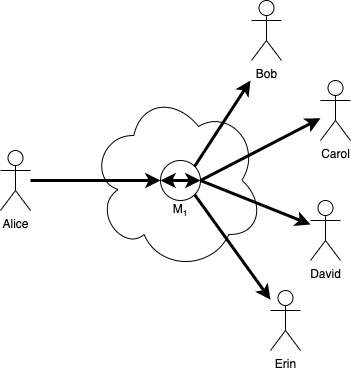
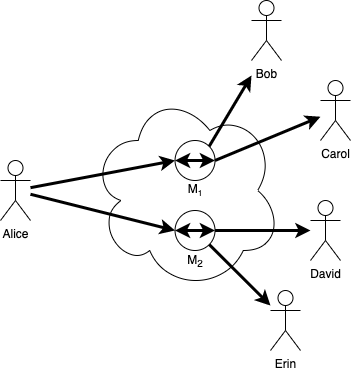
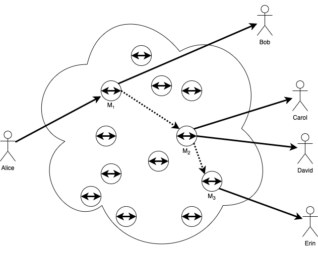
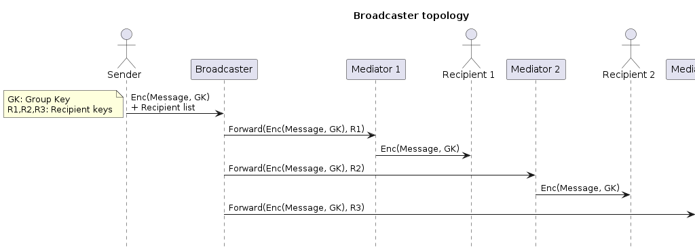

# Scalable anywise DIDComm: a secure anywise peer-to-peer communication based on decentralized identifiers

Authors: Alexander Blom, Ariel Gentile, Berend Sliedrecht, Karim Stekelenburg
Date: 30 September 2022

## Abstract

Currently DIDComm[^1] does not properly handle scalable multi-party well. This paper gives an overview of the current work that has been done in this field and proposes a new solution based on using a network of "repurposed" mediators with onion-like routing.
The current work that has been done in this field includes the following: DRAFT Aries-rfc 0748: N-wise DID Exchange[^2], ThreadSync Protocol[^3], ThreadParticipant Protocol[^4] and Gossyp[^5].
Our proposed solution is a mesh network of mediators who obfuscate the route and allow for a concealed participants list. The group will also share a common group key pair (public, private) which will be used for the end-to-end encryption. The mediators and their layered-encryption will use their own did:peer keypair.
Another proposition we would like to add is a new type of service called: broadcaster. This broadcaster will be able to do heavy lifting for mobile agents in terms of networking and processing power. A single message can be sent to the broadcaster and it will broadcast the message further to the actual recipients.

**Keywords** -- DIDComm, groupchat, broadcasting, scalable, peer-to-peer, networking

## Background

DIDComm[^1] is a promising technology. Although it finds its origin in the space of self-sovereign identity and is primarily used for the exchange of verifiable credentials and presentations, its potential stretches far beyond. One application where DIDComm has potential is chat.

## Motivation

The motivation for this work is to create a scalable anywise communication relation between parties based on DIDComm. DIDComm, v1 and v2, currently support multiple recipients but this does not scale as every person in the group must have an explicit peer connection with everyone else and every message must be seperately encrypted (which is an issue in mobile or low-powered environments). A very common approach for this is the hub-and-spoke[^6] model where a centrilized party is acting as the hub and is something that cannot be used for anywise peer-to-peer communication.

## Prior Art

In this section we discuss the prior art to give a complete overview to the reader. Each section does not cover the same problem as we do, but they each are a component which can be used to optimize or change a specific feature in other solutions. For example, _ThreadSync_[^3] can be used in combination with _n-wise DID Exchange_[^2] and even _ThreadParticipant_[^4].

### n-wise DID Exchange[^2]

### ThreadSync Protocol[^3]

### ThreadParticipant Protocol[^4]

## Use cases

## Broadcasters

A simple alternative to hub-and-spoke[^6] that attempts to prevent a single party to centralize message routing is the use of _Broadcasters_, which are components intended to help on offloading the original senders on the task of both encrypting and sending the same message to different endpoints. 

Broadcasters behave somehow as 'outbound mediators', in the sense that they don't know about the contents of the messages they are broadcasting, but they have to deal with recipient and routing keys. Therefore, it could be possible for a mediator to also provide services of broadcasting.

However, to reduce correlation it is possible to use multiple and/or different broadcasters for each group a sender is registered.

### Message sending

Let's see a practical use case where a sender wants to send a message to three recipients that are using a mediator, which would be the typical case for mobile agents.

In this case, _Sender_ will delegate to its _Broadcaster_ the task of spreading the messages to all recipients. Each recipient might use a different Broadcaster to send their messages and even might choose to rotate among multiple broadcasters to prevent them from knowing the entire participant list.

_Sender_ needs to provide _Broadcaster_ the message they want to send (already encrypted with group key) and the list of recipients for that message. Thus, _Broadcaster_ produces _n_ forward messages containing the incoming message as a payload and packed using each destination's routing keys (if any). 

Each recipient mediator will unpack these forward messages and dispatch them to the related connection for the given recipient key.

Finally, each recipient will receive an encrypted message that, to be unpacked, instead of using recipient key, it will need to use group private key. Therefore, recipient must have a mapping between the recipient key and the group.

In this message sending process, Recipient keys are actually used for identification rather than encryption, which is the only concept that differs from already existing DIDComm messaging specification.

### Broadcast coordination

Much in the same way that Routing Coordination protocol[^7] does, edge agents might want to setup their broadcasters in order to avoid the need of sending the recipient list every time a message is sent.

For instance, a new protocol can be defined to create (and update or delete if needed) sets of recipients lists and just add a reference to each set when sending a message to a certain group.

## Unresolved questions

The mesh and broadcaster topology presented in this document considers that the group members must share a common 'group key' that must be agreed and be able to be rotated. Existing implementations in other E2E group chat systems such as Signal[^8] (which uses Multi-party Off-the-Record messaging[^9]) or Matrix[^10] can be used as an starting point to tackle this issue.

[^1]: [DIDComm](https://identity.foundation/didcomm-messaging/spec/)
[^2]: [DRAFT Aries-rfc 0748: N-wise DID Exchange](https://github.com/mikelytaev/aries-rfcs/blob/17dbae1b54ba94741478c343d65a988648693140/features/0748-n-wise-did-exchange/README.md)
[^3]: [ThreadSync Protocol](/dxoXK4I-TGehMuFRoz1O8g)
[^4]: [ThreadParticipant Protocol](/vJkumSAmRkCXl8nijaLTnQ)
[^5]: [Gossyp](https://github.com/dhh1128/didcomm.org/blob/74e3c9b492150ca3909a777d7b6f20a5891e123d/gossyp/README.md)
[^6]: [hub-and-spoke](https://en.wikipedia.org/wiki/Spoke–hub_distribution_paradigm)
[^7]: [Route Coordination protocol](https://github.com/hyperledger/aries-rfcs/tree/main/features/0211-route-coordination)
[^8]: [Signal private groups](https://signal.org/blog/private-groups/)
[^9]: [Multi-party Off-the-record Messaging](https://www.cypherpunks.ca/~iang/pubs/mpotr.pdf)
[^10]: [Matrix End-to-End Encryption implementation guide
](https://matrix.org/docs/guides/end-to-end-encryption-implementation-guide)
---

- Background and motivation
- Current ecosystem and prior work
    - n-wise did exchange
    - Threadsync
    - Threadparticipant
    - Peer DIDs
- Use cases
- Scope
- References

$let \space G \space be \space the \space group \space key$
$let \space msg \space be \space the \space message \space to \space be \space sent$
$let \space R_{n}^{pub} \space be \space the \space public \space key \space to \space encrypt \space sent$
$let \space P_{n} \space be \space the \space message \space to \space be  \space sent \space forward$

$$P_{0}=(Enc(msg, G), [SE_{0}^{0}..SE_{n}^{0}])$$

$$P_{1}=(Enc(P_{0}, R_{0}^{pub}), [SE_{0}^{1}..SE_{n}^{1}])$$
$$\vdots$$
$$P_{n}=(Enc(P_{n-1}, R_{n-1}^{pub}), [SE_{0}^{n-1}..SE_{n}^{n-1}])$$
