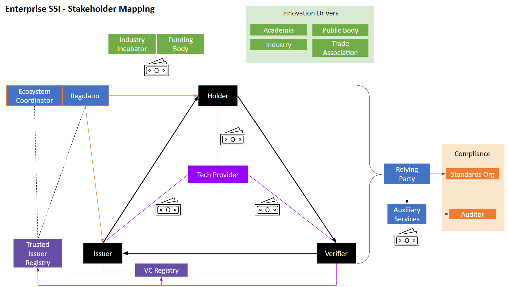

# Surviving in the SSI Ecosystem 
We used **stakeholder mapping** to list relevant questions intended help SSI technology providers (in particular SSI wallet providers) run a business for long-term success. We limited our elaborations to B2B use cases in regulated industries.

We identified SSI ecosystem stakeholders and their roles. We define ecosystem as consisting of all the parties and their environment with which they interact. Based on our mapping, we suggest aspects to consider when shaping an SSI business case.

Our discussions also revealed the importance of a neutral **Ecosystem Coordinator** not only as an operational centre but also as a catalyst for trust between all parties in the ecosystem.

We consider this a starting point for further discussions.

## Enterprise SSI - Stakeholder Mapping

| Role | Function |
| ----------- | ----------- |
| Technology Provider | see chapter below |
| Ecosystem Coordinator / Regulator | see chapter below |
| Trusted Issuer Registry | Is the trust anchor, for example: Maybe be a managed list of trusted entities that issue VC; May be a linked VC; May be a well-known address |
| Issuer, Holder, Verifier | Non-human corporate legal entity |
| Relying Party | Entity (human or non-human) that is affected by the functioning of the Trust Triangle but does not directly participate itself; it may also exert some influence over elements of the Trust Triangle |
| Auxiliary Services | A special type of relying party that builds services or products in relation to the Trust Triangle, e.g. Financial services, Consulting services, Infrastructure services, Data processing & monetisation services, Audit services |
| Innovation Drivers | May sit at any point in the SSI ecosystem; quite likely initial funders that catalyse R&D |

## Technology Provider
Provides digital wallet and optionally other services

### Possible Income Sources
- Subscription fee – direct, indirect (reseller)
- Usage-based charge
- Consulting fees
- Grants
- Investors

### Business Considerations
#### ☆ Prerequisites
We make the following assumptions:
- There is an ecosystem with several parties having a shared problem or interest.
- This problem or interest can be addressed with SSI. (See for example *SSI Scorecard* by [Preukschat & Reed](https://www.amazon.com/Self-Sovereign-Identity-Decentralized-verifiable-credentials/dp/1617296597))
- The available SSI technology stack is sufficiently advanced.

#### ☆ Questions
- What additional value does SSI bring to the table vs incumbents? (e.g. How is SSI better than OpenID Connect?)
- Who has the biggest problem in the ecosystem (fear, uncertainty, necessity, inefficiency)?
- Who has the money? What are their specific concerns or interests?
- Who are key influencers (e.g. regulator, trade associations, early adopters)?
- Who do you need to convince? What do they care about? Design your narrative according to *their* viewpoint.
- What is the focus of your offering?
- Who is your ideal customer?
- What is a suitable business model? (See for example [Decentralized ID Model](https://tykn.tech/decentralized-id-model/) or [Business Model Canvas](https://www.strategyzer.com/canvas)) 
- How do you allocate fees between customers of different size?
- Is there more than one market (e.g. farm produce tracking serves brand perception, Fairtrade compliance and food safety)?
- What is your go-to-market strategy?
- Has this business model been tried by anyone before? What can you learn from them?

#### ☆ Closing Thoughts
- Communicate your SSI ideas and concepts outside of your bubble whenever you can.
- Develop your business hypothesis. Trial it with potential customers. Try and prove yourself wrong.
- Keep reiterating the above questions and be ready to pivot.
- Share success stories publicly.

## Ecosystem Coordinator 
### Governance Layers
#### ☆ Organization Layer: Sets the rules of participation and legal form of the organisation
Key Criteria:
- Must be commercially neutral (and not for profit). If an existing regulator does not fulfil this role, another entity will need to step up or be formed.
- Must set and enforce community governance guidelines; regulator also enforces legal requirements
- May authorize issuers

Governance questions:
- What are the criteria for accepting new partners and entering new use cases? 
- Who decides about acquisition and use of financial resources?
#### ☆ Technology Layer: Defines the criteria of an interoperable digital infrastructure
Key Criteria:
- Must set conformance criteria for architecture and ecosystem participants to ensure interoperability and alignment on expected performance
- May manage Trusted Issuer Registry or other shared resources

Governance question: 
- How are interoperability, maintenance of conformance criteria and further development of the infrastructure ensured? 
#### ☆ Market Layer: Defines the offering of the coordinator, income and investment streams, joint value creation by ecosystem
Key Criteria:
- Facilitates and may fund PoC, pilots
- May offer chargeable consulting or other services that do not create a conflict of interest with its main role as coordinator of relevant parties in the ecosystem

Governance question: 
- Who decides about the creation and evolution of services?
#### ☆ Communication Layer: Shapes the shared key messaging and engages with stakeholders
Key Criteria:
- Facilitates community engagement, incl. stakeholder alignment, innovation meetups
- Facilitates public engagement, incl. education

Governance questions:
- What is the common language, terminology and shared message?
- How is the messaging towards key target audiences managed?

### Ecosystem Coordinator Evolution
#### ☆ Phase 1: Discovery
Determining the characteristics of the ecosystem, its positioning and why a SSI is needed
- purpose and goals
- members: motivations, contributions, benefits
- coordinator’s position within ecosystem and ecosystem position in wider environment
- technology layer
#### ☆ Phase 2: Design
Making high-level governance design choices including structures, coordination and incentives
- organization and participation structures
- decision mechanisms
- incentive mechanisms
- internal and external communication mechanisms and coordination
#### ☆ Phase 3: Deployment
Establishing an organisation with legal, organisational and technical frameworks
- legal framework and statute
- community rules
- organizational roles and responsibilities
- funding sources
- technical frameworks

## Authors
- Dr Christiane Wirrig, [Spherity](https://www.spherity.com/)
- Hans Boone, 

## Acknowledgements
Some thoughts on the Ecosystem Coordinator were inspired by discussions with Harmen van der Kooij of the [Dutch Blockchain Coalition](https://dutchblockchaincoalition.org/).