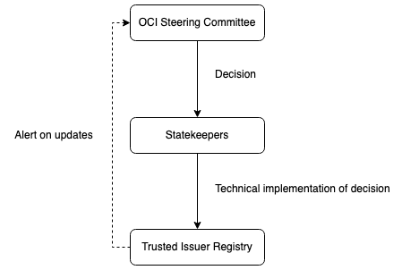
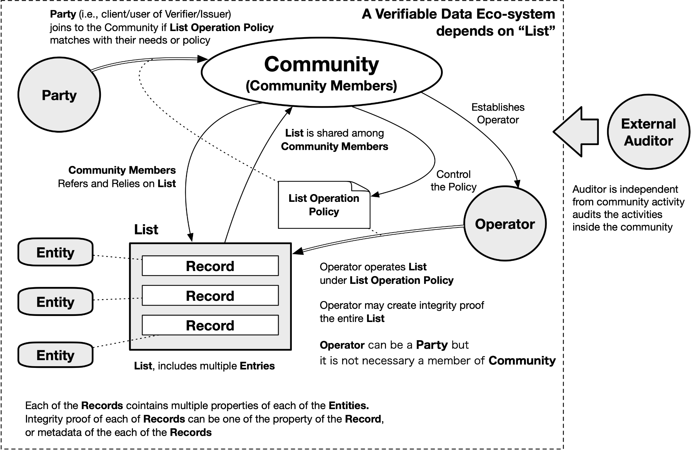
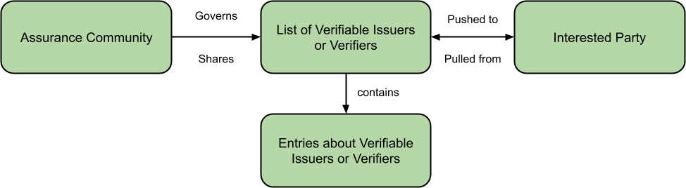
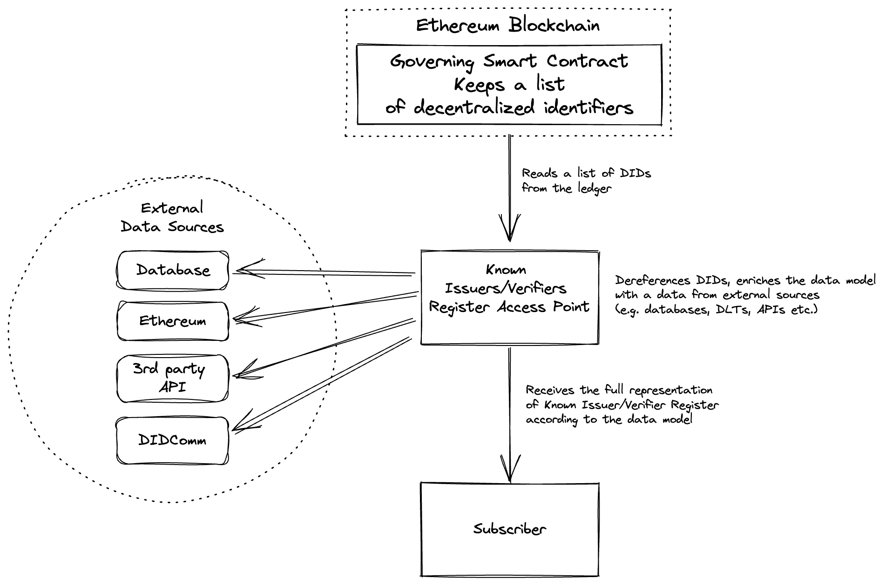

# Verifiable Issuers & Verifiers      

### Enabling anyone to share information about the Issuers and Verifiers for whom they assure trust

#### by Manu Sporny, Oskar van Deventer, Isaac Henderson Johnson Jeyakumar, Shigeya Suzuki, Konstantin Tsabolov, Line Kofoed, Rieks Joostena

## Abstract

This work focuses on how a party or its agent can decide whether or not
to engage with a counterparty in a transaction. The purpose of this work
is to enable the sharing of a list of Verifiable Issuers and Verifiers
in a way that is useful to a particular transaction. A set of use cases
provide examples where verification of an Issuer ("Is that diploma from
a recognized university?") or Verifier ("Should the wallet block an
unauthorized Verifier?") is needed. The studied prior art highlights
various solutions to verify Issuers and Verifiers and identifies a lack
of standards. Important contributions from this paper include a unified
set of requirements, a data model, and multiple serializations of the
data model --- including but not limited to Verifiable Credentials,
DNSSEC, and blockchain-based serializations --- that could then be
incubated and sent onto the standards track at global standards setting
organizations.

# 1. Introduction

## 1.1 General

The maintenance of lists of Verifiable Issuers, sometimes referred to as
Trusted Registries, is a well-known concept from the pre-internet age.
Whenever there is a diploma signed by a university, there are people and
organizations that keep track of what universities exist and what
methods can be used to confirm the authenticity of that diploma. A list
could be maintained by HR staff for the purpose of hiring personnel
based on qualifications asserted by particular Verifiable Issuers, and
the governance of that list would be minimal. Another list could be
maintained by a government, associated with well-governed accreditation
procedures, for the purpose of assuring that a diploma represents a
proper education. Lists of Verifiable Issuers support Verifiers in their
decision to trust the Issuer of a Verifiable Credential that is
presented by a Holder.

Digitally sharing lists of Verifiable Issuers and Verifiers is a
relatively new concept[^1]. The list of parties that are allowed to
use the digital fingerprint information on the chip of RFID-based
digital passports is one example. This is cryptographically enforced:
"chip-says-no" when an unauthorized party attempts to access this
information on the chip. Also eIDAS v2 will have a Verifiable-Verifiers
List that limits the access of Verifiers to credentials in a EUDI
(EUropean Digital Identity) wallet. Verifiable-Verifiers Lists support
Holders and holder implementations in their decision to trust a Verifier
to share a Verifiable Presentation to that Verifier.

Lists of Verifiable Issuers and Verifiers help to automate the decision
process of whether to engage with a counterparty in a transaction and
make it more auditable by ensuring that software can note that a party
was on a list before engaging with them. This paper contains the
following sections that provide background on the problem space as well
as a proposed set of solutions given the current state of the market:

-   Section 2 presents a set of use cases in the digital age that
    explain the use of lists of Verifiable Issuers and Verifiers.
-   Section 3 analyses prior art such as lists of Verifiable Issuers and
    Verifiers that have already been deployed, or that are being
    developed, as well as a gap analysis of the current solutions and
    desired outcomes.
-   Section 4 highlights the unified requirements derived from the
    analysis of prior art and a conceptual model for sharing lists of
    Verifiable Issuers and Verifiers and the format of the entries in
    the list.
-   Section 5 provides a concrete data model and possible
    serializations, which could serve as a starting point for future
    standardization.
-   Section 6 discusses possible next steps towards future
    standardization.
-   Section 7 concludes the paper and proposes future work.

The target audience of this paper is people that know the basics of
Self-Sovereign Identity (SSI) such as the concepts of Issuer, Holder,
Verifier, and Verifiable Credential. SSI developers may use this
document as input and inspiration for their code and other products.
Deployers of SSI use cases may use this document in the specification
process of their deployment.

## 1.2 Terminology

This section defines key terminology used throughout this paper with
references to W3C terminology.

### Credential

A set of one or more
[claims](https://www.w3.org/TR/vc-data-model/#dfn-claims) made by an
[issuer](https://www.w3.org/TR/vc-data-model/#dfn-issuers). A
**verifiable credential** is a tamper-evident credential that has
authorship that can be cryptographically verified. Verifiable
credentials can be used to build [verifiable
presentations](https://www.w3.org/TR/vc-data-model/#dfn-verifiable-presentations),
which can also be cryptographically verified. The
[claims](https://www.w3.org/TR/vc-data-model/#dfn-claims) in a
credential can be about different [subjects.
](https://www.w3.org/TR/vc-data-model/#dfn-subjects)

### Electronic Identification, Authentication and Trust Services (eIDAS)

**eIDAS** (**e**lectronic **ID**entification, **A**uthentication and
trust **S**ervices) is an [EU
regulation](https://en.wikipedia.org/wiki/Regulation_(European_Union))
on [electronic
identification](https://en.wikipedia.org/wiki/Electronic_identification)
and [trust
services](https://en.wikipedia.org/wiki/Trust_service_provider) for
[electronic
transactions](https://en.wikipedia.org/wiki/Electronic_transactions) in
the [European Single
Market](https://en.wikipedia.org/wiki/European_Single_Market). It was
established in EU Regulation 910/2014 of 23 July 2014. All
organizations delivering public digital services in an EU member state
must recognize electronic identification from all EU member states from
September 29, 2018.

### European Digital Identity (EUDI)

The European Digital Identity is based on a European Commission document
called "European Digital Identity Architecture and Reference Framework"
that has established the functional and architectural requirements for
an upcoming European Digital Identity Wallet.

### Holder

A role an [entity](https://www.w3.org/TR/vc-data-model/#dfn-entities)
might perform by possessing one or more [verifiable
credentials](https://www.w3.org/TR/vc-data-model/#dfn-verifiable-credentials)
and generating
[presentations](https://www.w3.org/TR/vc-data-model/#dfn-presentations)
from them. A holder is usually, but not always, a
[subject](https://www.w3.org/TR/vc-data-model/#dfn-subjects) of the
[verifiable
credentials](https://www.w3.org/TR/vc-data-model/#dfn-verifiable-credentials)
they are holding. Holders store their
[credentials](https://www.w3.org/TR/vc-data-model/#dfn-credential) in
[credential
repositories](https://www.w3.org/TR/vc-data-model/#dfn-credential-repository).

### Issuer

A role an [entity](https://www.w3.org/TR/vc-data-model/#dfn-entities)
can perform by asserting
[claims](https://www.w3.org/TR/vc-data-model/#dfn-claims) about one or
more [subjects](https://www.w3.org/TR/vc-data-model/#dfn-subjects),
creating a [verifiable
credential](https://www.w3.org/TR/vc-data-model/#dfn-verifiable-credentials)
from these [claims](https://www.w3.org/TR/vc-data-model/#dfn-claims),
and transmitting the [verifiable
credential](https://www.w3.org/TR/vc-data-model/#dfn-verifiable-credentials)
to a [holder](https://www.w3.org/TR/vc-data-model/#dfn-holders).

### Level of Assurance (LoA)

The degree of certainty that a relying party can have about the true
identity of someone presenting an identity credential. Four levels of
assurance were outlined by a 2006 document from the US National
Institute of Standards and Technology (NIST 800-63). The level of
assurance is measured by the strength and rigor of the identity proofing
process, the strength of the token used to authenticate the identity
claim, and the management processes the identity provider applies to it.

### Sharing

The act of transferring information from one party to another. This
paper uses the word \"sharing\" instead of \"publishing\" as the latter
presumes a one-way and public transfer of information. The **Verifiable
Issuer/Verifier** **lists** described in this paper are made available
in some form or other. They might be pushed to a party or pulled from a
party and might use a public communication channel or a private one.

### Verifiable Issuer / Verifiable Verifier

A party that is verifiable might have different levels of
trustworthiness associated with it by different parties. Note that
"trusted" or "authorized" are sometimes used as synonyms for
"verifiable", as the purpose of some lists is to assure trust or
authority. This paper uses the word "verifiable" as no presumption
should be made about the application of the lists, or the
trust/authority that they assure.

### Verifiable Issuer/Verifier List

A container that consists of a set of **Verifiable** **Issuers** or
**Verifiers**. The word "list" can be considered synonymous to
"register", depending on the amount of governance, assurances and
authority associated with it. This paper uses the word "list" and
presumes there will always be some form of governance, if only the
establishment of its purpose and the format of its entries.

### Verifier

A role an [entity](https://www.w3.org/TR/vc-data-model/#dfn-entities)
performs by receiving one or more [verifiable
credentials](https://www.w3.org/TR/vc-data-model/#dfn-verifiable-credentials),
optionally inside a [verifiable
presentation](https://www.w3.org/TR/vc-data-model/#dfn-verifiable-presentations)
for processing. Other specifications might refer to this concept as a
relying party.

## 1.3 Criteria

This section contains criteria that can be used to determine whether
something does or does not fit a particular terminological definition in
the previous section.

### sharing

-   Enables other parties to obtain a copy of a **list entry** about an
    **Issuer** or **Verifier** from the **list**, e.g. in VC format,
    through DNS query, or other mechanism.
-   May or may not enable others to obtain a copy of the full contents
    of a **list**.
-   Those others may be anyone in the world, or they may be only those
    who have access to the **list** or to a specific entry about an
    **Issuer** or **Verifier**.

### list

-   Contains zero-or-more entries about any **party**.
-   A list entry contains data about one specific **party.** The data is
    specified by the **party** that **governs** the **list**.
-   A list is associated with a policy containing one or more criteria
    that are used to determine whether or not a **party** qualifies for
    being registered in the **list**. Criterion may distinguish between
    **parties**, e.g., between parties that are trusted to issue or
    verify VCs of a specific kind.
-   Other parties may use the data in a **list entry** as the basis for
    a decision, e.g., to share further information, or to engage in a
    transaction. The perceived use of **list entries** by other
    **parties** should guide the **party** that governs the **list** as
    it specifies the structure of **list entries**.

### parties

-   Are expected to perform the roles of **issuer**, **holder**, and
    **verifier** as well as other verifiable-credential-related roles
    (e.g., revocator).
-   May or may not be a legal authority.
-   The **party** that manages the list has to be able to precisely
    describe the thing that the list entry enables because software will
    act upon that machine-readable description. For example, \"Issues
    Student ID cards for University X\".

# 2. Use Cases

This section outlines use cases that highlight the need for the
technology described in this paper by discussing the use cases in two
categories:

-   Verifiable Issuers
-   Verifiable Verifiers

A final use case section then checks for commonalities and differences
between the two categories

There are a number of other locations that have published use cases that
are related to this paper. Rather than include those use cases in this
document, they are included by reference:

-   [*Authorized Issuer List Use
    Cases*](https://github.com/WebOfTrustInfo/rwot11-the-hague/blob/master/advance-readings/authorized-issuer-lists.md#authorized-issuer-list-use-cases)
-   [*ESSIF-Lab Trust Management Infrastructure (TRAIN) Business
    Case*](https://gitlab.grnet.gr/essif-lab/infrastructure/fraunhofer/train_project_summary#business-problem)

## 2.1 Verifiable Issuer Use Cases

-   Acme Inc. is a producer of medical equipment. Twin Mountains
    Hospital decided to buy equipment from Acme Inc. The law says that
    medical equipment should be certified by a 3rd party certification
    body. Twin Mountains Hospital requests a certification from Acme,
    Inc.; Twin Mountains Hospital delivers it to them. The hospital then
    checks if Acme Inc. is in the Verifiable Issuer List of licensed 3rd
    party certification bodies to see if the Issuer of Acme Inc.\'s
    certification is an approved certification body.
    -   Note: The solution might need to convey a single item in a List
        vs. the entire List.
    -   Note: Many similar certification/license use cases are out
        there.
-   Walmay, Inc. is a wholesaler of drugs. John & Jane is a manufacturer
    of drugs. Walmay, Inc. finds out that a lot of Adenosine
    Triphosphate drugs has broken packaging and decides to return the
    lot to the manufacturer. It is required that all interactions in the
    drug market must be done only between authorized trading partners.
    John & Jane requests an authorized trading partner certificate from
    Walmay Inc. The certificate credential contains a link to the
    Issuer. John & Jane then verifies that the Issuer is a member of the
    Verifiable-Issuer List of Issuers authorized to issue ATP
    (Authorized Trading Partner) credentials.
-   Elena is an IT Administrator in the hiring department of a mid-size
    company that would like to vet job applicants as having received
    their degrees from an accredited college or university. Elena
    configures their hiring software to refer to multiple lists
    (Verifiable-Issuer Lists) containing several hundred organizations
    that are curated by the various accreditation bodies that they
    trust.
-   Line is elected treasurer of a Dutch church. In
    her role as treasurer, she goes online to open a bank account for
    the church. To comply with certain laws and adhere to internal risk
    mitigating policies, the bank needs to verify that Line has been
    authorized by the church to sign on its behalf. For companies,
    personal information about executive board members is registered by
    the Chamber of Commerce alongside the registration of the legal
    entity. However, due to the special sensitive nature of data
    regarding religious affiliations, the Chamber of Commerce in the
    case of religious institutions (mosque/synagogue/church) is
    prohibited from registering any data that can be correlated with a
    natural person. Instead of checking the Chamber of Commerce public
    register, the bank requests a credential from Line stating her
    mandate to sign, which she received from the church. The bank checks
    whether the church is on the Verifiable Issuer-List of Churches,
    which is maintained by the Chamber of Commerce. Finding the church
    on the list, the bank is now able to open a bank account for the
    church, which Line can administer.


***Figure 1: A Verifiable-Issuer List helps verifying whether a diploma is
genuine.***

## 2.2 Verifiable Verifier Use Cases

See also [*Verify the Verifier - Anti-coercion by Design; October 2020 | TNO*](https://blockchain.tno.nl/blog/verify-the-verifier-anti-coercion-by-design/)

-   Yuri has a digital driver\'s license and is attempting to rent a car
    from CarMart. CarMart requests to see Yuri\'s age, motor vehicle
    class, and driver\'s license number. Yuri\'s software checks against
    a Verifiable-Verifier List to make sure that CarMart is a Verifiable
    authority for information of that type, so it can warn Yuri if
    CarMart isn\'t trusted to request that information from Yuri.
-   Oskar joins a tennis club. The tennis club requests a
    government-issued proof of birth date. However, the tennis club does
    not have authorization to ask for this personal information. As a
    consequence, Oskar's certified EUDI wallet refuses to present the
    information, based on the absence of the tennis club in the relevant
    Verifiable-Verifier List. The tennis club realizes that they cannot
    obtain this high-LoA information from the EUDI wallet and instead
    accepts a self-asserted date-of-birth by Oskar.
-   Oskar was invited by the European Commission to become an evaluator.
    Even though Oskar would be paid only the equivalent of a book
    voucher, the EC requires a full contracting process, which includes
    an eIDAS LoA high identification and a recent authentic bank
    statement. Even though Oskar considers these requirements
    unreasonable, Oskar's certified EUDI wallet accepts the request, as
    the EC is registered in the relevant Verifiable-Verifier List. This
    way, Oskar knows at least that the request is genuine, and that
    there exists a sufficiently-well-governed policy associated with the
    request.
-   Oskar crosses the border to Dystopia. Immigration requests that
    Oskar surrender all Verifiable Credentials in his SSI wallet,
    including identification, driver's license, diplomas, certifications
    and other records. Immigration of this country is not authorized to
    make such a wide request, as it is not included in the relevant
    Verifiable-Verifier List. As a consequence, Oskar's certified EUDI
    wallet refuses to present this information. Even the threat of
    denial-of-entry or worse cannot change the situation, as neither
    immigration nor Oskar himself is physically able to compromise
    Oskar's EUDI wallet to surrender the information.


***Figure 2: A properly-implemented wallet with
Verifiable-Verifier List protects citizens against overzealous law
enforcement.***

## 2.3 Commonalities and Differences

Conceptually and technically, the two types of lists (Verifiable Issuer,
Verifiable Verifier) are fairly similar. Each type is a governed list of
parties with a role in SSI exchanges. Each type needs to provide some
form of sharing (publication/access), so that the list is available to
its users. This paper will presume that the types of lists themselves,
as well as their sharing methods, can be technically identical. The only
distinction is that a list could contain only Verifiable Issuers, only
Verifiable Verifiers, or a mixture[^2] of both, so the data model
should accommodate this.

Major differences arise in the applications surrounding the lists.
Verifiable Issuer lists target Verifier implementations, whereas
Verifiable Verifier lists target Holder (digital wallet)
implementations. Also there may be major differences in the governance
between the two types of lists, or whether/how the consulting of lists
is implemented and enforced. All of these differences are out of the
scope of this paper.

# 3. Analysis of Prior Art

## 3.1 Historic Perspective of lists of Verifiable Issuers and Verifiers

Verifiable Issuer lists pre-date the digital age. Governments have
always maintained lists of organizations with accreditation. This
includes educational accreditation (schools, universities), bank
accreditations, and telecom-operator licenses. A chamber-of-commerce
typically maintains a queryable register of companies. Many of those
lists have become queryable via an electronic Application Programming
Interface (API).

Verifiable-Verifier lists could be introduced in the digital age,
ensuring that only authorized parties could access specific sensitive
data. An example of this is the Extended Access Control of European
biometric passport chips.

This example, as well as several other existing
Verifiable-Issuer/Verifier Lists and technologies for these are
described in the remainder of this section. Note that, as highlighted in
the terminology section, different prior art uses different terminology,
e.g., "trusted" or "register."

## 3.2 EBSI Trusted Issuer Registry

EBSI, the European Blockchain Service Infrastructure, is a joint
initiative from the European Commission and the European Blockchain
Partnership. See also

[*https://api.preprod.ebsi.eu/docs/apis/trusted-apps-registry/latest#/*](https://api.preprod.ebsi.eu/docs/apis/trusted-apps-registry/latest#/)

One of the services offered by EBSI is a Trusted Issuers Registry (TIR).
The TIR is a generic decentralized registry holding information about
trusted Issuers such as public information, accreditations, and other
data. The TIR enables a Verifier to validate the identity and
accreditations of Trusted Issuers. The TIR is an Ethereum smart contract
that is deployed on the permissioned EBSI ledger for the purpose of
being public while at the same time ensuring a high level of trust and
transparency. The public smart contract methods are exposed via APIs:
JSON-RPC for write operations and REST for read operations. The API of
the EBSI TIR is published at
[*https://api.preprod.ebsi.eu/docs/apis/trusted-Issuers-registry/latest#/*](https://api.preprod.ebsi.eu/docs/apis/trusted-issuers-registry/latest#/).
The authors could not find any public information about the governance
of the TIR, e.g. how an organization could get itself registered on the
EBSI TIR. The EBSI documentation states: "Accreditation of trusted
Issuers domain-specific and is outside the EBSI scope".

The authors asked EBSI about Trusted Verifier Registry, and got the
following response: "At this moment, EBSI does not have a Verifier
Register as the Use Cases we are currently working on don\'t require
one. This means that Verifiers are not onboarded and they are not
accredited either -- in the sense of the accreditation given to Issuers.
If needed be, we could replicate the Issuers' trust model and apply it
to Verifiers. However, before doing this, we would need to have a
requirement from a Use Case[^3]."

## 3.3 Biometric passport chip

Certain passports have a chip that stores biometric information (facial
image and fingerprints). See
[*https://home-affairs.ec.europa.eu/policies/schengen-borders-and-visa/document-security_en*](https://home-affairs.ec.europa.eu/policies/schengen-borders-and-visa/document-security_en)

The chip is cryptographically secured. Only authorized chip readers can
read and verify the fingerprint information. This is enforced through
technology and governance processes that include a VerifiableVerifier
List. The so-called Extended Access Control (EAC),
[*https://www.icao.int/Security/FAL/PKD/BVRT/Pages/Document-readers.aspx*](https://www.icao.int/Security/FAL/PKD/BVRT/Pages/Document-readers.aspx),
is used to protect biometric data (fingerprint or iris) on the chip of
the ePassport. EAC is used by states in the European Union and the
Schengen-Area that wish to be able to share biometrics with other
States. This is achieved through a more complex cryptographic
infrastructure than is found in BAC/SAC and also implies an additional
Public Key Infrastructure for its Verifiable-Verifier List.

## 3.4 Gaia-X trust registry

Gaia-X is a framework for European federated cloud infrastructure
([*https://docs.gaia-x.eu/framework/*](https://docs.gaia-x.eu/framework/))
within which many parties provide cloud-related federation services.
Gaia-X includes Gaia-X Lab Registry, where one can verify the validity
of signed claims (e.g., self descriptions) by checking the provided
certificates against Gaia-X endorsed Trust Anchor certificates: see
[*https://gitlab.com/gaia-x/lab/compliance*](https://gitlab.com/gaia-x/lab/compliance).
Gaia-X provides open-souce code for a personal credential manager
(mobile wallet) and an organizational credential manager
([*https://gitlab.com/gaia-x/data-infrastructure-federation-services*](https://gitlab.com/gaia-x/data-infrastructure-federation-services)).
Gaia-X also provides an associated Trust Framework
([*https://compliance.gaia-x.eu/*](https://compliance.gaia-x.eu/)).

## 3.5 eSSIF-Lab TRAIN

### 3.5.1 TRAIN (TRust mAnagement INfrastructure)

[*Fraunhofer IAO*](https://www.iao.fraunhofer.de/en.html), a German
Research Institute based in Stuttgart, Germany, has developed [***TRAIN***](https://train.trust-scheme.de/info/)[*(TRust mAnagement
INfrastructure)*](https://train.trust-scheme.de/info/), which provides
an infrastructure that allows to verify the trustworthiness of involved
parties in an SSI Ecosystem. An example would be if a certain Issuer is
trustworthy (e.g. is it a real bank or just a fake bank).

TRAIN aims to add a trust-component to an SSI ecosystem. This component
enables the discovery and verification of lists of trustable parties in
the ecosystems (Trust Registries), as well as the definition,
consideration, and verification of eIDAS compliance (including LoAs) of
involved parties. TRAIN provides a decentralized framework for the
publication and querying of trust information. It makes use of the
Internet Domain Name System (DNS, DNSSEC) with its existing global
infrastructure, organization, governance and security standards to
establish the trust discovery process.

### 3.5.2 Interoperability using ETSI Trust List

TRAIN leverages the European Telecommunications Standards Institute
(ETSI) Technical Standard (TS) 119 612 \[ETSI\] for Trust Lists to
facilitate interoperability and adoption. This standard is already in
productive use for eIDAS Trust Lists for the identification and
verification of Qualified Trust Service Providers (QTSP). eIDAS Trust
List compiles different accredited Trust Service Providers along with
their services in a machine-readable form. For the SSI ecosystem the
Trust Service Providers' equivalent will be trustable (according to the
rules and accreditation processes of the respective Trust Scheme/Trust
Framework) entities who operate as Issuers, Holders, and Verifiers.
Entities and services can vary according to the respective requirements
and application domains of a certain Trust Scheme. For example: a State
authority can be a Trust Service Provider who offers different services
like National identity credential issuance, social security number
issuance, etc. These different services details are made available
through TRAIN Trust Lists in a machine-readable form. Thereby other
entities are able to verify the trustworthiness of these entities
\[TRAIN\].

### 3.5.3 TRAIN Outcomes

An illustrative interoperability use case for the European Health
Insurance Card (EHIC) has been realized and demonstrated with SICPA SA
and Validated ID \[TRUST\]. The latest draft of OpenID Connect for
Verifiable Presentations (OIDC4VC)\[OPENID\] contains informative
implementation guidelines describing how Issuers, Holders, and Verifiers
can utilize the TRAIN trust scheme approach. The TRAIN approach was also
used to develop a Proof of Concept (PoC) for Global Covid Certificate
Network (GCCN), an initiative by Linux Foundation for Public Health
(LPFH) to identify the trustworthiness of Covid Credentials on a global
scale\[GCCN\].

## 3.6 Ethereum-based

### 3.6.1 General

Spherity GmbH
([*https://www.spherity.com/*](https://www.spherity.com/)), a German
company, is working on a solution named CARO
([*https://www.caro.vc/*](https://www.caro.vc/)), which enables trading
partners in the US pharmaceutical industry to verify the Authorized
Trading Partner (ATP) status of their business partners. During the
verification process an ATP should check if the Issuer of the
counterparty Verifiable Credential was issued by a trusted Issuer.

The implementation
([*https://github.com/Open-Credentialing-Initiative/trusted-Issuer-registry*](https://github.com/Open-Credentialing-Initiative/trusted-issuer-registry))
implies the storage of the DIDs of trusted Issuers in a smart contract
on the Ethereum blockchain. The application then makes a request to
Ethereum in order to get the list of trusted Issuers and check if the
party of interest is in the list.

The governance of the list of trusted Issuers is done
by Open Credentialing Initiative
([*https://open-credentialing-initiative.github.io/OCI-Governance/#trusted-issuer-registry-governance*](https://open-credentialing-initiative.github.io/OCI-Governance/#trusted-issuer-registry-governance)),
who maintains a Trusted Issuer Registry. To this end, it employs an
Ethereum smart contract managed by so-called Statekeepers. They execute
the Steering Committee's decisions concerning the Trusted Issuer
Registry and report to the Steering Committee.



***Figure 3: Maintaining an Ethereum-based Trusted Issuer Registry.***

The approach aims to enforce the following policies:

-   Always available

    -   Calling the verifiable authorities list is an integral element
        in the verification of a counterparty identity or/and
        credentials, so it should be always available.

-   Trustless

    -   The architecture and the execution of the verifiable authorities
        list should not be owned and controlled by a single entity.

-   Transparent

    -   The code, state, and executions of the verifiable authorities
        list should be transparent to all parties in the ecosystem.

-   Auditability

    -   It should be possible to retrieve a previous state of the
        verifiable authorities list.

-   Security

    -   Changes to the verifiable authorities list should only be made
        by trusted entities. For this, a governance protocol is defined
        that relies on strong cryptography enforced by the Ethereum
        network.

-   Privacy

    -   Only the changes to the verifiable authorities list are visible
        (as events in the Ethereum network). Read operations are not
        recorded in the Ethereum network, so no one can trace if the
        list was retrieved or the frequency of such operations.

### 3.6.2 Architecture

The smart contract containing the trusted Issuer
registry is deployed to the Ethereum blockchain and acts as a backend.
Its state and methods can be accessed via an Ethereum node, e.g., an
OCI-owned one, that exposes all needed RPC methods or by a service such
as Infura.


***Figure 4: Interacting with the Ethereum blockchain.***

## 3.7 Trust-over-IP Trust Registry Task Force

The [*Trust Registry Task force of Trust Over IP
Foundation*](https://wiki.trustoverip.org/display/HOME/Trust+Registry+Task+Force)
(ToIP) attempts to address the requirement of enabling interoperability
in order to support transitive trust within and between different trust
communities implementing the ToIP stack. In this case, the desired
interoperability outcome is a common protocol that works between any
number of decentralized peer trust registries operated by independent
governing authorities representing multiple legal and business
jurisdictions.

In the [*v1 specification of Trust Registry
Protocol*](https://github.com/trustoverip/tswg-trust-registry-tf/blob/main/docs/ToIP%20Trust%20Registry%20V1%20Specification.md)
the trust registry was planned to include the authorized
Issuers/Verifiers. The scope of the specification was restricted to
query the current status of the entry in the trust registry. But the
definition of other metadata types has been planned for the second
version of the specification. And in the current specification the query
works based on the REST APIs but it seems to be moved to DIDComm. There
is also a swagger API available to describe what the query response
looks like.

The specification also contains the details to include **TrustService
***type *Property in the DID Document, thereby allowing authorities to
configure their trust registries in serviceEndpoint as HTTPS URI. Based
on the current specification it seems like the trust registry supports
DID serializations but there is not much clarity to accommodate
different serializations such as x.509, VC etc.

Trinsic built technology to quickly establish SSI trust registries. This
work was performed in NGI eSSIF-Lab:
[*https://gitlab.grnet.gr/essif-lab/infrastructure_3/trinsic*](https://gitlab.grnet.gr/essif-lab/infrastructure_3/trinsic).
The technology links to Fraunhofer TRAIN, which was also initiated in
the eSSIF-Lab context. Both are documents published by the ToIP
Foundation.

## 3.8 Expression as Verifiable Credential

In 2022, an advanced reading paper was submitted to the Rebooting the
Web of Trust 11 conference in The Hague, Netherlands. The paper was
based on work performed for the US Department of Homeland Security in
2020-2022 related to the publication of lists of authorized issuers for
issuing Verifiable Credentials.

The primary focus of the paper was a technical solution that would be
compatible with the W3C Verifiable Credentials ecosystem. As such, the
paper proposed a data model and serialization format for the lists. An
example of a serialized list is shown below:

**EXAMPLE: An VerifiableIssuerCredential Verifiable Credential**
```
{
  "@context": [
    "https://www.w3.org/2018/credentials/v2",
    "https://w3id.org/vc/viv/v1"
  ],
  "type": ["VerifiableCredential", "VerifiableIssuerCredential"],
  "issuer": "did:web:authority.example",
  "validFrom": "2023-02-13T00:18:30.053Z",
  "credentialSubject": [{
    "id": "did:web:issuer.example",
    "type": "AuthorizedIssuer",
    "authorizedToIssueCredential": [{
      "type": "UniversityDegreeCredential",
      "credentialSchema": {
        "id": "https://issuer.example/degree.json",
        "type": "JsonSchema2022"
      }
    }, {
      "type": "StudentIdCredential",
      "credentialSchema": {
        "type": "AuthorizedIssuerJsonSchema2022",
        "schema": "{\"properties\":\{\"credentialSubject.state\":\"NV\"}}"
      }
    }]
  },
  "proof": { ... }
}
```
The use cases and requirements outlined in the Authorized Issuer List
paper have been merged into this paper. The base data model provided in
the Authorized Issuer List paper has been analyzed and merged into the
TRAIN work described in this paper in a way that the authors believe
will be compatible with the ETSI standard (TS 119 612) for Trust Lists.

## 3.9 Governance of Verifiable-Issuers/Verifiers Lists

Governance of a Verifiable-Issuers/Verifiers List may include the
following:

-   Policies that determine what requirements Issuers and/or Verifiers
    need to satisfy and comply with in order to be registered on a
    Verifiable-Issuers/Verifiers List.
-   Policies that determine how one can become a subscriber, and how
    they may access the List.
-   Policies about the business model of the registry.
-   Enforcement of these policies, e.g. what happens if an Issuer or
    Verifier starts violating the policies. Governance is about policies
    related to subscribers and whether/how they may access the List.
-   Policies about how the policies are maintained, and who decides
    about those policies.
-   Policies about the assurance community that governs the List, e.g.
    how to join or leave the assurance community.

A Verifiable-Issuers/Verifiers List also needs technical policies, which
includes decisions about the data model of the List and its
serialization. There is a paper which discusses the governance of
important small data works \[DADCGO\]. The discussion of that paper
fully applies to the focus of this paper. The rest of this section is an
adaptation of the discussion for this paper.

The use of curated lists requires a mechanism to govern the value shared
within the ecosystem by such lists in a manner that includes who curates
the lists and what the policy for that curation will be, down to who
benefits from the lists.

It is well known that using X.509 PKI requires root Certificate
Authority certificates (root CA certificates) as the root of trust, and
this information is built into each OS and browser as a \"Trust Store.\"
Which root CA certificate is included in the Trust Store is fully
controlled by the organization that provides the software services
depending on the Trust Store included in the software or services. In
other words, Trust Stores are governed by operational rules predefined
by the controlling authority. Examples of the Trust Store and
operational rules include but are not limited to Microsoft \[MS\], Apple
\[Apple\], Google \[Gogle\], and Mozilla \[Mozilla\] products.

Until now, ordinary users have not been aware of such a trust store, but
from the perspective of constructing a self-sovereign system, such as
the application using Decentralized Identifiers and Verifiable
Credentials, it is crucial to understand its nature because it leads to
the determination of what to trust. Therefore, it is necessary to fully
understand the model of a system such as a trust store and to develop
governance mechanisms and policies that are appropriate to the nature of
the list.

In this section, we will explain the entities and their relationships
and policies that define the management of the list discussed in this
document, according to the perspectives described above.



***Figure 5: Governance of Verifiable-Issuers/Verifiers Lists.***

First, assume a Verifiable Data Eco-System that uses this list together.
Then, consider a community with Community Members who have decided to
use this list.

It is crucial to note the perspective of whether governance is
determined by the community or is external. As a driving principle, we
are designing a decentralized system with Self-Sovereignty in mind.
Thus, relying on external entities is not desirable. Even if governance
is externally constituted, if the community consists of members agreeing
to use the external governance, we can treat the external governance as
part of the community. From these two perspectives, we can simplify the
discussion that the governance mechanism is formed from within the
community\'s perspective. Note that it is also possible to express
governance in the form of a governance body within the community, such
as ICANN\'s board of directors, but since this is not relevant to the
essence of this discussion, it was omitted for the sake of brevity.

With the above context, the details of each of the entities in terms of
the governance contexts are the following:

-   A Party can choose whether or not to become a community member.
-   To be a community member means to choose to use the list for the
    list\'s purpose.
-   Leaving the community may be an option if the community member no
    longer agrees with the established policy.
-   The List Operation Policy defines the nature of the list.
-   The community member establishes the List Operation Policy
    establishes an operator, and the operator operates the list
    according to the List Operation Policy. In other words, the
    community governs the state of the list by the provisions of the
    List Operation Policy.
-   Each community member refers to and uses the list.
-   If needed, an external auditor might be necessary.

## 3.10 Gap Analysis: Missing Standards and Verifiable Credentials

The discussed prior art shows that, although there exist quite a few
implementations of Verifiable-Issuers Lists, and fewer
Verifiable-Verifiers Lists, all of them use proprietary APIs to access
entries to those lists. This is limiting, as APIs require a "phone-home"
API call for every verification, which is inefficient, time-consuming, a
potential privacy risk, and impractical in offline scenarios. Moreover,
the proprietary nature of the APIs imply significant integration cost
for implementations that aim to support multiple lists, and that give
users and stakeHolders viable choice and switching possibility between
lists.

The proprietary nature of the APIs can be resolved through harmonization
and standardization of both the data model and the serialization of
Verifiable-Issuers/Verifiers Lists.

The time/efficiency, offline and privacy issues with the API approach
can be resolved by including a standardisable serialization based on
Verifiable Credentials and/or anonymous credentials (anoncreds).

# 4. Requirements

## 4.1 Conceptual Model

An Assurance Community is what governs a list of Verifiable Issuers
and/or Verifiers. The community can consist of a single person, a group
of people, an organization, a group of organizations, or any other
relevant structure. The governing can be purely manual, partially
automated, or completely automated through the use of APIs or smart
contracts.

A list of Verifiable Issuers and/or Verifiable Verifiers contains
entries with information about the Issuers and/or Verifiers that it
verifies.This information can be as minimal as a single DID or public
key per Verifiable Issuer or Verifiable Verifier, or it can also include
metadata about each entity and the services that each entity performs.

An Interested Party is an entity that uses one or more entries from the
List of Verifiable Issuers and/or Verifiable Verifiers in a decision
making process. An interested party is typically software that is acting
on behalf of an Issuer, Holder, or Verifier. The party might request the
entire List, or portions of the List over either a public channel, or a
private channel.



***Figure 6: Conceptual model of sharing Lists of Verifiable Issuers and Verifiers.***

## 4.2 Requirements

The following requirements have been specified by the authors. It
includes both requirements on a Verifiable-Issuers/Verifiers List ("a
list" in short) as a whole and its individual entries. These
requirements may be updated in the future.

-   A list may be created and governed by any individual, group of
    individuals, organization, group of organizations, or other.
-   A list and/or its entries shall be made available to subscribers.
-   A list and/or its individual entries shall be serializable in one or
    more formats such as a Verifiable Credential.
-   Entries may be made available via a Wallet, a Website, a URI, a QR
    code, a DNS Resource Records, DNSSEC, on-chain Ethereum
    transactions, or other methods.
-   A list and its entries shall be cryptographically verifiable.
    -   A list shall accommodate Different cryptographic mechanisms
        (X.509, JWK etc.).
    -   There shall be an ability to authenticate the list or an
        individual entry.
-   A list and its entries shall have associated Governance Metadata
    Format, including:
    -   Policies; and
    -   Qualifier details.
-   A list and its entries shall be publicly resolvable.
-   A list and its entries shall be privately transmittable/retrievable.
-   A list may have metadata associated with it, e.g., metadata that is
    applicable to all of its entries.
-   A list may have different levels of privacy/confidentiality, ranging
    from fully public to for-authorized-yes-only.
-   Entries shall be able to be created, read, and deleted.
-   Entries may be updated, suspended and/or revoked.
-   Entries may have an individual level of assurance associated with
    it.
-   Entries may have an associated level of assurance.

# 5. Implementations

## 5.1 General

The following subsections provide a data model for entries to the
Verifiable-Issuers/Verifiers List and their serialization and a view on
its governance model.

## 5.2. Data Model(s)

The data model described in this section has been built using input from
a variety of the prior art evaluated for this paper including input from
the EBSI Trusted Issuer Registry, ETSI TS 119 612, eSSIF-Lab TRAIN, the
Trust over IP Foundation Trust Registry Protocol, and Rebooting the Web
of Trust input documents. The data model described in this section is
capable of expressing many, but not all, of the concepts described in
those other specifications.

The unified data model for this work can be represented as a list of
entries that represent parties.

Each list entry, representing a party, contains the following mandatory
information:

-   An identifier
-   The type, such as a \"VerifiableIssuer\" or \"VerifiableVerifier\"
-   A human-readable name

Each list entry, representing a party, might contain the following
optional information:

-   A legal name
-   An associated website
-   An email address
-   A set of identifiers that specify a human readable name for the
    property and its corresponding value
-   A set of operational schemes, such as a trust scheme, under which it
    operates, stored as tuples of a URL to the operational scheme and a
    human-readable name.
-   A set of accreditations that are identified by URL
-   A set of credentials that the party is authorized to issue, verify,
    or otherwise process where each credential description MUST contain:
    -   A type
    -   A credential schema that can be used to match against a
        Verifiable Credential

## 5.3 Serialization(s)

### 5.3.1 Serialization for Smart Contract-enabled environments

The example here is one of many possible ways of maintaining a list on
DLTs. This implementation was done for Ethereum blockchain and smart
contracts. The example implies that only a portion of the data is
actually stored on the ledger.

The minimally reasonable part of data would be a list of identifiers of
the trusted/verifiable entities. The rest of the data would be resolved
by a service whose duty is to dereference/resolve data and enrich it
with data from external data sources including but not limited to
databases, distributed ledgers, and 3rd-party APIs.

The following diagram illustrates the high-level architecture of the
proposed methodology:



***Figure 7: Serialization of Verifiable-Issuers/Verifiers Lists for smart
contracts.***

**EXAMPLE: Response from the smart contract**
```
[
  "did:web:weboftrust.info",
  "did:ethr:0x0..."
]
```

**EXAMPLE: Minimal response from the List Access Point**
```
[
  {
    "id": "did:web:weboftrust.info",
    "type": "VerifiableIssuer"
  },
  {
    "id": "did:ethr:0x0...",
    "type": "VerifiableIssuer"
  }
]
```

**EXAMPLE: Rich response from List Access Point**
```
[
  {
    "id": "did:web:weboftrust.info",
    "type": "VerifiableIssuer",
    "name": "Utopia University",
    "legalName": "The Polytechnic University of Utopia",
    "website": "https://utopia.edu.example/",
    "email": "accreditation@neaau.org.example",
    "identifier": [
      {
        "type": "PropertyValue",
        "propertId": "Utopia Educational Institution ID",
        "value": "123456789"
      }
    ],
    "usesOperationalScheme": [
      {
        "id": "http://oid-info.com/get/1.2.3.4.5",
        "name": "Utopian Trust Scheme 819-4"
      }
    ],
    "accreditation": [
      {
        "id": "https://utopia.gov.example/accreditations/123"
      }
    ],
    "service": [
      {
        "id": "did:example:123456789",
        "name": "University Diploma Service",
        "authorizedToIssue": [
          {
            "type": "UniversityDegreeCredential",
            "credentialSchema": {
              "id": "https://Issuer.example/degree.json",
              "type": "AuthorizedIssuerJsonSchema2022"
            }
          }
        ]
      },
      {
        "id": "did:example:abcdefghij",
        "name": "University Student Identity Services",
        "authorizedToIssue": [
          {
            "type": "StudentIdCredential",
            "credentialSchema": {
              "type": "AuthorizedIssuerJsonSchema2022",
              "schema": "{\"properties\":\{\"credentialSubject.state\":\"UA\"}}"
            }
          }
        ]
      }
    ]
  }
]
```

### 5.3.2 Verifiable List and Consortium

In this section, as an example of a method for sharing a Verifiable
List, we show how DNS/DNSSEC can be combined to publish members of a
consortium as Issuers and how the Consortium\'s rules can govern the
list. This section focuses on high-level concepts and does not describe
a serialization, which is elaborated upon in the next section.

First, we describe the relationship between the assumed parties, domain
names, and labels. A label is a unique name in a domain name within a
zone. See \[RFC1034\], \[RFC1035\], and \[RFC4034\] for more
information.

-   **Consortium: **A group of members who share a specific purpose. It
    consists of consortium members. A Consortium establishes and
    enforces rules for the operation of its members and lists. The
    Consortium is assumed to be a legal entity; thus, A Consortium is a
    Party.
-   **Consortium Member**: A Consortium Member is a Party, such as a
    corporation or an individual. A Party becomes a Consortium Member by
    agreeing to the consortium rules and registering as a participant.
-   **Consortium Domain**: A Consortium acquires and manages a dedicated
    domain name for its purpose. Each Consortium uses a different domain
    name. The zone belonging to the Consortium Domain is DNSSEC signed,
    and the Consortium manages the keys for the zones under its control.
    Here, as an example, the domain \`Consortium.example\` under the
    \`example\` top-level domain is used. Note that the \`example\`
    top-level domain does not currently exist.
-   **Member Labels**: The Consortium allocates a unique label in the
    Consortium Domain\'s zone when a to-be Consortium Member applies for
    membership. Member Labels are assigned on a preemptive basis.

The above elements allow the relationship between the Consortium and the
members to be expressed in the DNS/DNSSEC. Here, a Consortium owns
Consortium Domain, a DNS zone bound to the Consortium Domain, and the
Consortium manages both the DNS zone and the DNS zone signing key.
Therefore, whether an FQDN domain-based issuer is a consortium member
can be confirmed by the presence or absence of a member label. This
relationship means they constitute a list, and the situation can be
achieved where the Consortium enforces governance. Only those
participants who agree to the terms of the agreement can participate.

Using this method, as long as the related DNS Resource Records are
DNSSEC-verifiable, it is possible to verify whether an Issuer/Verifier
belongs to a particular consortium from the FQDN and to derive the
Issuer/Verifier\'s public key and other information. The serialization
method is described in another section.

Note there are two ways of assigning DNS Resource Records (RRs) directly
to member labels in the zone management of the Consortium Domain or
delegating zones to Member Labels and managing the zones by each
Consortium Member. These serializations are equivalent from a governance
perspective and differ only in the serialization method.

### 5.3.3 Serialization with DNS using TRAIN

### _X.509 Certificates_

In this approach qualified Domain Name will be used as Identifier of the
entity and this will be included in the *SubjectAltName* attribute of
the x.509 certificate. At the Verifier side the *SubjectAltName* is
extracted from the x.509 certificate. The Issuer details can be a HTTPS
URI or DID depending on the Issuer. The TRAIN infrastructure offers an
API, which acts as a proxy service for trust list discovery and provider
verification. The query of the TRAIN API looks as follows. An example of
Swagger API can be found in the following
[*link*](https://essif.trust-scheme.de/swagger_train/).
```
{
   “Issuer”: “https://universityx.com/2142”,, 
   “Trust_Scheme_Pointer”: exams.universityx.com
}
```

### _Verifiable Credentials_

In Verifiable Credentials the qualified Domain Name can be used to
specify the trust scheme the provider trusts. For example: If the
credential Issuer is issuing a Verifiable Credential, the trust scheme
that the Issuer trusts can be included in the *termsOfUse *property of
the VC. An example of how to use *termsOfUse *property is shown below.
This is also published in detail in the following paper entitled "[*A
novel approach to establish trust in verifiable credential issuers in
Self-sovereign identity ecosystems using
TRAIN*](https://dl.gi.de/handle/20.500.12116/38702)".
```
"termsOfUse": [{​
    "type": "https://train.trust-scheme.de/info",​
    "trustScheme": [“example.tso.com”, “ssi.company.uk”]​
}]
```

At the Verifier side, the Verifier can fetch Issuer details and call the
TRAIN to verify whether the Issuer has been listed in the trust-list
that the Verifier trusts. The Source Code for TRAIN Verifier is
available in open source as Apache 2.0 License under the following
[*gitlab*](https://gitlab.grnet.gr/essif-lab/infrastructure/fraunhofer/train-source-code).

### 5.3.4 Serialization with DNSSEC and Web

In this section, we describe how to serialize the list into a DNS zone
with a DNSSEC.

Prerequisites for serializing to DNSSEC include:

-   An FQDN for the list. This FQDN points to a zone. (List Zone)
-   The FQDN is at a zone apex.
-   The zone is delegated from the parent zone.
-   The maintainer of the list has control of the Zone Signing Key.
-   An entry label is created for each of the entries.
-   An Entry Owner controls the entry that the Entry Owner owns.

There are two options regarding record control delegation. Each of the
options provides different controls:

A.  Adding RRs directly in the zone

    a.  The List Zone owner has complete control of
        adding/removing/updating any of the entries.

B.  Adding NS RR to delegate the control of the zone to another domain
    name server
    
    a.  The List Zone owner has control over adding/removing control of
        the entry for the entry owner
    b.  Update of the RRs bound the Entry Label is under the control of
        the entry owner.
    c.  Adding/removing/updating additional sub-label is under the
        control of the entry owner.

There are at least three options regarding the use of key material and
metadata serialization:

1.  Store \`did:key\` encoded string as URI RR \[DID-DNS\]
2.  Store public key as KEY RR, additional materials in TXT RR, or
    externally on websites \[DID-DNSSEC\]
3.  Store DID document as TXT record \[DID-DNSTXT\]

If the whole entries are expressed as DNS RRs, it is just a simple DNS
Zone maintenance. Note that each zone maintainer needs to re-sign in the
event of Adding/Removing/Updating RRs. If there are resources externally
available via websites, web sites need to be updated.

Following is a Zone Example for \`consortium.example.\` with option B
with option two above. Note: Registration of keys used for non-DNS
purposes in the DNS RR is a violation of the convention, and the KEY in
the last line must be used in a TXT-based retention method to comply
with the current convention. On the other hand, since the use of TXT
records is inefficient, a better method may need to be explored.

```
@		IN	SOA	consortium.example. admin.consortium.example. (
        		2022122401 43200 300 3600000 36000 )

		IN	NS	ns1.consortium.example.
		IN	NS	ns2.consortium.example.
		IN	A	192.168.1.1
ns1		IN	A	192.168.1.1
ns2		IN	A	192.168.1.2

consortium.example. IN DNSKEY 256 3 8 AwEAA[...janSJw==
consortium.example. IN DNSKEY 257 3 8 AwEAAQ[...]1lHI4Q==
issuer.consortium.example. IN KEY 512 3 8 AwEAAQ[...]f2zRew==
```

### 5.3.5 Verifiable Credentials Serialization

The data model described in this section can be expressed as a
Verifiable Credential as outlined in the example below:

```
{
  "@context": [
    "https://www.w3.org/2018/credentials/v2",
    "https://w3id.org/verifiable-party/v1"
  ],
  "issuer": {
    "id": "did:web:authority.example",
    "name": "National Education Accreditation Authority of Utopia"
  },
  "issuanceDate": "2023-02-13T00:18:30.053Z",
  "type": ["VerifiableCredential", "VerifiablePartyCredential"],
  "credentialSubject": [{
    "id": "did:web:registrar.utopia.edu.example",
    "type": "VerifiableIssuer",
    "name": "Utopia University Registrar",
    "legalName": "The Polytechnic University of Utopia Registrar",
    "website": "https://utopia.edu.example/",
    "email": "accreditation@neaau.org.example",
    "identifier": [{
      "type": "PropertyValue",
      "propertyId": "Utopia Educational Institution ID",
      "value": "123456789"
    }],
    "usesOperationalScheme": [{
      "id": "http://oid-info.com/get/1.2.3.4.5",
      "name": "Utopian Trust Scheme 819-4"
    }],
    "accreditation": [{
      "id": "https://utopia.gov.example/accreditations/123"
    }],
    "authorizedToIssue": [{
      "type": "UniversityDegreeCredential",
      "credentialSchema": {
        "id": "https://Issuer.example/degree.json",
        "type": "AuthorizedIssuerJsonSchema2022",
        "schema": "{\"properties\":\{\"credentialSubject.state\":\"UA\"}}"
      }
    }]
  },
  "proof": { ... }
}
```

# 6. Conclusions and Future Work

This paper identified previous work, use cases, and requirements for the
management of Verifiable-Issuer/Verifier Lists. It establishes
terminology that can be used to describe ecosystems that use these sorts
of lists and proposes a common data model that might be useful across
analyzed ecosystems today. Several serialization formats are proposed
that could be used in future standardization work.

This paper was introduced for discussion at the 35th meeting of the
Internet Identity Workshop. During that workshop, participants noted
several deficiencies in the thinking around prior work, as well as this
paper, and raised the following questions for further study:

-   How does a list maintainer provide revoked DIDs per service?
-   How are valid date ranges specified in the data model for specific
    entries?
-   What items in the proposed data model are mandatory vs. optional?
-   Are \"DO NOT Trust\" lists useful? If so, how are they managed?

The authors of this paper suggest that future work might include
circulation of this paper among the other communities identified as
prior art such that they might provide input into the next iteration of
this work. For the data model and Verifiable Credential serialization,
the W3C Credentials Community Group would be a good next step to
incubate a technical specification that is compatible with the
Verifiable Credentials ecosystem. Once incubated, the technical
specification could follow the same process that standardized Verifiable
Credentials and Decentralized Identifiers. Finally, discussions should
be started with digital wallet, Issuer, and Verifier communities, such
as within the Education sector, that already utilize paper-based
processes and are currently transitioning to digital processes.

# Appendix A: References

This section contains complete references to citations made throughout
the paper:

\[APPLE\] Apple PKI.
[*https://www.apple.com/certificateauthority/*](https://www.apple.com/certificateauthority/)

\[DADCGO\] Shigeya Suzuki, Tatsuya Kurosaka, Jun Murai, Keio University,
"Dependency among Data, Code, Governance, and Operation in Trust,
Symposium on Designing the New Cyber Civilization", Cyber Civilization
Research Center, Keio University, January 2022.
<https://www.ccrc.keio.ac.jp/wp-content/uploads/2022/02/Suzuki-Kurosaka-Murai-Dependency-among-Data-Code-Governance-and-Operation-in-Trust.pdf>*.*

\[DID-DNS\] did:dns Method Specification, Markus Sabadello, online
[*https://danubetech.github.io/did-method-dns/*](https://danubetech.github.io/did-method-dns/)
(Accessed 2022/11/8)

\[DID-DNSSEC\] Proposal on the Design and Implementation of a DID method
over DNSSEC (did:dnssec), Shigeya Suzuki, online
[*https://shigeya.github.io/did-dnssec-proposal/main/draft-suzuki-did-dnssec-proposal.html*](https://shigeya.github.io/did-dnssec-proposal/main/draft-suzuki-did-dnssec-proposal.html)
(Accessed 2022/11/8)

\[DID-DNSTXT\] Proposal for did:dns method specification, Tomislav
Markovski, online memorandum
[*https://hackmd.io/OkbxCmKIR7KacHRQqNPyrA?view*](https://hackmd.io/OkbxCmKIR7KacHRQqNPyrA?view)
(Accessed 2022/11/8)

\[ETSI\] ETSI: Electronic Signatures and Infrastructures (ESI), 'General
Policy Requirements for Trust Service Providers'. ETSI, Sophia Antipois
Cedex, France, European Standard ETSI EN 319 401, 2016. Online

\[GCCN\] 'Global COVID Certificate Network (GCCN)', Linux Foundation
Public Health, Jan. 12,
2022. <https://www.lfph.io/global-covid-certificate-network/> (accessed
Jan. 12, 2022).

\[Google\] Chrome Root Program Policy, Version 1.2
[*https://www.chromium.org/Home/chromium-security/root-ca-policy/*](https://www.chromium.org/Home/chromium-security/root-ca-policy/)

\[Mozilla\] [*https://wiki.mozilla.org/CA*](https://wiki.mozilla.org/CA)

\[MS\] Program Requirements - Microsoft Trusted Root Program.
[*https://docs.microsoft.com/en-us/security/trusted-root/program-requirements*](https://docs.microsoft.com/en-us/security/trusted-root/program-requirements)

\[MSGI\] SUZUKI, Shigeya. MultistakeHolder Governance for the Internet.
In: International Conference on Financial Cryptography and Data
Security. Springer, Cham, 2020. p. 230-241. Online:
[*https://link.springer.com/chapter/10.1007/978-3-030-54455-3_17*](https://link.springer.com/chapter/10.1007/978-3-030-54455-3_17)

\[OPENID\] 'OpenID Connect for Verifiable
Presentations'. <https://openid.net/specs/openid-connect-4-verifiable-presentations-1_0-07.html> (accessed
Feb. 11, 2022).

\[RFC1034\] Mockapetris, P., \"Domain names - concepts and facilities\",
STD 13, DOI 10.17487/RFC1034, November 1987,
[*https://www.rfc-editor.org/rfc/rfc1034*](https://www.rfc-editor.org/rfc/rfc1034).

\[RFC1035\] Mockapetris, P., \"Domain names - implementation and
specification\", STD 13, DOI 10.17487/RFC1035, November 1987,
[*https://www.rfc-editor.org/rfc/rfc1035*](https://www.rfc-editor.org/rfc/rfc1035).

\[RFC4034\] Arends, R., Austein, R., Larson, M., Massey, D., and S.
Rose, \"Resource Records for the DNS Security Extensions\", RFC 4034,
DOI 10.17487/RFC4034, March 2005,
[*https://www.rfc-editor.org/info/rfc4034*](https://www.rfc-editor.org/info/rfc4034)

\[SGDFSUBT\] "A Study on Governance for Decentralized Finance Systems
Using Blockchain Technologies", Joint Research of Keio University and
Japan Financial Services Agency, May 2020,\
[*https://www.fsa.go.jp/en/policy/bgin/information.html*](https://www.fsa.go.jp/en/policy/bgin/information.html)
(at the very end of the page)

\[TRAIN\] I. H. J. Jeyakumar, D. W. Chadwick, and M. Kubach, 'A novel
approach to establish trust in verifiable credential issuers in
Self-sovereign identity ecosystems using TRAIN', In: Roßnagel, H.,
Schunck, C. H. & Mödersheim, S. (Hrsg.), Open Identity Summit 2022.
Bonn: Gesellschaft für Informatik e.V.. (S. 27-38). DOI:
10.18420/OID2022_02.

\[TRUST\] V. M. Jurado, X. Vila, M. Kubach, I. H. Johnson, A. Solana,
and M. Marangoni, 'Applying assurance levels when issuing and verifying
credentials using Trust Frameworks', In: Roßnagel, H., Schunck, C. H. &
Mödersheim, S. (Hrsg.), Open Identity Summit 2021. Bonn: Gesellschaft
für Informatik e.V.. (S. 167-178)., p. 12.

## Additional Credits

**Lead Author:** Konstantin Tsabolov (Spherity)

**Authors:** Manu Sporny (Digital Bazaar), Oskar van Deventer (TNO),
Isaac Henderson Johnson Jeyakumar (University of Stuttgart, Fraunhofer
IAO), Shigeya Suzuki (Keio University), Konstantin Tsabolov (Spherity),
Line Kofoed (Bloqzone), Rieks Joosten (TNO)

## Sample APA Citation

Sporny, M., van Deventer, O. , Jeyakumar, I., Suzuki, S., Tsabolov, K.,
Kofoed, L., and Joosten, R. (2022). Verifiable Issuers & Verifiers.
Rebooting the Web of Trust XI. Retrieved from
<https://github.com/WebOfTrustInfo/rwot11-the-hague/blob/master/final-documents/verifiable-issuers-and-verifiers.pdf>.

This paper is licensed under
[CC-BY-4.0](https://creativecommons.org/licenses/by/4.0/).

## About Rebooting the Web of Trust

*This paper was produced as part of
the Rebooting the Web of Trust XI design workshop. On September 26th to
30th, 2022, over 60 tech visionaries came together in The Hague, The
Netherlands to talk about the future of decentralized trust on the
internet with the goal of writing at least 5 white papers and specs.
This is one of them.*

**• RWOT Board of Directors:** Christopher Allen, Joe Andrieu, Erica
Connell.

**• RWOT11 Coordination Team:** Will Abramson, Christopher Allen, Joe
Andrieu, Shannon Appelcline, Erica Connell, Eric Schuh, Carsten Stöcker.

**• Workshop Credits:** Will Abramson (Producer), Christopher Allen
(Founder), Shannon Appelcline (Editor-in-Chief), Erica Connell (Host),
Amy Guy (Ombudsperson), Willemijn Lambert (Graphic Recorder), Eric Schuh
(Ombudsperson), Carsten Stöcker (Co-Producer, Demo Organizer), Dorothy
Zablah (Facilitator).

**• Gold Sponsors:** The City of the Hague, Digital Contract Design,
Dutch Blockchain Coalition, The Hague University of Applied Sciences,
eSSIF-Lab.

**• Contributing Sponsors:** Blockchain Commons, Legendary Requirements,
Spherity.

Thanks to all our attendees and other contributors!

## What's Next?

The design workshop and this paper are just starting
points for Rebooting the Web of Trust. If you have any comments,
thoughts, or expansions on this paper, please post them to our GitHub
issues page:

<https://github.com/WebOfTrustInfo/rwot11/issues>

The twelfth Rebooting the Web of Trust design workshop is scheduled for
late 2022. If you'd like to be involved or would like to help sponsor
the event, email: <Leadership@WebOfTrust.info>

[^1]: A pre-digital-age example is a police uniform, which enables a
    citizen to distinguish a police officer from a mugger for the
    purpose of reducing misunderstandings that could lead to violence.

[^2]: For forward compatibility, it should be assumed that other "known
    roles" could arise.

[^3]: Joao Rodrigues Frade (EC DG DIGIT), personal communication
